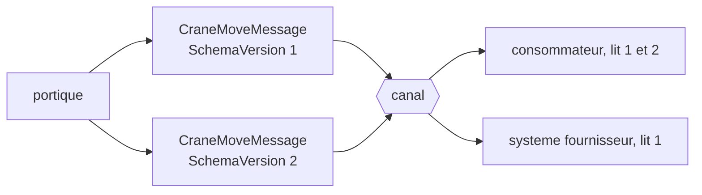

# Format Indicator

🌍 🇫🇷 Français (ce fichier) · 🇬🇧 [English](FormatIndicator-en.md)

## Intention

Format Indicator dit dans quelle version ou quel format se trouve un message, de sorte qu'un receveur puisse en
accepter plusieurs et qu'un émetteur puisse passer à un troisième.

## Problème

Le message de portique du terminal a gagné un champ.

Six consommateurs lisent l'ancienne forme, et ils ne seront pas tous redéployés le même après-midi — l'un est un
système de fournisseur, l'un appartient au commissionnaire en douane, et l'un n'est livré que trimestriellement.
Pendant ce temps les deux formes sont sur le canal.

Un receveur qui tient un message ne peut dire dans quelle forme il est qu'en cherchant le champ et en inférant, ce
qui est deviner déguisé en analyser. Et un émetteur qui veut passer à une troisième forme n'a aucun moyen de savoir
quand le dernier consommateur de la première a disparu, parce que rien nulle part ne consigne quelle forme chacun
lit.

## Solution

Le patron est une propriété qui nomme le format du message.

Un receveur lit l'indicateur et sait quelle forme il a, donc il peut en accepter deux. Un émetteur peut passer à une
troisième, parce que ceux qui la comprennent le diront et que ceux qui ne la comprennent pas peuvent être
distingués.

L'exemple est direct sur l'économie plutôt que sur le mécanisme, et c'est le cadrage honnête : c'est *la chose la
moins chère à ajouter avant la livraison de la première version et la plus chère après.* L'ajouter plus tard oblige
à inventer une règle pour ce que signifie un indicateur absent, et chaque consommateur doit s'accorder sur cette
règle.

## Structure



Les deux formes sur un canal en même temps, ce à quoi ressemble réellement un redéploiement échelonné.

## Les rôles

| Rôle | Annotation | S'applique à | Ce qu'il porte |
|---|---|---|---|
| FormatIndicator | `[FormatIndicator]` | propriété, champ | La propriété qui nomme le format du message. |

Un seul rôle, sur une propriété. Ce qu'il marque est la propriété qu'un receveur lit **avant** les autres — le seul
champ dont le sens ne peut pas lui-même dépendre de la version, ce qui est pourquoi il vaut d'être désigné.

## L'exemple

Extrait de [`FormatIndicatorUsage.cs`](../../../../DesignPatternCatalog.Usage/EnterpriseIntegration/FormatIndicatorUsage.cs).

```csharp
[FormatIndicator]
public string SchemaVersion { get; }

public string ContainerNumber { get; }
```

L'indicateur est déclaré **en premier**, avant la charge utile. Cet ordre n'est imposé par rien et il est le bon :
la version est ce qu'un lecteur consulte pour comprendre le reste, et la mettre en tête le dit.

C'est un `string` plutôt qu'un `int`. Une version obligée d'être un nombre ne peut pas être `2.1` ni `codeco-d95b`,
et le patron du livre porte sur le format autant que sur la version — un `string` couvre les deux, au prix de ne
pouvoir en comparer deux pour les ordonner.

La remarque énonce les deux sens dans lesquels le patron travaille : *il permet à un receveur d'accepter plus d'une
forme et à un émetteur de passer à une troisième, sans que ni l'un ni l'autre devine.* Les deux moitiés comptent —
un indicateur de format que seul le receveur emploie est la moitié du patron, puisque l'émetteur ne peut toujours
pas dire quand il est sûr de cesser d'envoyer l'ancienne forme.

## Possibilités d'application

**Ajoutez un indicateur de format avant la livraison de la première version.** L'économie propre de l'exemple, et
la chose la plus forte que cette page puisse dire : cela ne coûte rien maintenant et cela coûte une migration plus
tard.

**Employez-le partout où les consommateurs sont redéployés selon des calendriers différents.** C'est-à-dire partout
où un message franchit une frontière d'organisation, et à la plupart des endroits à l'intérieur d'une seule.

**Employez-le sur des messages dont vous ne maîtrisez pas les consommateurs.** Un [document](DocumentMessage-fr.md)
lu par des systèmes que l'émetteur ne connaît pas ne peut être coordonné d'aucune autre façon.

**Nommez un format, non seulement un numéro.** Version *et* format est ce que couvre le patron du livre, et une
chaîne porte les deux.

## Quand ne pas l'utiliser

**Ne l'ajoutez pas à un message qui ne changera jamais.** En pratique cet ensemble est plus petit qu'il n'y paraît,
ce qui est pourquoi le défaut va dans l'autre sens.

**Ne l'employez pas là où un canal de type répond déjà à la question.** Un [canal de type](DatatypeChannel-fr.md)
dit de quelle *sorte* est ce message ; un indicateur de format dit de quelle *forme* d'une sorte. Ils répondent à
des questions différentes, et l'un ne remplace pas l'autre.

**Ne le laissez pas devenir un `switch` dans chaque consommateur.** Six consommateurs qui branchent chacun sur trois
versions font dix-huit chemins ; au-delà de deux versions vivantes, la réponse est un
[Message Translator](MessageTranslator-fr.md) à la frontière, traduisant l'ancienne vers la nouvelle une fois.

**Ne l'employez pas pour ne jamais retirer une version.** Un indicateur rend la coexistence possible, non gratuite,
et un émetteur qui n'abandonne jamais une forme les paie toutes indéfiniment.

**Ne prenez pas un indicateur absent pour une version connue.** Les messages antérieurs à l'indicateur sont des
messages de forme inconnue, et un receveur qui suppose la version 1 la supposera un jour d'un message de version 3
venu d'un système qui a oublié le champ.

## Avantages

* Un receveur connaît la forme au lieu de l'inférer.
* Les consommateurs peuvent être redéployés selon leurs propres calendriers, ce qui est la seule façon dont cela se
  passe entre organisations.
* Un émetteur peut introduire une troisième forme sans coordonner de bascule.
* Cela coûte une propriété, et rien du tout si elle est là dès la première version.
* Cela fait de *quelle version est encore employée* une question à laquelle on peut répondre plutôt qu'une devinette.

## Inconvénients

* Chaque consommateur doit le lire, et celui qui l'ignore ne tire aucun bénéfice du fait que les autres le portent.
* Il favorise la prolifération des versions : la coexistence étant possible, le retrait est repoussé.
* Une chaîne ne s'ordonne pas : *plus récent que* n'est pas une comparaison que le receveur peut faire.
* Brancher dessus multiplie les chemins dans chaque consommateur, et les chemins sont rarement tous testés.
* L'ajouter tard oblige à décider ce que signifie son absence, et chaque consommateur doit s'y accorder.

## Liens avec les autres patrons

**`MessageTranslator`** est ce vers quoi se tourner au-delà de deux versions vivantes : traduire l'ancienne vers la
nouvelle à la frontière plutôt que de brancher dans chaque consommateur.

**`DatatypeChannel`** répond à la question voisine — quelle sorte, plutôt que quelle forme d'une sorte — et sa page
note que les consommateurs d'un tel canal ont cessé de vérifier, ce qui est exactement pourquoi l'indicateur reste
nécessaire.

**`DocumentMessage`** est la sorte qui en a le plus besoin, parce que ses consommateurs sont ceux que l'émetteur ne
connaît pas.

**`CanonicalDataModel`** est la réponse plus large quand les formats se multiplient au-delà des versions d'un même
message.

**`Message`** est ce qui le porte, et un indicateur de format appartient à l'en-tête plutôt qu'au corps — la division
que les annotations propres de `Message` rendent contrôlable.

## Source

*Enterprise Integration Patterns*, Gregor Hohpe et Bobby Woolf, Addison-Wesley, 2003 — le chapitre sur la
construction des messages.

* [Entrée d'index](../../../generated/catalog-index.md#formatindicator-enterprise-integration-patterns)
* [Attribut généré](../../../../DesignPatternCatalog.EnterpriseIntegration/FormatIndicator.cs)
* [Exemple](../../../../DesignPatternCatalog.Usage/EnterpriseIntegration/FormatIndicatorUsage.cs)
