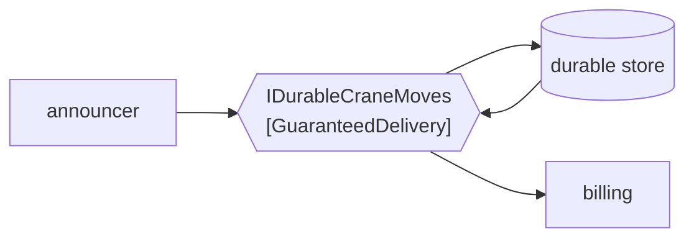

# Guaranteed Delivery

🌍 🇬🇧 English (this file) · 🇫🇷 [Français](GuaranteedDelivery-fr.md)

## Intent

Guaranteed Delivery makes the messaging system persist a message until it is delivered, so that a crash between
sending and receiving loses nothing.

## Problem

A crane move is announced the instant before the broker's host is rebooted.

The publisher's send returned. From its side the move happened. The message was in memory, the host went down,
and the move is gone. Billing invoices the vessel for one lift fewer than it lifted, and the discrepancy is found
weeks later by a customer reading their statement.

Nothing in the code is wrong, and nothing in the code can fix it: a message held only in memory has the
durability of the process holding it, and neither the publisher nor the receiver can change that from where they
stand.

## Solution

The pattern makes the channel persist what it carries.

A channel with guaranteed delivery writes the message to a durable store before acknowledging it, and keeps it
until a receiver has taken it. A restart, a crash or a network partition delays delivery instead of ending it.

It is a property of the **channel**, not of a message, and the cost is throughput: every message pays a write.
That is why the sample calls it declared rather than assumed — a team that believes its channel is durable and is
mistaken has the failure mode without the cost, which is the worst of the two arrangements.

## Structure



The store is on the path, not beside it. A message reaches the receiver by way of disk, and that detour is both
the guarantee and the cost.

## The roles

| Role | Annotation | Applies to | What it carries |
|---|---|---|---|
| GuaranteedDelivery | `[GuaranteedDelivery]` | interface, class | The channel that persists what it carries. |

One role, and it annotates the channel rather than the message or the send. That placement is the pattern's main
claim: durability is not something a caller opts into per message, it is something the channel either has or
does not.

## The example

From [`GuaranteedDeliveryUsage.cs`](../../../../DesignPatternCatalog.Usage/EnterpriseIntegration/GuaranteedDeliveryUsage.cs).

```csharp
[GuaranteedDelivery]
public interface IDurableCraneMoves {

    void Send(string craneMove);

}
```

The signature is that of an ordinary channel. There is no `durable: true`, no acknowledgement mode, no flush —
and that absence is the point being made: a channel with guaranteed delivery and one without are
indistinguishable at the call site, which is exactly why the property has to be declared somewhere.

The name says it too — `IDurableCraneMoves` — because in a codebase where some channels are durable and some are
not, the type name is the first place a reader looks.

The sample states both halves, the guarantee and its price: *a property of the channel rather than of a message,
and it costs throughput for durability — which is why it is declared rather than assumed.*

## Applicability

**Use guaranteed delivery where losing a message costs more than the throughput.** A billable lift, a customs
declaration, a container release: the book's own framing is that the message must survive a crash.

**Use it where the sender cannot repeat itself.** A publisher that has already returned to its caller cannot be
asked to send again, so the durability has to be in the channel.

**Declare it.** The property is invisible at the call site, so a channel that is relied on for durability should
say that it has it.

## When not to use it

**Do not use it where the message is worthless a moment later.** A yard occupancy reading published every second
does not need to survive a reboot; the next one is along shortly, and paying a disk write per reading buys
nothing.

**Do not use it where throughput is the constraint.** Every message pays a write, and a channel carrying
telemetry at volume will feel it. The book presents this as the trade rather than as a caveat.

**Do not read it as exactly-once.** A durable channel can deliver a message twice — a crash after delivery and
before acknowledgement is the ordinary case — and tolerating that is
[Idempotent Receiver](../../../generated/catalog-index.md#idempotentreceiver-enterprise-integration-patterns)'s
subject rather than this pattern's.

**Do not read it as delivered.** Guaranteed delivery guarantees the message is not lost, not that a receiver
exists, is running, or can process it. A message durably stored for a receiver that never returns is a message
nobody has, and [Dead Letter Channel](DeadLetterChannel-en.md) is what reports the difference.

**Do not assume it makes a transaction.** The message surviving and the database row surviving are two
guarantees, and the pattern that joins them is
[Transactional Client](../../../generated/catalog-index.md#transactionalclient-enterprise-integration-patterns).

## Advantages

* A crash between send and receive delays the message instead of losing it.
* The sender needs no retry logic, and no memory of what it has sent.
* Restarts and deployments stop being windows in which messages disappear.
* It is one property of one channel, so the decision is made once rather than at every send.

## Drawbacks

* Every message pays a write, and the throughput cost is real rather than nominal.
* It is invisible at the call site, so a channel wrongly believed to be durable behaves exactly like one that is
  until the day it does not.
* Durable is not exactly-once: redelivery after a crash still has to be tolerated by the receiver.
* Durable is not delivered: a message can be safely stored for a receiver that never comes.
* The store becomes something to operate — sized, monitored and backed up — and it is a new thing that can fill
  up.

## Relations with other patterns

**`MessageChannel`** is the root this narrows, and it narrows it along a third axis: not how many receivers, not
what may travel, but whether the channel survives its host.

**`DeadLetterChannel`** is the complement — this one keeps the message through a crash, that one reports that it
was never delivered.

**`DurableSubscriber`** is the publish-subscribe counterpart at the endpoint: this makes the channel survive, that
makes a subscriber's interest survive its own absence.

**`TransactionalClient`** is what ties the message's durability to the application's own, since two independent
guarantees are not one.

**`IdempotentReceiver`** is what makes a redelivery harmless, which durability makes more likely rather than less.

**`MessageStore`** is a different use of persistence — this stores in order to deliver, that stores in order to
look afterwards.

## Source

*Enterprise Integration Patterns*, Gregor Hohpe and Bobby Woolf, Addison-Wesley, 2003 — the messaging-channels
chapter.

* [Index entry](../../../generated/catalog-index.md#guaranteeddelivery-enterprise-integration-patterns)
* [Generated attribute](../../../../DesignPatternCatalog.EnterpriseIntegration/GuaranteedDelivery.cs)
* [Example](../../../../DesignPatternCatalog.Usage/EnterpriseIntegration/GuaranteedDeliveryUsage.cs)
