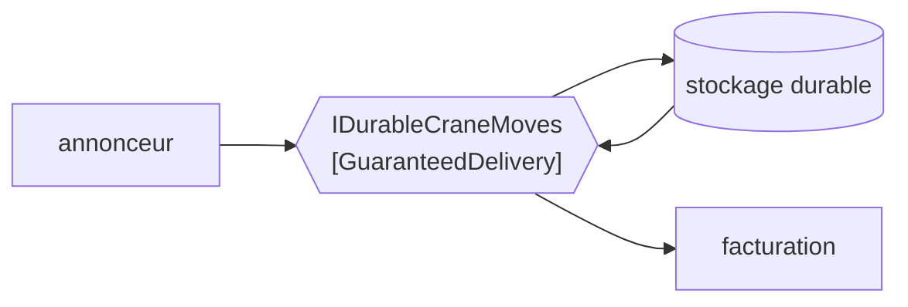

# Guaranteed Delivery

🌍 🇫🇷 Français (ce fichier) · 🇬🇧 [English](GuaranteedDelivery-en.md)

## Intention

Guaranteed Delivery fait persister un message par le système de messagerie jusqu'à ce qu'il soit délivré, de sorte
qu'une panne entre l'envoi et la réception ne perde rien.

## Problème

Un mouvement de portique est annoncé l'instant avant que l'hôte du courtier ne soit redémarré.

L'envoi de l'émetteur a rendu. De son côté, le mouvement a eu lieu. Le message était en mémoire, l'hôte est tombé,
et le mouvement a disparu. La facturation facture au navire une levée de moins qu'il n'en a levé, et l'écart est
trouvé des semaines plus tard par un client qui lit son relevé.

Rien dans le code n'est faux, et rien dans le code ne peut le corriger : un message tenu en mémoire seule a la
durabilité du processus qui le tient, et ni l'émetteur ni le receveur ne peuvent changer cela d'où ils sont.

## Solution

Le patron fait persister au canal ce qu'il porte.

Un canal à délivrance garantie écrit le message dans un stockage durable avant de l'acquitter, et le garde jusqu'à
ce qu'un receveur l'ait pris. Un redémarrage, une panne ou une partition réseau retarde la délivrance au lieu d'y
mettre fin.

C'est une propriété du **canal**, non d'un message, et le coût est le débit : chaque message paie une écriture.
C'est pourquoi l'exemple la dit déclarée plutôt que supposée — une équipe qui croit son canal durable et se trompe
a le mode de défaillance sans le coût, ce qui est le pire des deux agencements.

## Structure



Le stockage est sur le chemin, non à côté. Un message atteint le receveur en passant par le disque, et ce détour
est à la fois la garantie et le coût.

## Les rôles

| Rôle | Annotation | S'applique à | Ce qu'il porte |
|---|---|---|---|
| GuaranteedDelivery | `[GuaranteedDelivery]` | interface, classe | Le canal qui fait persister ce qu'il porte. |

Un seul rôle, et il annote le canal plutôt que le message ou l'envoi. Ce placement est la revendication principale
du patron : la durabilité n'est pas quelque chose qu'un appelant choisit message par message, c'est quelque chose
que le canal a ou n'a pas.

## L'exemple

Extrait de [`GuaranteedDeliveryUsage.cs`](../../../../DesignPatternCatalog.Usage/EnterpriseIntegration/GuaranteedDeliveryUsage.cs).

```csharp
[GuaranteedDelivery]
public interface IDurableCraneMoves {

    void Send(string craneMove);

}
```

La signature est celle d'un canal ordinaire. Pas de `durable: true`, pas de mode d'acquittement, pas de `flush` —
et cette absence est le propos : un canal à délivrance garantie et un canal sans sont indiscernables au point
d'appel, ce qui est exactement pourquoi la propriété doit être déclarée quelque part.

Le nom le dit aussi — `IDurableCraneMoves` — parce que dans un code où certains canaux sont durables et d'autres
non, le nom du type est le premier endroit où un lecteur regarde.

L'exemple énonce les deux moitiés, la garantie et son prix : *une propriété du canal plutôt que d'un message, et
elle coûte du débit pour de la durabilité — ce qui est pourquoi elle est déclarée plutôt que supposée.*

## Possibilités d'application

**Employez la délivrance garantie là où perdre un message coûte plus que le débit.** Une levée facturable, une
déclaration en douane, une libération de conteneur : le cadrage propre du livre est que le message doit survivre à
une panne.

**Employez-la là où l'émetteur ne peut pas se répéter.** Un émetteur qui a déjà rendu à son appelant ne peut pas
être prié de renvoyer, donc la durabilité doit être dans le canal.

**Déclarez-la.** La propriété est invisible au point d'appel : un canal sur la durabilité duquel on compte devrait
dire qu'il l'a.

## Quand ne pas l'utiliser

**Ne l'employez pas là où le message ne vaut plus rien un instant plus tard.** Un relevé d'occupation du parc publié
chaque seconde n'a pas besoin de survivre à un redémarrage ; le suivant arrive sous peu, et payer une écriture
disque par relevé n'achète rien.

**Ne l'employez pas là où le débit est la contrainte.** Chaque message paie une écriture, et un canal qui porte de
la télémétrie en volume le sentira. Le livre présente cela comme l'échange plutôt que comme une réserve.

**Ne la lisez pas comme *exactement une fois*.** Un canal durable peut délivrer un message deux fois — une panne
après la délivrance et avant l'acquittement est le cas ordinaire — et tolérer cela est le sujet d'
[Idempotent Receiver](../../../generated/catalog-index.md#idempotentreceiver-enterprise-integration-patterns)
plutôt que celui de ce patron.

**Ne la lisez pas comme *délivré*.** La délivrance garantie garantit que le message n'est pas perdu, non qu'un
receveur existe, tourne ou peut le traiter. Un message durablement stocké pour un receveur qui ne revient jamais
est un message que personne n'a, et [Dead Letter Channel](DeadLetterChannel-fr.md) est ce qui signale la
différence.

**Ne supposez pas qu'elle fait une transaction.** La survie du message et la survie de la ligne en base sont deux
garanties, et le patron qui les joint est
[Transactional Client](../../../generated/catalog-index.md#transactionalclient-enterprise-integration-patterns).

## Avantages

* Une panne entre l'envoi et la réception retarde le message au lieu de le perdre.
* L'émetteur n'a besoin d'aucune logique de réessai, ni de mémoire de ce qu'il a envoyé.
* Redémarrages et déploiements cessent d'être des fenêtres pendant lesquelles des messages disparaissent.
* C'est une propriété d'un canal : la décision se prend une fois plutôt qu'à chaque envoi.

## Inconvénients

* Chaque message paie une écriture, et le coût en débit est réel plutôt que nominal.
* Elle est invisible au point d'appel : un canal qu'on croit à tort durable se comporte exactement comme un canal
  qui l'est, jusqu'au jour où non.
* Durable n'est pas *exactement une fois* : une redélivrance après panne doit toujours être tolérée par le
  receveur.
* Durable n'est pas *délivré* : un message peut être stocké en sûreté pour un receveur qui ne vient jamais.
* Le stockage devient quelque chose à exploiter — dimensionné, surveillé, sauvegardé — et c'est une nouvelle chose
  qui peut se remplir.

## Liens avec les autres patrons

**`MessageChannel`** est la racine que celui-ci restreint, et il la restreint selon un troisième axe : non combien
de receveurs, non ce qui peut voyager, mais si le canal survit à son hôte.

**`DeadLetterChannel`** est le complément — celui-ci garde le message à travers une panne, celui-là signale qu'il
n'a jamais été délivré.

**`DurableSubscriber`** est le pendant en publication-abonnement, du côté du point de terminaison : celui-ci fait
survivre le canal, celui-là fait survivre l'intérêt d'un abonné à sa propre absence.

**`TransactionalClient`** est ce qui lie la durabilité du message à celle de l'application, puisque deux garanties
indépendantes n'en font pas une.

**`IdempotentReceiver`** est ce qui rend une redélivrance inoffensive, ce que la durabilité rend plus probable
plutôt que moins.

**`MessageStore`** est un autre usage de la persistance — celui-ci stocke pour délivrer, celui-là stocke pour
regarder après coup.

## Source

*Enterprise Integration Patterns*, Gregor Hohpe et Bobby Woolf, Addison-Wesley, 2003 — le chapitre sur les canaux
de messagerie.

* [Entrée d'index](../../../generated/catalog-index.md#guaranteeddelivery-enterprise-integration-patterns)
* [Attribut généré](../../../../DesignPatternCatalog.EnterpriseIntegration/GuaranteedDelivery.cs)
* [Exemple](../../../../DesignPatternCatalog.Usage/EnterpriseIntegration/GuaranteedDeliveryUsage.cs)
