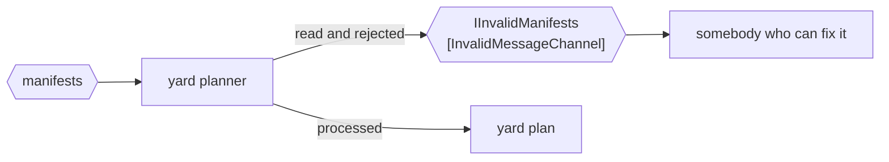

# Invalid Message Channel

🌍 🇬🇧 English (this file) · 🇫🇷 [Français](InvalidMessageChannel-fr.md)

## Intent

Invalid Message Channel gives a receiver somewhere to put a message it cannot process, so that bad data neither
blocks the channel nor disappears.

## Problem

A manifest arrives with a container number that is not a container number.

The yard planner has three ways to deal with it, and all three are bad. It can throw, in which case the message
is redelivered and thrown again, and the channel is blocked by one bad manifest until somebody notices the
terminal has stopped. It can catch and continue, in which case the manifest is gone and the vessel is short a
container with no record of why. It can log and continue, which is the same as the second with a line in a file
nobody reads.

The situation is ordinary — bad data arrives daily — and each of the three answers fails in a way that is
discovered late.

## Solution

The pattern is a fourth place to put it.

The receiver reads the message, decides it cannot process it, and moves it to a channel meant for exactly that.
The channel is not blocked, because the message has been taken. The message is not lost, because it is on a
channel. And somebody can go and look, because a channel is a thing with a name rather than a line in a log.

What distinguishes this from [Dead Letter Channel](DeadLetterChannel-en.md) is **who decides**: here the receiver
read the message and rejected it. That distinction is the reason the book has both, and it is the one thing to
get right about either.

## Structure



The rejecting arrow starts at the receiver, not at the messaging system. That is the whole distinction from a
dead letter channel drawn as a picture.

## The roles

| Role | Annotation | Applies to | What it carries |
|---|---|---|---|
| InvalidMessageChannel | `[InvalidMessageChannel]` | interface, class | The channel a receiver moves a message to when the message makes no sense to it. |

One role, and what it carries is an intent rather than a mechanism. A channel of rejected manifests looks like any
other channel of manifests; the annotation is what says this one is where rejections go, and therefore that
something should be watching it.

## The example

From [`InvalidMessageChannelUsage.cs`](../../../../DesignPatternCatalog.Usage/EnterpriseIntegration/InvalidMessageChannelUsage.cs).

```csharp
[InvalidMessageChannel]
public interface IInvalidManifests {

    void Reject(string message, string why);

}
```

Two parameters, and the second is the pattern's practical value. `why` is what turns a channel of bad manifests
into something a person can act on — *container number failed the check-digit* is a fixable problem, and a
manifest with no reason attached is a puzzle.

The method is called `Reject` rather than `Send`. The receiver is not forwarding the message onward in a
pipeline; it is declining it, and the verb says which.

The channel is named for what is on it — `IInvalidManifests`, invalid manifests — rather than for the receiver
that rejected them, so a second consumer of the same manifests can reject onto the same channel.

The sample states the distinction that matters: *the distinction from a dead letter channel is WHO decides: here
the receiver read the message and rejected it.*

## Applicability

**Use an invalid message channel wherever a receiver can read a message and find it unusable.** Which is
wherever a receiver validates anything, so in practice: most receivers.

**Use it to keep one bad message from blocking a channel.** This is the operational reason. A receiver that throws
on bad data has coupled the terminal's availability to the quality of its inputs.

**Use it to keep the message.** Bad data is evidence — of a partner's bug, a version skew, a bad translation —
and the message itself is the only complete record of what arrived.

**Attach the reason.** The sample's second parameter is the difference between a channel somebody can work
through and a channel somebody gives up on.

## When not to use it

**Do not use it for a failure that is not the message's fault.** A database that is down does not make the
manifest invalid, and rejecting the message means throwing away work that would have succeeded a minute later.
Retry, or let the delivery fail and let
[Dead Letter Channel](DeadLetterChannel-en.md) have it.

**Do not use it as a place to put anything unexpected.** A channel that receives everything a receiver did not
feel like handling is a second inbox with nobody responsible for it, and it grows.

**Do not leave it unwatched.** An invalid message channel nothing consumes and nobody monitors is a slower way of
losing the message — worse than logging, because it looks like it was handled.

**Do not reject silently.** Moving the message with no reason attached, or with a reason that says *invalid*,
leaves the next person to re-derive what the receiver already knew.

**Do not use it where the sender could have been told instead.** In a request-reply conversation the honest answer
to bad input is a reply saying so; putting it on an invalid message channel means the sender is still waiting.

## Advantages

* One bad message cannot block the channel, so availability stops depending on input quality.
* The message survives, which is what makes the cause findable.
* The reason travels with it, so the channel is a work list rather than a pile.
* It is a named channel, so it can be monitored, alerted on and counted like any other.
* Receivers get simpler: *process it or reject it* has no third branch.

## Drawbacks

* It is a channel somebody has to watch, and an unwatched one is worse than useless because it looks like a
  handler.
* Deciding what counts as invalid is a judgement, and it will be made differently by each receiver.
* Rejected messages accumulate, and reprocessing them after a fix is work the pattern does not describe.
* It can be used to make an unreliable receiver look reliable, since rejecting is always available.
* Ordering is broken for whatever was rejected: a manifest fixed and resubmitted arrives after its successors.

## Relations with other patterns

**`DeadLetterChannel`** is the counterpart, and the pair divides by who decided: the receiver here, the messaging
system there.

**`MessageChannel`** is the root both narrow.

**`MessageRouter`** is the other participant that needs one of these, and for the same reason: a message whose
value matches no branch has to go somewhere, which is why the sample router's `_` case sends to `terminal.invalid`
rather than throwing.

**`DatatypeChannel`** narrows what may arrive but does not validate it, so a datatype channel and one of these are
usually both present.

**`MessageStore`** and **`MessageHistory`** are what turn a rejected message into a diagnosis, by saying where it
had been before it arrived.

## Source

*Enterprise Integration Patterns*, Gregor Hohpe and Bobby Woolf, Addison-Wesley, 2003 — the messaging-channels
chapter.

* [Index entry](../../../generated/catalog-index.md#invalidmessagechannel-enterprise-integration-patterns)
* [Generated attribute](../../../../DesignPatternCatalog.EnterpriseIntegration/InvalidMessageChannel.cs)
* [Example](../../../../DesignPatternCatalog.Usage/EnterpriseIntegration/InvalidMessageChannelUsage.cs)
