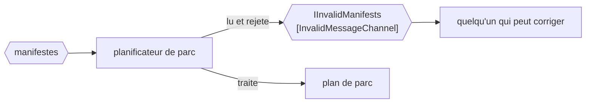

# Invalid Message Channel

🌍 🇫🇷 Français (ce fichier) · 🇬🇧 [English](InvalidMessageChannel-en.md)

## Intention

Invalid Message Channel donne à un receveur un endroit où mettre un message qu'il ne peut pas traiter, de sorte
qu'une donnée mauvaise ne bloque pas le canal et ne disparaisse pas.

## Problème

Un manifeste arrive avec un numéro de conteneur qui n'est pas un numéro de conteneur.

Le planificateur de parc a trois façons de s'en occuper, et les trois sont mauvaises. Il peut lever, et alors le
message est redélivré puis relevé, et le canal est bloqué par un manifeste jusqu'à ce que quelqu'un remarque que le
terminal s'est arrêté. Il peut attraper et continuer, et alors le manifeste a disparu et le navire manque d'un
conteneur sans trace de la raison. Il peut journaliser et continuer, ce qui est le deuxième cas avec une ligne dans
un fichier que personne ne lit.

La situation est ordinaire — de la donnée mauvaise arrive tous les jours — et chacune des trois réponses échoue
d'une façon qu'on découvre tard.

## Solution

Le patron est un quatrième endroit où le mettre.

Le receveur lit le message, décide qu'il ne peut pas le traiter, et le déplace vers un canal fait exactement pour
cela. Le canal n'est pas bloqué, puisque le message a été pris. Le message n'est pas perdu, puisqu'il est sur un
canal. Et quelqu'un peut aller regarder, parce qu'un canal est une chose qui a un nom plutôt qu'une ligne dans un
journal.

Ce qui le distingue de [Dead Letter Channel](DeadLetterChannel-fr.md), c'est **qui décide** : ici le receveur a lu
le message et l'a rejeté. Cette distinction est la raison pour laquelle le livre a les deux, et c'est la seule
chose à ne pas se tromper au sujet de l'un ou de l'autre.

## Structure



La flèche du rejet part du receveur, non du système de messagerie. C'est toute la distinction avec un canal de
lettres mortes, dessinée.

## Les rôles

| Rôle | Annotation | S'applique à | Ce qu'il porte |
|---|---|---|---|
| InvalidMessageChannel | `[InvalidMessageChannel]` | interface, classe | Le canal vers lequel un receveur déplace un message qui n'a aucun sens pour lui. |

Un seul rôle, et ce qu'il porte est une intention plutôt qu'un mécanisme. Un canal de manifestes rejetés ressemble
à n'importe quel autre canal de manifestes ; l'annotation est ce qui dit que celui-ci est là où vont les rejets, et
donc que quelque chose devrait le surveiller.

## L'exemple

Extrait de [`InvalidMessageChannelUsage.cs`](../../../../DesignPatternCatalog.Usage/EnterpriseIntegration/InvalidMessageChannelUsage.cs).

```csharp
[InvalidMessageChannel]
public interface IInvalidManifests {

    void Reject(string message, string why);

}
```

Deux paramètres, et le second est la valeur pratique du patron. `why` est ce qui transforme un canal de mauvais
manifestes en quelque chose sur quoi une personne peut agir — *le numéro de conteneur a échoué au chiffre de
contrôle* est un problème réparable, et un manifeste sans raison attachée est une énigme.

La méthode s'appelle `Reject` et non `Send`. Le receveur ne transmet pas le message plus loin dans un pipeline ; il
le décline, et le verbe dit lequel des deux.

Le canal est nommé d'après ce qui s'y trouve — `IInvalidManifests`, des manifestes invalides — plutôt que d'après
le receveur qui les a rejetés, si bien qu'un second consommateur des mêmes manifestes peut rejeter sur le même
canal.

L'exemple énonce la distinction qui compte : *la distinction avec un canal de lettres mortes est QUI décide : ici
le receveur a lu le message et l'a rejeté.*

## Possibilités d'application

**Employez un canal de messages invalides partout où un receveur peut lire un message et le trouver
inutilisable.** C'est-à-dire partout où un receveur valide quoi que ce soit, donc en pratique : la plupart des
receveurs.

**Employez-le pour éviter qu'un mauvais message bloque un canal.** C'est la raison d'exploitation. Un receveur qui
lève sur une donnée mauvaise a couplé la disponibilité du terminal à la qualité de ses entrées.

**Employez-le pour conserver le message.** Une donnée mauvaise est une preuve — du bogue d'un partenaire, d'une
dérive de version, d'une mauvaise traduction — et le message lui-même est le seul relevé complet de ce qui est
arrivé.

**Attachez la raison.** Le second paramètre de l'exemple est la différence entre un canal qu'on peut dépiler et un
canal devant lequel on renonce.

## Quand ne pas l'utiliser

**Ne l'employez pas pour une panne qui n'est pas la faute du message.** Une base de données arrêtée ne rend pas le
manifeste invalide, et rejeter le message revient à jeter un travail qui aurait réussi une minute plus tard.
Réessayez, ou laissez la délivrance échouer et laissez
[Dead Letter Channel](DeadLetterChannel-fr.md) s'en occuper.

**N'en faites pas un endroit où mettre tout ce qui est inattendu.** Un canal qui reçoit tout ce qu'un receveur n'a
pas eu envie de traiter est une seconde boîte de réception dont personne n'est responsable, et elle grossit.

**Ne le laissez pas sans surveillance.** Un canal de messages invalides que rien ne consomme et que personne ne
surveille est une façon plus lente de perdre le message — pire que journaliser, parce qu'il a l'air d'avoir été
traité.

**Ne rejetez pas en silence.** Déplacer le message sans raison attachée, ou avec une raison qui dit *invalide*,
laisse au suivant le soin de redériver ce que le receveur savait déjà.

**Ne l'employez pas là où l'émetteur aurait pu être averti.** Dans une conversation requête-réponse, la réponse
honnête à une entrée mauvaise est une réponse qui le dit ; la mettre sur un canal de messages invalides signifie
que l'émetteur attend toujours.

## Avantages

* Un mauvais message ne peut pas bloquer le canal : la disponibilité cesse de dépendre de la qualité des entrées.
* Le message survit, ce qui est ce qui rend la cause trouvable.
* La raison voyage avec lui : le canal est une liste de travail plutôt qu'un tas.
* C'est un canal nommé : il peut être surveillé, alerté et compté comme n'importe quel autre.
* Les receveurs se simplifient : *le traiter ou le rejeter* n'a pas de troisième branche.

## Inconvénients

* C'est un canal que quelqu'un doit surveiller, et un canal non surveillé est pire qu'inutile parce qu'il a l'air
  d'un traitement.
* Décider ce qui compte comme invalide est un jugement, et il sera fait différemment par chaque receveur.
* Les messages rejetés s'accumulent, et les retraiter après une correction est un travail que le patron ne décrit
  pas.
* Il peut servir à faire passer un receveur peu fiable pour fiable, puisque rejeter est toujours disponible.
* L'ordre est rompu pour ce qui a été rejeté : un manifeste corrigé et resoumis arrive après ses successeurs.

## Liens avec les autres patrons

**`DeadLetterChannel`** est le pendant, et la paire se divise selon qui a décidé : le receveur ici, le système de
messagerie là.

**`MessageChannel`** est la racine que les deux restreignent.

**`MessageRouter`** est l'autre participant qui en a besoin, et pour la même raison : un message dont la valeur ne
correspond à aucune branche doit aller quelque part, ce qui est pourquoi le cas `_` du routeur de l'exemple envoie
vers `terminal.invalid` plutôt que de lever.

**`DatatypeChannel`** restreint ce qui peut arriver mais ne le valide pas, si bien qu'un canal de type et l'un de
ceux-ci sont d'ordinaire tous deux présents.

**`MessageStore`** et **`MessageHistory`** sont ce qui transforme un message rejeté en diagnostic, en disant où il
était passé avant d'arriver.

## Source

*Enterprise Integration Patterns*, Gregor Hohpe et Bobby Woolf, Addison-Wesley, 2003 — le chapitre sur les canaux
de messagerie.

* [Entrée d'index](../../../generated/catalog-index.md#invalidmessagechannel-enterprise-integration-patterns)
* [Attribut généré](../../../../DesignPatternCatalog.EnterpriseIntegration/InvalidMessageChannel.cs)
* [Exemple](../../../../DesignPatternCatalog.Usage/EnterpriseIntegration/InvalidMessageChannelUsage.cs)
