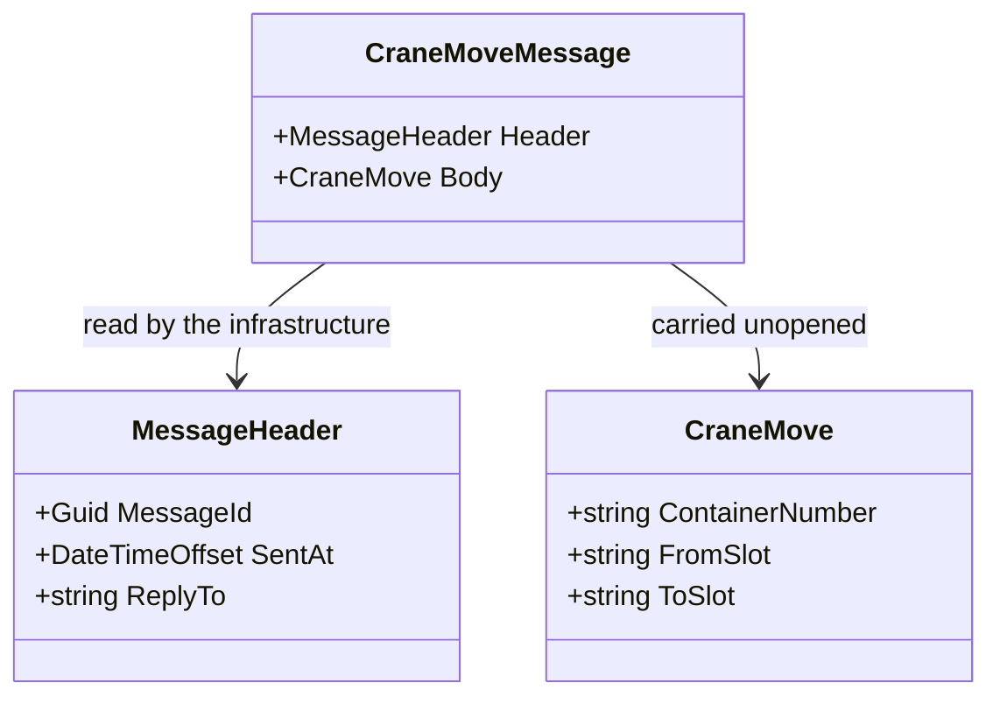

# Message

🌍 🇬🇧 English (this file) · 🇫🇷 [Français](Message-fr.md)

## Intent

Message wraps data in a packet the channel can carry, so that what is sent is a thing in its own right rather than
a call's arguments.

## Problem

A crane move crossing a boundary is not an argument list.

```csharp
void Announce(string containerNumber, string fromSlot, string toSlot);
```

Three parameters have no identity, so a duplicate cannot be recognised. They have no moment, so *when* is whatever
the receiver's clock says on arrival. They have no return address, so a reply has nowhere to go. And they have no
version, so adding a fourth breaks every consumer at once.

## Solution

The pattern names the packet.

What crosses becomes a type: a thing with an identity, a moment and a return address, that may be logged, replayed
and versioned.

And it separates what the messaging system reads from what the application sent. The infrastructure routes on the
**header** and never opens the **body** — which is what lets one channel serve payloads it knows nothing about.

## Structure



The two arrows have different readers, and that difference is the pattern. Everything the broker needs is on one
side; everything the application means is on the other.

## The roles

| Role | Annotation | Applies to | What it carries |
|---|---|---|---|
| Message | `[Message.Message]` | class, struct | The packet sent over a channel. It exists as a type so that what crosses a boundary is named and versionable. |
| Header | `[Message.Header]` | property, field | What the messaging system reads to do its work — the identifiers, the return address, the expiry. |
| Body | `[Message.Body]` | property, field | What the application sent. The messaging system carries it without looking at it. |

Three roles, and the two on members are the useful ones: they mark the boundary between what infrastructure may
read and what it may not. The packet's own annotation reads `[Message.Message]`, nested because a role sharing its
pattern's name is nested under it.

## The example

From [`MessageUsage.cs`](../../../../DesignPatternCatalog.Usage/EnterpriseIntegration/MessageUsage.cs).

```csharp
[Message.Message]
public sealed class CraneMoveMessage {

    public CraneMoveMessage(MessageHeader header, CraneMove body) {
        Header = header;
        Body   = body;
    }
```

A type, with both halves required at construction. There is no message without a header and none without a body.

```csharp
    [Message.Header]
    public MessageHeader Header { get; }

    [Message.Body]
    public CraneMove Body { get; }

}
```

Two annotated properties, and what they assert is a permission rather than a shape. The sample's remarks say it
exactly: the header is *held apart from the body because the infrastructure may read this and has no business
reading the rest*, and the body is *carried without being looked at, which is what lets one channel serve payloads
it knows nothing about*.

That is what an architecture rule can range over. A router that reads `Body` has broken the separation, and the
two annotations are what let the rule be written.

```csharp
public sealed record MessageHeader(Guid MessageId, DateTimeOffset SentAt, string? ReplyTo);

public sealed record CraneMove(string ContainerNumber, string FromSlot, string ToSlot);
```

The header's three fields answer the three questions the parameter list could not. `MessageId` makes a duplicate
recognisable — which is what
[Idempotent Receiver](../../../generated/catalog-index.md#idempotentreceiver-enterprise-integration-patterns) needs.
`SentAt` is when the sender sent, not when the receiver read. `ReplyTo` is nullable because an announcement has
nowhere to reply to and a request does — the same header serving both.

## Applicability

**Use Message wherever data crosses a channel.** The book presents it as a root pattern: messaging means sending
messages, and a message is a packet rather than a parameter list.

**Separate the header from the body.** This is the book's own division and the one the annotations record: the
messaging system reads the header to do its work, and carries the body without opening it.

**Make the message a type so that it can be versioned.** A named type can gain a field, be serialised two ways, or
exist in two versions at once; an argument list cannot.

## When not to use it

**Do not put in the header what only the application needs.** A header field the infrastructure never reads is a
body field in the wrong place, and it invites a router to make decisions on business data.

**Do not let the infrastructure read the body.** This is the separation's whole point, and breaking it couples the
broker to the payload: a router that switches on a container number cannot carry a message it does not understand.

**Do not use a message where a call is wanted.** The packet exists because sender and receiver are decoupled; where
they are not — the crane's release check — the argument list was right, and wrapping it buys nothing. That is
[Remote Procedure Invocation](RemoteProcedureInvocation-en.md)'s case.

**Do not make the body a type from the sender's domain model.** The message is a contract with a receiver, and a
domain type serialised onto a channel makes every internal refactoring a breaking change — which is what
[Published Language](../domain-driven-design/PublishedLanguage-en.md) exists to prevent.

**Do not omit the identity because nothing needs it yet.** The identifier is what makes a duplicate recognisable,
and duplicates are discovered rather than predicted.

## Advantages

* What crosses the boundary is named, so it can be versioned, logged and replayed.
* A duplicate is recognisable, because the packet has an identity.
* The moment of sending is carried, so a delayed consumer can still reason about time correctly.
* A reply has somewhere to go without the sender being known.
* One channel can serve payloads the infrastructure knows nothing about, because it reads only the header.

## Drawbacks

* Every payload needs a type, and a system with sixty message kinds has sixty of them.
* The header is a second contract, shared with the infrastructure rather than with the receiver.
* Serialising a type is a decision — format, versioning, compatibility — that a parameter list did not require.
* The separation is a convention: nothing in C# stops a consumer reading a header or a router reading a body.

## Relations with other patterns

**`MessageChannel`** is where it travels, and the two are the minimum pair.

**`CommandMessage`**, **`DocumentMessage`** and **`EventMessage`** are what a message can be *for*, and the choice
among them is a statement about what the receiver may do with it.

**`CorrelationIdentifier`** and **`ReturnAddress`** are header fields raised to patterns, because each answers a
question the plain packet leaves open.

**`MessageTranslator`** changes the body's format, and a router reads only the header — the two patterns divide
along exactly the line these annotations draw.

**`MessageExpiration`** is another header concern, and the reason `SentAt` is worth carrying.

## Source

*Enterprise Integration Patterns*, Gregor Hohpe and Bobby Woolf, Addison-Wesley, 2003 — chapter 3, messaging
systems.

* [Index entry](../../../generated/catalog-index.md#message-enterprise-integration-patterns)
* [Generated attribute](../../../../DesignPatternCatalog.EnterpriseIntegration/Message.cs)
* [Example](../../../../DesignPatternCatalog.Usage/EnterpriseIntegration/MessageUsage.cs)
