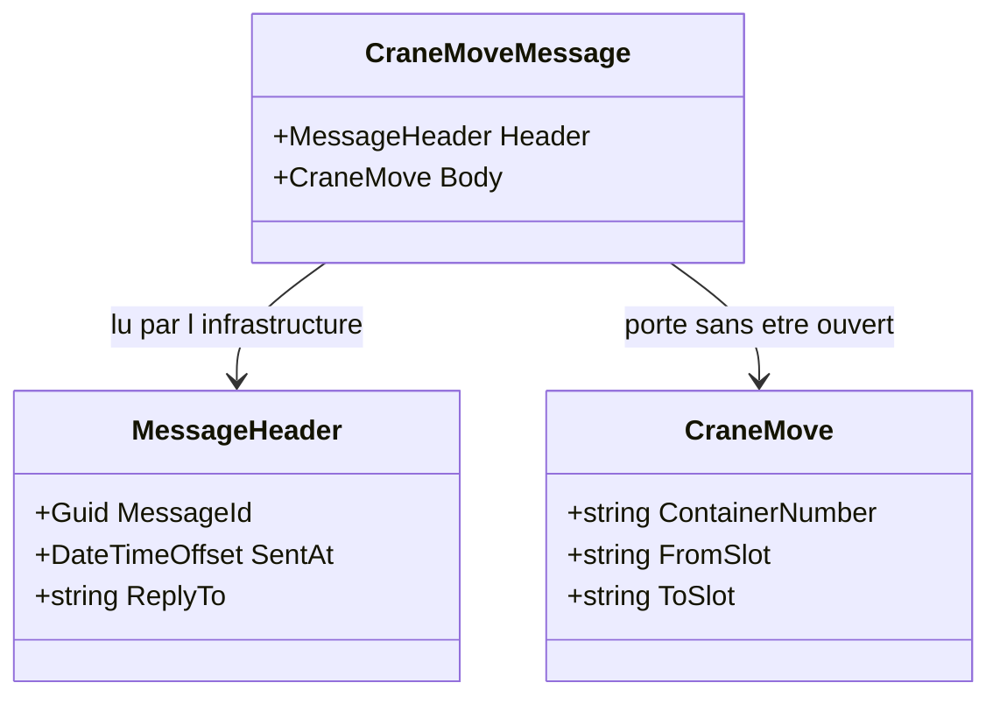

# Message

🌍 🇫🇷 Français (ce fichier) · 🇬🇧 [English](Message-en.md)

## Intention

Message enveloppe des données dans un paquet que le canal sait porter, de sorte que ce qui est envoyé soit une chose
à part entière plutôt que les arguments d'un appel.

## Problème

Un mouvement de portique qui franchit une frontière n'est pas une liste d'arguments.

```csharp
void Announce(string containerNumber, string fromSlot, string toSlot);
```

Trois paramètres n'ont pas d'identité : un doublon ne peut pas être reconnu. Ils n'ont pas de moment : le *quand*
est ce que dit l'horloge du receveur à l'arrivée. Ils n'ont pas d'adresse de retour : une réponse n'a nulle part où
aller. Et ils n'ont pas de version : en ajouter un quatrième casse tous les consommateurs d'un coup.

## Solution

Le patron nomme le paquet.

Ce qui traverse devient un type : une chose avec une identité, un moment et une adresse de retour, qui peut être
journalisée, rejouée et versionnée.

Et il sépare ce que le système de messagerie lit de ce que l'application a envoyé. L'infrastructure route sur
l'**en-tête** et n'ouvre jamais le **corps** — ce qui permet à un canal de servir des charges utiles dont il ne sait
rien.

## Structure



Les deux flèches ont des lecteurs différents, et cette différence est le patron. Tout ce dont le courtier a besoin
est d'un côté ; tout ce que l'application veut dire est de l'autre.

## Les rôles

| Rôle | Annotation | S'applique à | Ce qu'il porte |
|---|---|---|---|
| Message | `[Message.Message]` | classe, struct | Le paquet envoyé sur un canal. Il existe comme type pour que ce qui franchit une frontière soit nommé et versionnable. |
| Header | `[Message.Header]` | propriété, champ | Ce que le système de messagerie lit pour faire son travail — les identifiants, l'adresse de retour, l'expiration. |
| Body | `[Message.Body]` | propriété, champ | Ce que l'application a envoyé. Le système de messagerie le porte sans le regarder. |

Trois rôles, et les deux qui portent sur des membres sont les utiles : ils marquent la frontière entre ce que
l'infrastructure a le droit de lire et ce qu'elle n'a pas le droit de lire. L'annotation du paquet s'écrit
`[Message.Message]`, imbriquée parce qu'un rôle portant le nom de son pattern s'imbrique sous lui.

## L'exemple

Extrait de [`MessageUsage.cs`](../../../../DesignPatternCatalog.Usage/EnterpriseIntegration/MessageUsage.cs).

```csharp
[Message.Message]
public sealed class CraneMoveMessage {

    public CraneMoveMessage(MessageHeader header, CraneMove body) {
        Header = header;
        Body   = body;
    }
```

Un type, avec les deux moitiés exigées à la construction. Il n'y a pas de message sans en-tête, et aucun sans corps.

```csharp
    [Message.Header]
    public MessageHeader Header { get; }

    [Message.Body]
    public CraneMove Body { get; }

}
```

Deux propriétés annotées, et ce qu'elles affirment est une permission plutôt qu'une forme. Les remarques de
l'exemple le disent exactement : l'en-tête est *tenu à l'écart du corps parce que l'infrastructure peut le lire et
n'a rien à faire du reste*, et le corps est *porté sans être regardé, ce qui permet à un canal de servir des
charges utiles dont il ne sait rien*.

C'est ce sur quoi une règle d'architecture peut porter. Un routeur qui lit `Body` a rompu la séparation, et les
deux annotations sont ce qui permet d'écrire la règle.

```csharp
public sealed record MessageHeader(Guid MessageId, DateTimeOffset SentAt, string? ReplyTo);

public sealed record CraneMove(string ContainerNumber, string FromSlot, string ToSlot);
```

Les trois champs de l'en-tête répondent aux trois questions que la liste de paramètres ne pouvait pas résoudre.
`MessageId` rend un doublon reconnaissable — ce dont
[Idempotent Receiver](../../../generated/catalog-index.md#idempotentreceiver-enterprise-integration-patterns) a
besoin. `SentAt` est le moment où l'émetteur a émis, non celui où le receveur a lu. `ReplyTo` est nullable parce
qu'une annonce n'a nulle part où répondre et qu'une requête, si — le même en-tête servant les deux.

## Possibilités d'application

**Employez Message partout où des données franchissent un canal.** Le livre le présente comme un patron racine :
faire de la messagerie, c'est envoyer des messages, et un message est un paquet plutôt qu'une liste de paramètres.

**Séparez l'en-tête du corps.** C'est la division propre du livre et celle que les annotations consignent : le
système de messagerie lit l'en-tête pour faire son travail, et porte le corps sans l'ouvrir.

**Faites du message un type pour qu'il puisse être versionné.** Un type nommé peut gagner un champ, être sérialisé
de deux façons, ou exister en deux versions à la fois ; une liste d'arguments non.

## Quand ne pas l'utiliser

**Ne mettez pas dans l'en-tête ce dont seule l'application a besoin.** Un champ d'en-tête que l'infrastructure ne
lit jamais est un champ de corps au mauvais endroit, et il invite un routeur à décider sur des données métier.

**Ne laissez pas l'infrastructure lire le corps.** C'est tout le propos de la séparation, et la rompre couple le
courtier à la charge utile : un routeur qui aiguille sur un numéro de conteneur ne peut pas porter un message qu'il
ne comprend pas.

**N'employez pas un message là où un appel est voulu.** Le paquet existe parce qu'émetteur et receveur sont
découplés ; là où ils ne le sont pas — le contrôle de mainlevée du portique — la liste d'arguments avait raison, et
l'envelopper n'achète rien. C'est le cas de [Remote Procedure Invocation](RemoteProcedureInvocation-fr.md).

**Ne faites pas du corps un type du modèle de domaine de l'émetteur.** Le message est un contrat avec un receveur, et
un type de domaine sérialisé sur un canal fait de chaque remaniement interne une rupture — ce que
[Published Language](../domain-driven-design/PublishedLanguage-fr.md) existe pour prévenir.

**N'omettez pas l'identité parce que rien n'en a encore besoin.** L'identifiant est ce qui rend un doublon
reconnaissable, et les doublons se découvrent plutôt qu'ils ne se prévoient.

## Avantages

* Ce qui franchit la frontière est nommé : cela peut être versionné, journalisé et rejoué.
* Un doublon est reconnaissable, puisque le paquet a une identité.
* Le moment de l'envoi est porté : un consommateur retardé peut encore raisonner correctement sur le temps.
* Une réponse a un endroit où aller sans que l'émetteur soit connu.
* Un canal peut servir des charges utiles dont l'infrastructure ne sait rien, puisqu'elle ne lit que l'en-tête.

## Inconvénients

* Chaque charge utile demande un type, et un système à soixante espèces de messages en a soixante.
* L'en-tête est un second contrat, partagé avec l'infrastructure plutôt qu'avec le receveur.
* Sérialiser un type est une décision — format, versionnage, compatibilité — qu'une liste de paramètres n'exigeait
  pas.
* La séparation est une convention : rien en C# n'empêche un consommateur de lire un en-tête ni un routeur de lire
  un corps.

## Liens avec les autres patrons

**`MessageChannel`** est là où il voyage, et les deux forment la paire minimale.

**`CommandMessage`**, **`DocumentMessage`** et **`EventMessage`** sont ce à quoi un message peut *servir*, et le
choix entre eux est une affirmation sur ce que le receveur a le droit d'en faire.

**`CorrelationIdentifier`** et **`ReturnAddress`** sont des champs d'en-tête élevés au rang de patrons, parce que
chacun répond à une question que le paquet nu laisse ouverte.

**`MessageTranslator`** change le format du corps, et un routeur ne lit que l'en-tête — les deux patrons se divisent
exactement sur la ligne que ces annotations tracent.

**`MessageExpiration`** est une autre affaire d'en-tête, et la raison pour laquelle `SentAt` mérite d'être porté.

## Source

*Enterprise Integration Patterns*, Gregor Hohpe et Bobby Woolf, Addison-Wesley, 2003 — chapitre 3, les systèmes de
messagerie.

* [Entrée d'index](../../../generated/catalog-index.md#message-enterprise-integration-patterns)
* [Attribut généré](../../../../DesignPatternCatalog.EnterpriseIntegration/Message.cs)
* [Exemple](../../../../DesignPatternCatalog.Usage/EnterpriseIntegration/MessageUsage.cs)
