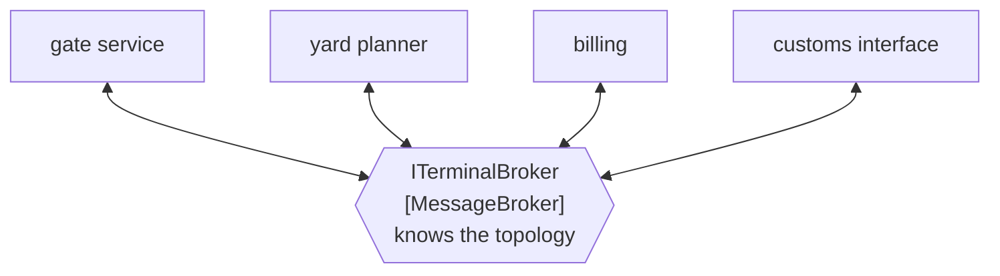

# Message Broker

🌍 🇬🇧 English (this file) · 🇫🇷 [Français](MessageBroker-fr.md)

## Intent

Message Broker puts the routing of a whole system in one hub, so that each application has one channel rather
than one per correspondent.

## Problem

Eleven applications around the terminal.

Point to point, that is fifty-five integrations to build and to keep working, and the twelfth application makes
it sixty-six. Each one has its own format, its own schedule and its own owner, and retiring an application means
finding everything that talked to it — which nobody has a list of.

The arithmetic is the problem, and it is quadratic. Every application added makes the next one more expensive.

## Solution

The pattern replaces that arithmetic with one dependency.

Every application sends to and receives from a hub. The hub is the only participant that knows the topology, so
an application connects once rather than once per correspondent, and the count of integrations grows with the
applications rather than with their pairs.

And then the trade, which the sample states rather than leaves to be found: it **becomes the thing whose failure
stops everything**, which is a trade to state rather than to discover on a Sunday.

## Structure



Every application has one line to the middle, and the middle is the only box that knows what the picture looks
like.

## The roles

| Role | Annotation | Applies to | What it carries |
|---|---|---|---|
| MessageBroker | `[MessageBroker]` | interface, class | The hub every application sends to and receives from, and the only participant that knows the topology. |

One role, and what it claims is a **concentration**: this participant knows what no other one does. That is worth
annotating precisely because it is a decision people arrive at by accident — a
[content-based router](ContentBasedRouter-en.md) that acquires one more destination each quarter is a broker
nobody chose.

## The example

From [`MessageBrokerUsage.cs`](../../../../DesignPatternCatalog.Usage/EnterpriseIntegration/MessageBrokerUsage.cs).

```csharp
[MessageBroker]
public interface ITerminalBroker {

    void Publish(string channel, string message);

    void Route(string fromChannel, string toChannel, Func<string, bool> when);

}
```

Two methods, and they are for **two different audiences**. `Publish` is what an application calls; `Route` is what
whoever configures the estate calls. An interface that mixes the two is the honest shape here, because a broker is
exactly the participant that serves both — but it is also why a broker accumulates: the second method is an
invitation, and every accepted invitation is another piece of topology in the middle.

`Route` taking a `Func<string, bool>` is a routing rule supplied from outside. That is what makes the broker
general and what makes it dangerous: the rule is code passed in, so *what does this broker do* has no answer in
the broker's own source.

`fromChannel` and `toChannel` are both channels, which keeps the broker in the business of moving messages
between channels rather than knowing about applications. A broker whose `Route` named systems would have taken on
the estate's org chart as well as its topology.

The sample states the trade in the same breath as the benefit: *replaces that arithmetic with one dependency —
and becomes the thing whose failure stops everything.*

## Applicability

**Use a message broker where the number of applications makes point-to-point untenable.** The book's case, and
the arithmetic is the argument.

**Use it where applications come and go.** Connecting once rather than once per correspondent is what makes a
long-lived estate maintainable.

**Choose it deliberately.** A broker arrived at by accretion has all the costs and none of the design.

**Design for its failure.** It is the single point of failure by construction, so its availability is the
estate's — and that is a thing to plan rather than to discover.

## When not to use it

**Do not use it for a handful of applications.** Three applications are three integrations, and a hub is more
infrastructure than the problem justifies.

**Do not let one arrive by accretion.** A router that gains a destination each quarter becomes a broker without
anybody deciding, which is how the costs get paid without the benefits being designed for.

**Do not put business logic in it.** A hub that decides what should happen to a message has taken domain
decisions into the one component nobody owns, and the coupling removed from the edges is now concentrated where it
is hardest to see.

**Do not confuse it with a message bus.** A [message bus](MessageBus-en.md) is shared infrastructure plus an
agreed command set, with the intelligence at the endpoints; a broker is a hub that decides. The bus page puts it
from the other side: a bus that starts deciding has become one of these.

**Do not let it be the only thing that knows the topology, undocumented.** The knowledge is concentrated by
design; if it is also only in configuration nobody reads, an outage is an archaeology exercise.

**Do not route through it what does not need routing.** Every message through the hub is a hop, and traffic that
has one obvious destination is paying for flexibility it never uses.

## Advantages

* The integration count grows with the applications rather than with their pairs.
* An application connects once, and knows no correspondent.
* Adding or retiring an application is a change at the hub.
* Routing is in one place, so it can be changed without touching any application.
* Monitoring the estate's traffic is monitoring one component.

## Drawbacks

* It is the single point of failure, and its availability is the estate's.
* It concentrates knowledge that no other participant has, which makes it hard to reason about and hard to
  replace.
* Routing rules passed in from outside mean the broker's own source does not say what it does.
* Every message pays a hop it might not need.
* It grows: a hub is where logic accretes, because putting it there is always the easiest option.

## Relations with other patterns

**`MessageBus`** is the alternative arrangement, and the distinction is where the intelligence sits: at the
endpoints with an agreed vocabulary there, in the hub here.

**`ContentBasedRouter`** and **`DynamicRouter`** are what a broker is made of, and what one becomes when it
accumulates destinations.

**`MessageChannel`** is what the broker moves messages between, and keeping its `Route` in terms of channels is
what stops it knowing about applications.

**`ControlBus`** is how a broker is operated and inspected, which matters more here than anywhere else in the
catalogue.

**`MessagingBridge`** is what joins two brokers, and an estate with two is usually mid-migration.

## Source

*Enterprise Integration Patterns*, Gregor Hohpe and Bobby Woolf, Addison-Wesley, 2003 — the message-routing
chapter.

* [Index entry](../../../generated/catalog-index.md#messagebroker-enterprise-integration-patterns)
* [Generated attribute](../../../../DesignPatternCatalog.EnterpriseIntegration/MessageBroker.cs)
* [Example](../../../../DesignPatternCatalog.Usage/EnterpriseIntegration/MessageBrokerUsage.cs)
