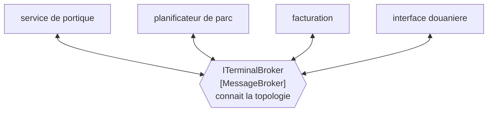

# Message Broker

🌍 🇫🇷 Français (ce fichier) · 🇬🇧 [English](MessageBroker-en.md)

## Intention

Message Broker met le routage d'un système entier dans un pivot, de sorte que chaque application ait un canal
plutôt qu'un par correspondant.

## Problème

Onze applications autour du terminal.

En point à point, cela fait cinquante-cinq intégrations à bâtir et à maintenir, et la douzième application les
porte à soixante-six. Chacune a son format, son calendrier et son propriétaire, et retirer une application demande
de trouver tout ce qui lui parlait — dont personne n'a la liste.

L'arithmétique est le problème, et elle est quadratique. Chaque application ajoutée rend la suivante plus chère.

## Solution

Le patron remplace cette arithmétique par une seule dépendance.

Chaque application envoie à un pivot et reçoit de lui. Le pivot est le seul participant qui connaisse la topologie :
une application se relie une fois plutôt qu'une fois par correspondant, et le compte des intégrations croît avec les
applications plutôt qu'avec leurs paires.

Et puis l'échange, que l'exemple énonce au lieu de le laisser trouver : il **devient la chose dont la panne arrête
tout**, ce qui est un échange à énoncer plutôt qu'à découvrir un dimanche.

## Structure



Chaque application a une ligne vers le milieu, et le milieu est la seule boîte qui sache à quoi ressemble l'image.

## Les rôles

| Rôle | Annotation | S'applique à | Ce qu'il porte |
|---|---|---|---|
| MessageBroker | `[MessageBroker]` | interface, classe | Le pivot auquel chaque application envoie et duquel elle reçoit, et le seul participant qui connaisse la topologie. |

Un seul rôle, et ce qu'il revendique est une **concentration** : ce participant sait ce qu'aucun autre ne sait. Cela
vaut d'être annoté précisément parce que c'est une décision à laquelle on arrive par accident — un
[routeur fondé sur le contenu](ContentBasedRouter-fr.md) qui gagne une destination par trimestre est un pivot que
personne n'a choisi.

## L'exemple

Extrait de [`MessageBrokerUsage.cs`](../../../../DesignPatternCatalog.Usage/EnterpriseIntegration/MessageBrokerUsage.cs).

```csharp
[MessageBroker]
public interface ITerminalBroker {

    void Publish(string channel, string message);

    void Route(string fromChannel, string toChannel, Func<string, bool> when);

}
```

Deux méthodes, et elles s'adressent à **deux publics différents**. `Publish` est ce qu'une application appelle ;
`Route` est ce qu'appelle celui qui configure le parc. Une interface qui mêle les deux est la forme honnête ici,
parce qu'un pivot est exactement le participant qui sert les deux — mais c'est aussi pourquoi un pivot s'accroît : la
seconde méthode est une invitation, et chaque invitation acceptée est un morceau de topologie de plus au milieu.

`Route` qui prend un `Func<string, bool>` est une règle de routage fournie du dehors. C'est ce qui rend le pivot
général et ce qui le rend dangereux : la règle est du code passé en paramètre, si bien que *que fait ce pivot* n'a
aucune réponse dans les sources du pivot.

`fromChannel` et `toChannel` sont tous deux des canaux, ce qui garde le pivot dans le métier de déplacer des messages
entre canaux plutôt que de connaître des applications. Un pivot dont le `Route` nommerait des systèmes aurait pris en
charge l'organigramme du parc en plus de sa topologie.

L'exemple énonce l'échange dans le même souffle que le bénéfice : *remplace cette arithmétique par une seule
dépendance — et devient la chose dont la panne arrête tout.*

## Possibilités d'application

**Employez un pivot là où le nombre d'applications rend le point à point intenable.** Le cas du livre, et
l'arithmétique est l'argument.

**Employez-le là où les applications vont et viennent.** Se relier une fois plutôt qu'une fois par correspondant est
ce qui rend un parc de longue vie maintenable.

**Choisissez-le délibérément.** Un pivot atteint par accrétion a tous les coûts et aucune conception.

**Concevez pour sa panne.** C'est le point unique de défaillance par construction : sa disponibilité est celle du
parc, et c'est une chose à planifier plutôt qu'à découvrir.

## Quand ne pas l'utiliser

**Ne l'employez pas pour une poignée d'applications.** Trois applications font trois intégrations, et un pivot est
plus d'infrastructure que le problème n'en justifie.

**N'en laissez pas naître un par accrétion.** Un routeur qui gagne une destination par trimestre devient un pivot
sans que personne le décide, ce qui est la façon dont les coûts se paient sans que les bénéfices aient été conçus.

**N'y mettez pas de logique métier.** Un pivot qui décide ce qui doit arriver à un message a emporté des décisions de
domaine dans le seul composant que personne ne possède, et le couplage retiré des bords est désormais concentré là où
il est le plus difficile à voir.

**Ne le confondez pas avec un bus de messages.** Un [bus de messages](MessageBus-fr.md) est une infrastructure
partagée plus un jeu de commandes convenu, avec l'intelligence aux extrémités ; un pivot est un centre qui décide. La
page du bus le dit par l'autre côté : un bus qui se met à décider est devenu l'un de ceux-ci.

**Ne le laissez pas être le seul à connaître la topologie, sans documentation.** La connaissance est concentrée par
conception ; si elle n'est en outre que dans une configuration que personne ne lit, une panne devient un exercice
d'archéologie.

**N'y routez pas ce qui n'a pas besoin de routage.** Chaque message qui passe par le pivot est un saut, et un trafic
qui a une destination évidente paie une souplesse dont il ne se sert jamais.

## Avantages

* Le compte des intégrations croît avec les applications plutôt qu'avec leurs paires.
* Une application se relie une fois, et ne connaît aucun correspondant.
* Ajouter ou retirer une application est un changement au pivot.
* Le routage est à un seul endroit : il peut changer sans toucher à aucune application.
* Surveiller le trafic du parc, c'est surveiller un composant.

## Inconvénients

* C'est le point unique de défaillance, et sa disponibilité est celle du parc.
* Il concentre une connaissance qu'aucun autre participant n'a, ce qui le rend difficile à raisonner et difficile à
  remplacer.
* Des règles de routage passées du dehors font que les sources du pivot ne disent pas ce qu'il fait.
* Chaque message paie un saut dont il n'a peut-être pas besoin.
* Il grossit : un pivot est là où la logique s'accrète, parce que l'y mettre est toujours l'option la plus facile.

## Liens avec les autres patrons

**`MessageBus`** est l'agencement alternatif, et la distinction est où siège l'intelligence : aux extrémités avec un
vocabulaire convenu là-bas, dans le pivot ici.

**`ContentBasedRouter`** et **`DynamicRouter`** sont ce dont un pivot est fait, et ce que l'un d'eux devient quand il
accumule des destinations.

**`MessageChannel`** est ce entre quoi le pivot déplace des messages, et garder son `Route` en termes de canaux est ce
qui l'empêche de connaître des applications.

**`ControlBus`** est la façon dont un pivot est exploité et inspecté, ce qui compte davantage ici que partout ailleurs
dans le catalogue.

**`MessagingBridge`** est ce qui joint deux pivots, et un parc qui en a deux est d'ordinaire en cours de migration.

## Source

*Enterprise Integration Patterns*, Gregor Hohpe et Bobby Woolf, Addison-Wesley, 2003 — le chapitre sur le routage
des messages.

* [Entrée d'index](../../../generated/catalog-index.md#messagebroker-enterprise-integration-patterns)
* [Attribut généré](../../../../DesignPatternCatalog.EnterpriseIntegration/MessageBroker.cs)
* [Exemple](../../../../DesignPatternCatalog.Usage/EnterpriseIntegration/MessageBrokerUsage.cs)
