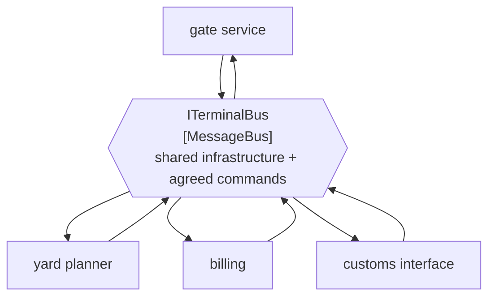

# Message Bus

🌍 🇬🇧 English (this file) · 🇫🇷 [Français](MessageBus-fr.md)

## Intent

Message Bus gives applications a shared messaging infrastructure and a common command set, so that one can be
added or removed without the others being touched.

## Problem

Eleven applications around the terminal, and every new one used to mean a point-to-point integration with each of
the others it needed.

The arithmetic is the problem. Eleven applications fully connected is fifty-five integrations, each with its own
format, its own schedule and its own owner — and the twelfth application does not add one integration, it adds up
to eleven. Retiring an application means finding everything that talked to it, which nobody has a list of.

Adding shared plumbing alone does not fix this. Eleven applications on one broker, each publishing its own shape of
message and each learning the shapes of the others, has the same arithmetic with a nicer diagram.

## Solution

The pattern is two things, and the second is the one that matters.

A message bus is the shared **infrastructure** — one messaging system every application connects to — *and* a
common **command set**, an agreed vocabulary in which those applications speak. With both, an application can be
added by learning the vocabulary, and removed by leaving; nothing else changes.

The sample is direct about which half is skipped: the command set is *the part people skip, and the part that makes
it more than a way of moving strings.*

## Structure



Every application has one connection rather than one per peer, and the fifth is added by drawing one more pair of
arrows instead of four.

## The roles

| Role | Annotation | Applies to | What it carries |
|---|---|---|---|
| MessageBus | `[MessageBus]` | interface, class, assembly | The participant that provides the shared infrastructure and the agreed vocabulary. |

One role, and it is the only one in this chapter that may be applied to an **assembly**. That target is the honest
one for this pattern: a bus is often not a type but a whole component — the shared library that carries the command
set and the connection — and annotating the assembly says so where annotating one interface inside it would
understate it.

## The example

From [`MessageBusUsage.cs`](../../../../DesignPatternCatalog.Usage/EnterpriseIntegration/MessageBusUsage.cs).

```csharp
[MessageBus]
public interface ITerminalBus {

    void Send(string command);

    void Subscribe(string commandType, Action<string> handler);

}
```

Both directions in one type, which no channel in this chapter has. A channel is one-way by nature; a bus is the
thing an application joins, and joining means both speaking and listening.

`commandType` is the command set made visible. It is a `string` here, and that is the sample being honest rather
than aspirational — in most codebases the vocabulary is a set of agreed names rather than a set of C# types. What
matters is that the parameter exists at all: a bus whose subscribe method took no type would be a transport, and
the agreement would live nowhere.

The name is `ITerminalBus` — the terminal's bus, not the broker's product. A bus named after its technology invites
the eleven applications to depend on the technology instead of on the vocabulary, which is how a bus becomes a
transport again.

The sample states the whole claim: *without a common command set a bus is only a transport; with one, an
application can be added or removed without the others being touched.*

## Applicability

**Use a message bus where the number of applications makes pairwise integration untenable.** The book's framing is
the arithmetic: the count of integrations grows with the square of the count of applications.

**Use it where applications come and go.** The payoff is that adding or removing one touches nothing else, which is
what makes a long-lived estate maintainable.

**Agree the command set, and treat it as the deliverable.** This is the pattern's own emphasis. Shared plumbing
without a shared vocabulary buys nothing that a broker did not already give.

**Consider annotating the assembly.** Where the bus is a shared component rather than a type, the assembly is what
the role describes.

## When not to use it

**Do not use it for two applications.** A bus between two participants is a channel with a committee, and the
vocabulary work has no payoff at that size.

**Do not build the infrastructure and skip the vocabulary.** This is the failure the sample names. Eleven
applications on one broker, each with its own message shapes, is fifty-five integrations wearing a bus.

**Do not let the command set become one application's model.** A vocabulary that is the yard planner's domain
objects makes every other application a client of the yard planner, and the coupling comes back with a nicer name.
The book's answer to shared vocabulary is
[Canonical Data Model](../../../generated/catalog-index.md#canonicaldatamodel-enterprise-integration-patterns), and
the counter-argument worth reading beside it is
[Bounded Context](../domain-driven-design/BoundedContext-en.md).

**Do not put logic in it.** A bus that decides what happens to a command has become a
[Message Broker](../../../generated/catalog-index.md#messagebroker-enterprise-integration-patterns) — a hub that
knows every destination — and the coupling the bus removed from the edges has been collected in the middle.

**Do not expect it to make the applications agree.** A shared vocabulary constrains how they speak, not what they
mean, and two applications can use the same command name correctly and still disagree about what a container is.

## Advantages

* An application is added or removed without any other being touched.
* The integration count grows with the applications rather than with their pairs.
* The agreed vocabulary is written down somewhere, which is the part pairwise integration never has.
* One connection per application, so operating the estate is one thing rather than fifty-five.
* Annotating the assembly lets a whole shared component say what it is.

## Drawbacks

* The command set is a shared artefact, and changing it needs the agreement of everybody on the bus.
* A vocabulary that suits every application suits none of them precisely, which is the standing cost of the middle
  ground.
* Everything depends on the bus, so its availability is the estate's availability.
* It can become a broker by accretion, one piece of logic at a time.
* The vocabulary constrains words rather than meanings, so agreement can be apparent rather than real.

## Relations with other patterns

**`MessageChannel`** is what a bus is made of, and the channels of this chapter are the properties an individual
conversation on a bus can have.

**`MessageBroker`** is the arrangement this becomes when the middle starts deciding: a hub that knows every
destination rather than shared plumbing plus an agreement.

**`CanonicalDataModel`** is the command set's data half, and the pattern to reach for when the vocabulary has to
span formats.

**`MessagingBridge`** is what joins two buses, and an estate with two is usually an estate mid-migration or
post-acquisition.

**`Messaging`** is the style, and the bus is the shape it takes at the scale of a whole estate rather than a single
conversation.

**`BoundedContext`**, in the Domain-Driven Design catalogue, is the argument against pushing a shared vocabulary
too far — a bus can standardise the words without standardising the models behind them.

## Source

*Enterprise Integration Patterns*, Gregor Hohpe and Bobby Woolf, Addison-Wesley, 2003 — the messaging-channels
chapter.

* [Index entry](../../../generated/catalog-index.md#messagebus-enterprise-integration-patterns)
* [Generated attribute](../../../../DesignPatternCatalog.EnterpriseIntegration/MessageBus.cs)
* [Example](../../../../DesignPatternCatalog.Usage/EnterpriseIntegration/MessageBusUsage.cs)
