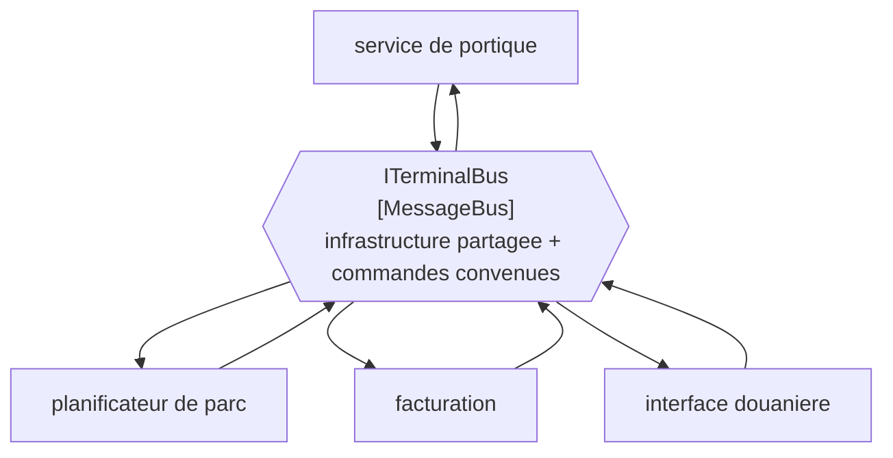

# Message Bus

🌍 🇫🇷 Français (ce fichier) · 🇬🇧 [English](MessageBus-en.md)

## Intention

Message Bus donne aux applications une infrastructure de messagerie partagée et un jeu de commandes commun, de sorte
que l'une puisse être ajoutée ou retirée sans que les autres soient touchées.

## Problème

Onze applications autour du terminal, et chaque nouvelle signifiait auparavant une intégration point à point avec
chacune des autres dont elle avait besoin.

L'arithmétique est le problème. Onze applications entièrement reliées font cinquante-cinq intégrations, chacune avec
son format, son calendrier et son propriétaire — et la douzième application n'ajoute pas une intégration, elle en
ajoute jusqu'à onze. Retirer une application demande de trouver tout ce qui lui parlait, dont personne n'a la liste.

Ajouter de la plomberie partagée ne suffit pas à corriger cela. Onze applications sur un courtier, chacune publiant
sa propre forme de message et apprenant les formes des autres, a la même arithmétique avec un plus beau diagramme.

## Solution

Le patron est deux choses, et la seconde est celle qui compte.

Un bus de messages est l'**infrastructure** partagée — un système de messagerie auquel chaque application se relie —
*et* un **jeu de commandes** commun, un vocabulaire convenu dans lequel ces applications parlent. Avec les deux, une
application s'ajoute en apprenant le vocabulaire et se retire en partant ; rien d'autre ne change.

L'exemple est direct sur la moitié qu'on saute : le jeu de commandes est *la part que les gens sautent, et la part
qui en fait plus qu'une façon de déplacer des chaînes.*

## Structure



Chaque application a une connexion plutôt qu'une par pair, et la cinquième s'ajoute en dessinant une paire de flèches
de plus au lieu de quatre.

## Les rôles

| Rôle | Annotation | S'applique à | Ce qu'il porte |
|---|---|---|---|
| MessageBus | `[MessageBus]` | interface, classe, assemblage | Le participant qui fournit l'infrastructure partagée et le vocabulaire convenu. |

Un seul rôle, et c'est le seul de ce chapitre qui puisse s'appliquer à un **assemblage**. Cette cible est l'honnête
pour ce patron : un bus n'est souvent pas un type mais un composant entier — la bibliothèque partagée qui porte le
jeu de commandes et la connexion — et annoter l'assemblage le dit, là où annoter une interface à l'intérieur le
sous-estimerait.

## L'exemple

Extrait de [`MessageBusUsage.cs`](../../../../DesignPatternCatalog.Usage/EnterpriseIntegration/MessageBusUsage.cs).

```csharp
[MessageBus]
public interface ITerminalBus {

    void Send(string command);

    void Subscribe(string commandType, Action<string> handler);

}
```

Les deux sens dans un seul type, ce qu'aucun canal de ce chapitre n'a. Un canal est à sens unique par nature ; un bus
est la chose qu'une application rejoint, et rejoindre veut dire à la fois parler et écouter.

`commandType` est le jeu de commandes rendu visible. C'est un `string` ici, et c'est l'exemple qui reste honnête
plutôt qu'ambitieux — dans la plupart des codes le vocabulaire est un ensemble de noms convenus plutôt qu'un ensemble
de types C#. Ce qui compte est que le paramètre existe : un bus dont la méthode d'abonnement ne prendrait aucun type
serait un transport, et l'accord ne vivrait nulle part.

Le nom est `ITerminalBus` — le bus du terminal, non le produit du courtier. Un bus nommé d'après sa technologie
invite les onze applications à dépendre de la technologie au lieu du vocabulaire, ce qui est la façon dont un bus
redevient un transport.

L'exemple énonce la revendication entière : *sans jeu de commandes commun un bus n'est qu'un transport ; avec un,
une application peut être ajoutée ou retirée sans que les autres soient touchées.*

## Possibilités d'application

**Employez un bus de messages là où le nombre d'applications rend l'intégration deux à deux intenable.** Le cadrage
du livre est l'arithmétique : le compte des intégrations croît avec le carré du compte des applications.

**Employez-le là où les applications vont et viennent.** Le gain est qu'en ajouter ou en retirer une ne touche à rien
d'autre, ce qui est ce qui rend un parc de longue vie maintenable.

**Convenez du jeu de commandes, et tenez-le pour le livrable.** C'est l'insistance propre du patron. De la plomberie
partagée sans vocabulaire partagé n'achète rien qu'un courtier ne donnait déjà.

**Envisagez d'annoter l'assemblage.** Là où le bus est un composant partagé plutôt qu'un type, l'assemblage est ce
que le rôle décrit.

## Quand ne pas l'utiliser

**Ne l'employez pas pour deux applications.** Un bus entre deux participants est un canal avec un comité, et le
travail de vocabulaire n'a aucun gain à cette taille.

**Ne bâtissez pas l'infrastructure en sautant le vocabulaire.** C'est l'échec que l'exemple nomme. Onze applications
sur un courtier, chacune avec ses propres formes de messages, sont cinquante-cinq intégrations déguisées en bus.

**Ne laissez pas le jeu de commandes devenir le modèle d'une application.** Un vocabulaire qui est les objets de
domaine du planificateur de parc fait de toutes les autres applications des clientes du planificateur, et le couplage
revient sous un plus joli nom. La réponse du livre au vocabulaire partagé est
[Canonical Data Model](../../../generated/catalog-index.md#canonicaldatamodel-enterprise-integration-patterns), et le
contre-argument qui vaut d'être lu à côté est [Bounded Context](../domain-driven-design/BoundedContext-fr.md).

**N'y mettez pas de logique.** Un bus qui décide ce qu'il advient d'une commande est devenu un
[Message Broker](../../../generated/catalog-index.md#messagebroker-enterprise-integration-patterns) — un pivot qui
connaît toutes les destinations — et le couplage que le bus avait retiré des bords a été rassemblé au milieu.

**N'attendez pas qu'il mette les applications d'accord.** Un vocabulaire partagé contraint la façon dont elles
parlent, non ce qu'elles veulent dire, et deux applications peuvent employer correctement le même nom de commande et
continuer de ne pas s'accorder sur ce qu'est un conteneur.

## Avantages

* Une application est ajoutée ou retirée sans qu'aucune autre soit touchée.
* Le compte des intégrations croît avec les applications plutôt qu'avec leurs paires.
* Le vocabulaire convenu est écrit quelque part, ce que l'intégration deux à deux n'a jamais.
* Une connexion par application : exploiter le parc est une chose plutôt que cinquante-cinq.
* Annoter l'assemblage permet à un composant partagé entier de dire ce qu'il est.

## Inconvénients

* Le jeu de commandes est un artefact partagé, et le changer demande l'accord de tous ceux qui sont sur le bus.
* Un vocabulaire qui convient à chaque application ne convient précisément à aucune, ce qui est le coût permanent du
  terrain d'entente.
* Tout dépend du bus : sa disponibilité est la disponibilité du parc.
* Il peut devenir un pivot par accrétion, un morceau de logique à la fois.
* Le vocabulaire contraint les mots plutôt que les sens : l'accord peut être apparent plutôt que réel.

## Liens avec les autres patrons

**`MessageChannel`** est ce dont un bus est fait, et les canaux de ce chapitre sont les propriétés qu'une
conversation particulière sur un bus peut avoir.

**`MessageBroker`** est l'agencement que celui-ci devient quand le milieu commence à décider : un pivot qui connaît
toutes les destinations plutôt que de la plomberie partagée plus un accord.

**`CanonicalDataModel`** est la moitié « données » du jeu de commandes, et le patron vers lequel se tourner quand le
vocabulaire doit enjamber des formats.

**`MessagingBridge`** est ce qui joint deux bus, et un parc qui en a deux est d'ordinaire un parc en cours de
migration ou d'après-acquisition.

**`Messaging`** est le style, et le bus est la forme qu'il prend à l'échelle d'un parc entier plutôt que d'une seule
conversation.

**`BoundedContext`**, dans le catalogue Domain-Driven Design, est l'argument contre le fait de pousser un vocabulaire
partagé trop loin — un bus peut normaliser les mots sans normaliser les modèles derrière eux.

## Source

*Enterprise Integration Patterns*, Gregor Hohpe et Bobby Woolf, Addison-Wesley, 2003 — le chapitre sur les canaux de
messagerie.

* [Entrée d'index](../../../generated/catalog-index.md#messagebus-enterprise-integration-patterns)
* [Attribut généré](../../../../DesignPatternCatalog.EnterpriseIntegration/MessageBus.cs)
* [Exemple](../../../../DesignPatternCatalog.Usage/EnterpriseIntegration/MessageBusUsage.cs)
