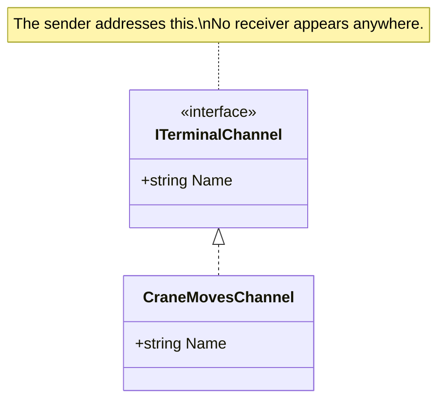

# Message Channel

🌍 🇬🇧 English (this file) · 🇫🇷 [Français](MessageChannel-fr.md)

## Intent

Message Channel names the logical path a message travels, so that a sender addresses a channel rather than a
receiver and neither has to know the other exists.

## Problem

Crane moves go one way, customs responses another, and the terminal's own audit trail a third.

Written as queue-name strings scattered through the code, the channel is a literal:

```csharp
_bus.Send("terminal.crane.moves", message);
```

A typo is a message that vanishes — no exception, no receiver, nothing. And a rename is a search across the
solution, with no way to be sure it was complete.

## Solution

The pattern gives the path a type.

The channel becomes a declared thing rather than a string, and the sender addresses it. What the pattern asserts
is that the sender chooses a **channel** and not a recipient — which is exactly what makes a receiver replaceable
without the sender being touched.

## Structure



One interface and one implementation, and the diagram has no receiver in it. That absence is the pattern: a
channel drawn with its consumers would be drawing something else.

## The roles

| Role | Annotation | Applies to | What it carries |
|---|---|---|---|
| MessageChannel | `[MessageChannel]` | interface, class | The channel itself, where a codebase gives it a type rather than a configured name. |

One role, and the qualification in its summary matters: *where a codebase gives it a type*. A channel configured
as a string in a settings file is still a channel — it is simply not annotatable, because there is no declaration
to annotate.

## The example

From [`MessageChannelUsage.cs`](../../../../DesignPatternCatalog.Usage/EnterpriseIntegration/MessageChannelUsage.cs).

```csharp
[MessageChannel]
public interface ITerminalChannel {

    string Name { get; }

}
```

One property. The channel's whole contract is that it has a name, and the type exists so that the name is written
once and referred to everywhere else.

```csharp
public sealed class CraneMovesChannel : ITerminalChannel {

    public string Name => "terminal.crane.moves";

}
```

The literal appears exactly once in the solution. A typo is now a compile error at the one place it could occur,
and a rename is an edit to one line.

Note that the implementation carries no annotation. The role is introduced by the interface, and annotating each
channel class would count one role several times — which is the convention
[ADR-0010](../../for-maintainers/adr/0010-annotate-the-declaration-that-introduces-a-role.md) states for the whole
catalogue.

The sample's remark names the assertion: *the sender chooses a channel and not a recipient — which is exactly what
makes a receiver replaceable without the sender being touched.*

## Applicability

**Use Message Channel wherever messaging is used at all.** The book presents it as one of the root patterns: a
message goes somewhere, and the somewhere is a channel.

**Give the channel a type where the codebase can.** That is this catalogue's contribution rather than the book's:
a typed channel is a channel a compiler can check and a tool can enumerate.

**Address a channel, never a receiver.** This is the discipline the annotation records, and the property every
other pattern in the catalogue depends on.

## When not to use it

The book does not offer channels as optional — anything that sends a message sends it somewhere. What is worth
saying instead is where the *typed* form does not apply, and where a channel is the wrong tool.

**Do not annotate a channel that has no declaration.** A queue named in configuration is a channel and has no
type; there is nothing to mark, and inventing an empty class to carry the annotation would put an artefact of this
system into the code.

**Do not use one channel for payloads a receiver cannot tell apart.** That is
[Datatype Channel](../../../generated/catalog-index.md#datatypechannel-enterprise-integration-patterns)'s subject,
and the failure it prevents: a consumer that must inspect a message to learn whether it was meant for it.

**Do not name a channel after its consumer.** `terminal.billing.input` couples the publisher to who reads, which
is the whole thing the pattern removes. Name it after what travels.

## Advantages

* The channel name exists once, so a typo is a compile error rather than a lost message.
* A rename is one edit.
* The sender is coupled to a path and not to a party, so a receiver can be replaced or added freely.
* Channels become enumerable: a tool can list what paths a system has, which a set of string literals cannot.

## Drawbacks

* A type per channel is a type per channel, and a system with forty of them has forty small classes.
* The type is a local convenience: the broker still knows only the string, so the two can drift if the name is
  duplicated anywhere.
* Nothing prevents a sender from being given a receiver instead — the annotation records the discipline and does
  not impose it.

## Relations with other patterns

**`Message`** is what travels on it, and the two are the minimum pair: a message with nowhere to go and a channel
with nothing on it are both incomplete.

**`MessageEndpoint`** is how an application attaches to a channel, and where the broker's API lives.

**`PointToPointChannel`** and **`PublishSubscribeChannel`** are the two kinds, and the choice between them decides
whether one consumer or all of them see each message.

**`DatatypeChannel`**, **`InvalidMessageChannel`** and **`DeadLetterChannel`** are channels with a stated purpose,
and each is a decision about what a channel is allowed to carry.

**`PipesAndFilters`** uses channels as the joints between steps, which is what decouples the steps in time.

## Source

*Enterprise Integration Patterns*, Gregor Hohpe and Bobby Woolf, Addison-Wesley, 2003 — chapter 3, messaging
systems.

* [Index entry](../../../generated/catalog-index.md#messagechannel-enterprise-integration-patterns)
* [Generated attribute](../../../../DesignPatternCatalog.EnterpriseIntegration/MessageChannel.cs)
* [Example](../../../../DesignPatternCatalog.Usage/EnterpriseIntegration/MessageChannelUsage.cs)
