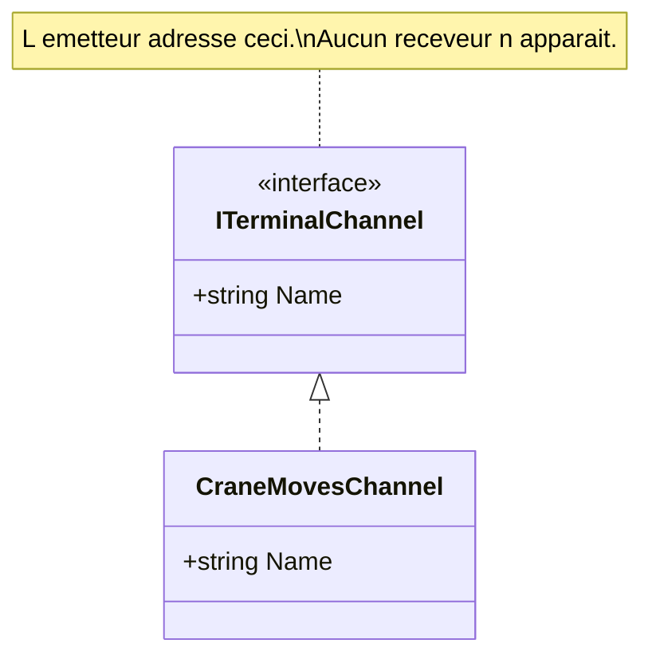

# Message Channel

🌍 🇫🇷 Français (ce fichier) · 🇬🇧 [English](MessageChannel-en.md)

## Intention

Message Channel nomme le chemin logique qu'emprunte un message, de sorte qu'un émetteur adresse un canal plutôt
qu'un receveur et qu'aucun des deux n'ait à savoir que l'autre existe.

## Problème

Les mouvements de portique vont dans un sens, les réponses de la douane dans un autre, et la piste d'audit du
terminal dans un troisième.

Écrit en chaînes de noms de files dispersées dans le code, le canal est un littéral :

```csharp
_bus.Send("terminal.crane.moves", message);
```

Une faute de frappe est un message qui disparaît — pas d'exception, pas de receveur, rien. Et un renommage est une
recherche dans toute la solution, sans moyen d'être sûr qu'elle est complète.

## Solution

Le patron donne un type au chemin.

Le canal devient une chose déclarée plutôt qu'une chaîne, et l'émetteur l'adresse. Ce que le patron affirme, c'est
que l'émetteur choisit un **canal** et non un destinataire — ce qui est exactement ce qui rend un receveur
remplaçable sans qu'on touche à l'émetteur.

## Structure



Une interface et une implémentation, et le diagramme n'a aucun receveur. Cette absence est le patron : un canal
dessiné avec ses consommateurs dessinerait autre chose.

## Les rôles

| Rôle | Annotation | S'applique à | Ce qu'il porte |
|---|---|---|---|
| MessageChannel | `[MessageChannel]` | interface, classe | Le canal lui-même, là où une base de code lui donne un type plutôt qu'un nom configuré. |

Un seul rôle, et la réserve de son résumé compte : *là où une base de code lui donne un type*. Un canal configuré
en chaîne dans un fichier de réglages est toujours un canal — il n'est simplement pas annotable, faute de
déclaration à annoter.

## L'exemple

Extrait de [`MessageChannelUsage.cs`](../../../../DesignPatternCatalog.Usage/EnterpriseIntegration/MessageChannelUsage.cs).

```csharp
[MessageChannel]
public interface ITerminalChannel {

    string Name { get; }

}
```

Une propriété. Tout le contrat du canal est d'avoir un nom, et le type existe pour que ce nom soit écrit une fois et
référencé partout ailleurs.

```csharp
public sealed class CraneMovesChannel : ITerminalChannel {

    public string Name => "terminal.crane.moves";

}
```

Le littéral apparaît exactement une fois dans la solution. Une faute de frappe est désormais une erreur de
compilation au seul endroit où elle pouvait se produire, et un renommage est une modification d'une ligne.

Noter que l'implémentation ne porte pas d'annotation. Le rôle est introduit par l'interface, et annoter chaque
classe de canal compterait un rôle plusieurs fois — c'est la convention que
l'[ADR-0010](../../for-maintainers/adr/0010-annotate-the-declaration-that-introduces-a-role.fr.md) énonce pour tout
le catalogue.

La remarque de l'exemple nomme l'affirmation : *l'émetteur choisit un canal et non un destinataire — ce qui est
exactement ce qui rend un receveur remplaçable sans qu'on touche à l'émetteur.*

## Possibilités d'application

**Employez Message Channel partout où la messagerie est employée.** Le livre le présente comme l'un des patrons
racines : un message va quelque part, et ce quelque part est un canal.

**Donnez au canal un type là où la base de code le permet.** C'est la contribution de ce catalogue plutôt que celle
du livre : un canal typé est un canal qu'un compilateur peut vérifier et qu'un outil peut énumérer.

**Adressez un canal, jamais un receveur.** C'est la discipline que l'annotation consigne, et la propriété dont
dépend tout autre patron du catalogue.

## Quand ne pas l'utiliser

Le livre ne propose pas les canaux comme facultatifs — tout ce qui envoie un message l'envoie quelque part. Ce qui
mérite d'être dit à la place, c'est où la forme *typée* ne s'applique pas, et où un canal est le mauvais outil.

**N'annotez pas un canal qui n'a pas de déclaration.** Une file nommée en configuration est un canal et n'a pas de
type ; il n'y a rien à marquer, et inventer une classe vide pour porter l'annotation mettrait un artefact de ce
système dans le code.

**N'employez pas un canal unique pour des charges utiles qu'un receveur ne peut pas distinguer.** C'est le sujet de
[Datatype Channel](../../../generated/catalog-index.md#datatypechannel-enterprise-integration-patterns), et l'échec
qu'il prévient : un consommateur obligé d'inspecter un message pour savoir s'il lui était destiné.

**Ne nommez pas un canal d'après son consommateur.** `terminal.billing.input` couple l'éditeur à qui lit, ce qui est
précisément ce que le patron retire. Nommez-le d'après ce qui voyage.

## Avantages

* Le nom du canal existe une fois : une faute de frappe est une erreur de compilation plutôt qu'un message perdu.
* Un renommage est une modification.
* L'émetteur est couplé à un chemin et non à une partie : un receveur peut être remplacé ou ajouté librement.
* Les canaux deviennent énumérables : un outil peut lister les chemins d'un système, ce qu'un jeu de littéraux ne
  permet pas.

## Inconvénients

* Un type par canal est un type par canal, et un système qui en a quarante a quarante petites classes.
* Le type est une commodité locale : le courtier ne connaît toujours que la chaîne, et les deux peuvent diverger si
  le nom est dupliqué quelque part.
* Rien n'empêche de donner un receveur à un émetteur — l'annotation consigne la discipline et ne l'impose pas.

## Liens avec les autres patrons

**`Message`** est ce qui voyage dessus, et les deux forment la paire minimale : un message sans destination et un
canal sans rien dessus sont tous deux incomplets.

**`MessageEndpoint`** est la façon dont une application s'attache à un canal, et l'endroit où vit l'API du courtier.

**`PointToPointChannel`** et **`PublishSubscribeChannel`** sont les deux espèces, et le choix entre elles décide si
un consommateur ou tous voient chaque message.

**`DatatypeChannel`**, **`InvalidMessageChannel`** et **`DeadLetterChannel`** sont des canaux à finalité énoncée, et
chacun est une décision sur ce qu'un canal a le droit de porter.

**`PipesAndFilters`** emploie des canaux comme jointures entre étapes, ce qui découple les étapes dans le temps.

## Source

*Enterprise Integration Patterns*, Gregor Hohpe et Bobby Woolf, Addison-Wesley, 2003 — chapitre 3, les systèmes de
messagerie.

* [Entrée d'index](../../../generated/catalog-index.md#messagechannel-enterprise-integration-patterns)
* [Attribut généré](../../../../DesignPatternCatalog.EnterpriseIntegration/MessageChannel.cs)
* [Exemple](../../../../DesignPatternCatalog.Usage/EnterpriseIntegration/MessageChannelUsage.cs)
