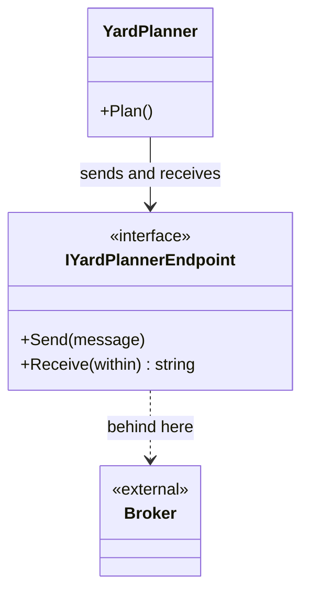

# Message Endpoint

🌍 🇬🇧 English (this file) · 🇫🇷 [Français](MessageEndpoint-fr.md)

## Intent

Message Endpoint encapsulates how an application attaches to a channel, so that the application's code sends and
receives without holding the messaging system's API.

## Problem

The yard planner should not hold a broker's connection factory, its retry policy or its serialiser.

```csharp
using QueueConnection connection = _factory.CreateConnection(_settings.Broker);
using QueueSession session = connection.CreateSession(transacted: true);
session.CreateProducer(session.CreateQueue("terminal.yard.planning")).Send(…);
```

Three lines of broker and none of yard planning. And the day the terminal moves from MSMQ to a cloud bus, the
planner should not know — but with this code, it is the planner that changes.

## Solution

The pattern is that seam.

The application sends and receives through a type of its own; the messaging library lives behind it. Connection,
session, serialisation, retry and acknowledgement are the endpoint's business, and the yard planner's code mentions
none of them.

Two things follow, and they are the reason the pattern is a root rather than a convenience: the application can be
tested without a broker, and the broker can be replaced without the application.

## Structure



The application's arrow stops at the interface. Everything to the right of it — connection strings, retries,
serialisers — is on the far side of the seam.

## The roles

| Role | Annotation | Applies to | What it carries |
|---|---|---|---|
| MessageEndpoint | `[MessageEndpoint]` | interface, class | The participant that connects application code to a channel. |

One role, and the sample annotates the **interface**: the seam is the contract, and it is the interface that lets an
implementation be swapped for a fake.

## The example

From [`MessageEndpointUsage.cs`](../../../../DesignPatternCatalog.Usage/EnterpriseIntegration/MessageEndpointUsage.cs).

```csharp
[MessageEndpoint]
public interface IYardPlannerEndpoint {

    void Send(string message);

    string? Receive(TimeSpan within);

}
```

Two methods, and what is absent from them is the pattern. No connection, no queue name, no serialiser, no retry
count, no acknowledgement — none of it appears, because none of it is the yard planner's business.

`Receive(TimeSpan within)` is the one concession to messaging, and it is an honest one: a receive that may find
nothing has to say how long it will wait, and that is a decision the application makes rather than the broker.
`string?` returning null is *nothing arrived in time*, which is a normal outcome rather than a failure.

The sample's remark states both payoffs: *the seam the messaging library lives behind, which is what lets the
application be tested without a broker and the broker be replaced without the application.*

Note also what is **not** here: the channel. The endpoint knows which channel it serves, and the application does
not — which is the division that keeps [Message Channel](MessageChannel-en.md)'s promise that a sender addresses a
channel and not a recipient.

## Applicability

**Use Message Endpoint wherever an application sends or receives.** The book presents it as a root pattern: an
application does not talk to a channel directly, it talks through an endpoint.

**Use it so that the application can be tested without a broker.** This is the practical benefit and the one that is
felt first — a fake endpoint is two methods.

**Use it so that the messaging technology can be replaced.** MSMQ to a cloud bus should be a change behind the
interface and nowhere else.

**Keep the messaging vocabulary behind it.** The book's own point: the endpoint is the only place that knows the
library, and an application that mentions a session has lost the seam.

## When not to use it

**Do not let the broker's vocabulary leak through it.** An endpoint whose method takes the library's own message
type, or whose interface throws the library's exceptions, is a seam in name only — the application still cannot be
compiled without the library.

**Do not make one endpoint for the whole application.** An endpoint per channel, or per meaningful conversation,
keeps the interface small; a single type with fourteen methods is the messaging library again, with different names.

**Do not put business decisions in it.** Retry and acknowledgement are the endpoint's; deciding that a rejected
manifest should be re-sent tomorrow is the domain's, and burying it here hides it.

**Do not use it to hide that messaging is asynchronous.** An endpoint whose `Send` blocks until a reply arrives has
made a channel look like a call, which is the coupling
[Remote Procedure Invocation](RemoteProcedureInvocation-en.md) is honest about and this is not. Where a reply is
genuinely needed, the pattern for it is
[Request-Reply](../../../generated/catalog-index.md#requestreply-enterprise-integration-patterns).

## Advantages

* The application holds no messaging API, so it compiles and tests without a broker.
* The broker can be replaced behind the interface.
* The channel is the endpoint's knowledge, not the application's.
* Retry, serialisation and acknowledgement live in one place per conversation rather than at every send.
* A fake endpoint is two methods, which makes the application's tests fast and hermetic.

## Drawbacks

* It is another abstraction, and one per conversation means several.
* An endpoint that leaks the library's types gives the appearance of a seam without the substance.
* Messaging concerns that genuinely need tuning — prefetch, batching, ordering — end up either hidden or pushed back
  through the interface.
* The asynchrony can be hidden by an endpoint that blocks, and the interface will not say so.

## Relations with other patterns

**`MessageChannel`** is what the endpoint attaches to, and the endpoint is what keeps the channel out of the
application.

**`Message`** is what crosses it, and the endpoint is usually where a message becomes bytes and back.

**`MessagingGateway`** is the specialised form of this in the messaging-endpoints chapter — an endpoint that
presents a domain-shaped interface rather than a send-and-receive one.

**`PollingConsumer`** and **`EventDrivenConsumer`** are the two ways an endpoint receives, and the choice between
them is the one thing `Receive(TimeSpan)` above has already made.

**`Messaging`** is the style all of this serves: the endpoint is the seam that keeps the style from reaching into the
application.

## Source

*Enterprise Integration Patterns*, Gregor Hohpe and Bobby Woolf, Addison-Wesley, 2003 — chapter 3, messaging
systems.

* [Index entry](../../../generated/catalog-index.md#messageendpoint-enterprise-integration-patterns)
* [Generated attribute](../../../../DesignPatternCatalog.EnterpriseIntegration/MessageEndpoint.cs)
* [Example](../../../../DesignPatternCatalog.Usage/EnterpriseIntegration/MessageEndpointUsage.cs)
