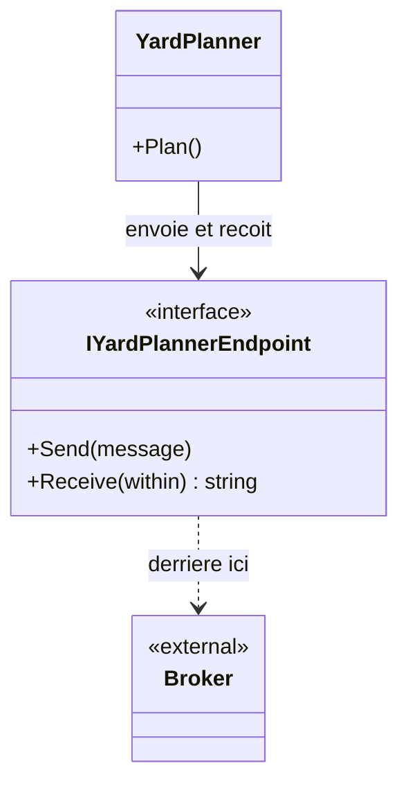

# Message Endpoint

🌍 🇫🇷 Français (ce fichier) · 🇬🇧 [English](MessageEndpoint-en.md)

## Intention

Message Endpoint encapsule la façon dont une application s'attache à un canal, de sorte que le code de l'application
envoie et reçoive sans détenir l'API du système de messagerie.

## Problème

Le planificateur de parc ne devrait pas détenir la fabrique de connexions d'un courtier, sa politique de réessai ni
son sérialiseur.

```csharp
using QueueConnection connection = _factory.CreateConnection(_settings.Broker);
using QueueSession session = connection.CreateSession(transacted: true);
session.CreateProducer(session.CreateQueue("terminal.yard.planning")).Send(…);
```

Trois lignes de courtier et aucune de planification de parc. Et le jour où le terminal passe de MSMQ à un bus dans le
nuage, le planificateur ne devrait pas le savoir — mais avec ce code, c'est le planificateur qui change.

## Solution

Le patron est cette couture.

L'application envoie et reçoit à travers un type propre ; la bibliothèque de messagerie vit derrière. Connexion,
session, sérialisation, réessai et acquittement sont l'affaire du point de terminaison, et le code du planificateur
n'en mentionne aucun.

Deux choses s'ensuivent, et ce sont elles qui font de ce patron une racine plutôt qu'une commodité : l'application
peut être testée sans courtier, et le courtier peut être remplacé sans l'application.

## Structure



La flèche de l'application s'arrête à l'interface. Tout ce qui est à sa droite — chaînes de connexion, réessais,
sérialiseurs — est de l'autre côté de la couture.

## Les rôles

| Rôle | Annotation | S'applique à | Ce qu'il porte |
|---|---|---|---|
| MessageEndpoint | `[MessageEndpoint]` | interface, classe | Le participant qui relie le code applicatif à un canal. |

Un seul rôle, et l'exemple annote l'**interface** : la couture est le contrat, et c'est l'interface qui permet
d'échanger une implémentation contre une doublure.

## L'exemple

Extrait de [`MessageEndpointUsage.cs`](../../../../DesignPatternCatalog.Usage/EnterpriseIntegration/MessageEndpointUsage.cs).

```csharp
[MessageEndpoint]
public interface IYardPlannerEndpoint {

    void Send(string message);

    string? Receive(TimeSpan within);

}
```

Deux méthodes, et ce qui en est absent est le patron. Pas de connexion, pas de nom de file, pas de sérialiseur, pas de
compte de réessais, pas d'acquittement — rien n'apparaît, parce que rien de cela n'est l'affaire du planificateur de
parc.

`Receive(TimeSpan within)` est la seule concession à la messagerie, et elle est honnête : une réception qui peut ne
rien trouver doit dire combien de temps elle attendra, et c'est une décision que prend l'application plutôt que le
courtier. Un `string?` qui rend `null` veut dire *rien n'est arrivé à temps*, ce qui est une issue normale plutôt
qu'un échec.

La remarque de l'exemple énonce les deux gains : *la couture derrière laquelle vit la bibliothèque de messagerie, ce
qui permet à l'application d'être testée sans courtier et au courtier d'être remplacé sans l'application.*

Noter aussi ce qui n'est **pas** là : le canal. Le point de terminaison sait quel canal il sert, et l'application non —
c'est la division qui tient la promesse de [Message Channel](MessageChannel-fr.md), à savoir qu'un émetteur adresse
un canal et non un destinataire.

## Possibilités d'application

**Employez Message Endpoint partout où une application envoie ou reçoit.** Le livre le présente comme un patron
racine : une application ne parle pas à un canal directement, elle parle à travers un point de terminaison.

**Employez-le pour que l'application puisse être testée sans courtier.** C'est le bénéfice pratique et celui qu'on
ressent d'abord — une doublure de point de terminaison fait deux méthodes.

**Employez-le pour que la technologie de messagerie puisse être remplacée.** MSMQ vers un bus dans le nuage doit être
un changement derrière l'interface et nulle part ailleurs.

**Gardez le vocabulaire de la messagerie derrière lui.** Le propos propre du livre : le point de terminaison est le
seul endroit qui connaisse la bibliothèque, et une application qui mentionne une session a perdu la couture.

## Quand ne pas l'utiliser

**Ne laissez pas le vocabulaire du courtier fuir à travers lui.** Un point de terminaison dont la méthode prend le
type de message de la bibliothèque, ou dont l'interface lève les exceptions de la bibliothèque, est une couture de nom
seulement — l'application ne compile toujours pas sans la bibliothèque.

**Ne faites pas un point de terminaison pour toute l'application.** Un par canal, ou par conversation significative,
garde l'interface petite ; un type unique à quatorze méthodes est la bibliothèque de messagerie revenue sous d'autres
noms.

**N'y mettez pas de décisions métier.** Réessai et acquittement sont l'affaire du point de terminaison ; décider qu'un
manifeste rejeté doit être renvoyé demain est celle du domaine, et l'enterrer ici le cache.

**Ne l'employez pas pour masquer que la messagerie est asynchrone.** Un point de terminaison dont le `Send` bloque
jusqu'à l'arrivée d'une réponse a fait ressembler un canal à un appel, soit le couplage dont
[Remote Procedure Invocation](RemoteProcedureInvocation-fr.md) est honnête et dont celui-ci ne l'est pas. Là où une
réponse est réellement nécessaire, le patron pour cela est
[Request-Reply](../../../generated/catalog-index.md#requestreply-enterprise-integration-patterns).

## Avantages

* L'application ne détient aucune API de messagerie : elle compile et se teste sans courtier.
* Le courtier peut être remplacé derrière l'interface.
* Le canal est la connaissance du point de terminaison, non celle de l'application.
* Réessai, sérialisation et acquittement vivent à un endroit par conversation plutôt qu'à chaque envoi.
* Une doublure de point de terminaison fait deux méthodes, ce qui rend les tests de l'application rapides et
  hermétiques.

## Inconvénients

* C'est une abstraction de plus, et un par conversation en fait plusieurs.
* Un point de terminaison qui laisse fuir les types de la bibliothèque donne l'apparence d'une couture sans la
  substance.
* Les préoccupations de messagerie qui demandent vraiment un réglage — préchargement, lots, ordre — finissent soit
  cachées, soit repoussées à travers l'interface.
* L'asynchronie peut être masquée par un point de terminaison qui bloque, et l'interface ne le dira pas.

## Liens avec les autres patrons

**`MessageChannel`** est ce à quoi le point de terminaison s'attache, et le point de terminaison est ce qui garde le
canal hors de l'application.

**`Message`** est ce qui le traverse, et le point de terminaison est d'ordinaire l'endroit où un message devient des
octets et inversement.

**`MessagingGateway`** est la forme spécialisée de celui-ci au chapitre sur les points de terminaison — un point de
terminaison qui présente une interface façonnée par le domaine plutôt qu'une interface d'envoi et de réception.

**`PollingConsumer`** et **`EventDrivenConsumer`** sont les deux façons dont un point de terminaison reçoit, et le
choix entre elles est la seule chose que le `Receive(TimeSpan)` ci-dessus a déjà tranchée.

**`Messaging`** est le style que tout cela sert : le point de terminaison est la couture qui empêche le style
d'atteindre l'application.

## Source

*Enterprise Integration Patterns*, Gregor Hohpe et Bobby Woolf, Addison-Wesley, 2003 — chapitre 3, les systèmes de
messagerie.

* [Entrée d'index](../../../generated/catalog-index.md#messageendpoint-enterprise-integration-patterns)
* [Attribut généré](../../../../DesignPatternCatalog.EnterpriseIntegration/MessageEndpoint.cs)
* [Exemple](../../../../DesignPatternCatalog.Usage/EnterpriseIntegration/MessageEndpointUsage.cs)
