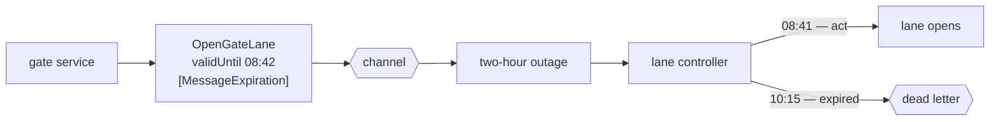

# Message Expiration

🌍 🇬🇧 English (this file) · 🇫🇷 [Français](MessageExpiration-fr.md)

## Intent

Message Expiration says when a message stops being worth acting on, so that a stale instruction is discarded
rather than obeyed late.

## Problem

A gate instruction is queued during a two-hour broker outage, and arrives after the truck has left.

Obeying it opens a lane for a vehicle that is no longer there. The next truck in the line drives through a lane
it was not cleared for, and the terminal has admitted a vehicle it did not check.

The receiver did nothing wrong. It read a valid instruction, from a legitimate sender, and carried it out — and
there is nothing in the message, in the channel or in the receiver's own state that could have told it the
instruction had gone stale. From where the receiver stands, an instruction two hours old and one two seconds old
look identical.

## Solution

The pattern is a property on the message saying when it stops being worth obeying.

The sender knows the deadline, because the sender knows what the instruction is for: a lane opening is worth
something for a few minutes and worth nothing after that. Carrying it on the message is what lets a receiver
decide, and the decision is the one the sender would have made.

What expires is not delivered late — it is discarded, and where it goes is
[Dead Letter Channel](DeadLetterChannel-en.md), so that expiry is visible rather than silent.

## Structure



The same message, the same receiver, two different outcomes decided by one property.

## The roles

| Role | Annotation | Applies to | What it carries |
|---|---|---|---|
| MessageExpiration | `[MessageExpiration]` | property, field | The property after which the message should not be processed. |

One role, on a property. What it marks is an **instruction to the receiver**, which is unusual: most of what a
message carries is data, and this is a rule about how to treat the rest of it.

## The example

From [`MessageExpirationUsage.cs`](../../../../DesignPatternCatalog.Usage/EnterpriseIntegration/MessageExpirationUsage.cs).

```csharp
public string Lane { get; }

/// <summary>
///     After this, do not process.
/// </summary>
[MessageExpiration]
public DateTimeOffset ValidUntil { get; }
```

`DateTimeOffset` rather than a `TimeSpan` — an absolute moment, not a duration. A duration would have to be
counted from something, and the two candidates are when the message was sent and when it arrived; the first
requires a clock the receiver does not have, and the second makes an expiry impossible to reach, since a message
delayed two hours would begin its lifetime on arrival.

`ValidUntil` names the thing rather than the mechanism. A property called `Ttl` or `ExpiresAt` would read as
infrastructure; `ValidUntil` reads as a fact about the instruction, which is what it is.

The summary is an imperative — *after this, do not process* — because that is what the property is. It does not
describe the message; it tells the receiver what to do with it.

The remark states why the receiver cannot work it out alone: *a message queued through an outage may arrive after
it has become wrong, and a receiver has no other way to know that.*

## Applicability

**Use a message expiration where acting late is worse than not acting.** The book's case, and the test worth
applying: if a late execution is merely useless, this is optional; if it is harmful, it is not.

**Use it on instructions whose worth is bounded in time.** Gate lanes, quotes, holds pending a decision — a
[command](CommandMessage-en.md) is the kind that usually needs one.

**Let the sender set it.** The deadline follows from what the instruction is for, and the sender is the party
that knows.

**Send what expires to a dead letter channel.** Expiry is a delivery outcome, and one that is
[visible](DeadLetterChannel-en.md) is worth more than one that is silent.

## When not to use it

**Do not use it on a fact.** An [event](EventMessage-en.md) reporting that a container moved is still true two
hours later; expiring it discards history because a broker was down.

**Do not use it on data that keeps.** A [document](DocumentMessage-en.md) is usually worth reading late, and a
stowage plan that expired in transit is a plan somebody now has to ask for again.

**Do not use it to paper over a slow consumer.** Expiry then hides a backlog by discarding it, and the symptom
disappears along with the work.

**Do not rely on synchronised clocks between systems.** An absolute deadline compared against a receiver's own
clock is only as good as that clock, and a receiver running a few minutes fast discards instructions that were
still valid.

**Do not expire silently.** A message that vanishes because it was late and says so nowhere produces the same
investigation as a message that was lost.

**Do not treat it as a substitute for idempotence.** Expiry bounds *when* a message may be acted on, not *how many
times* — a redelivery inside the window is still a second execution.

## Advantages

* A stale instruction is discarded rather than obeyed, which is the whole point.
* The decision is the sender's, made where the knowledge of what the instruction is for lives.
* The receiver needs no special case and no configuration: it compares one property.
* An outage stops producing a burst of wrong actions when the broker comes back.
* It bounds how long a requestor must keep state for an unanswered request.

## Drawbacks

* It depends on clocks agreeing between systems, and they do not perfectly.
* An expiry set too short discards work that was still good; too long, and the pattern buys nothing.
* It can hide a backlog rather than reveal one, by discarding the evidence.
* It bounds time and not repetition, so it is not a defence against redelivery.
* Expiry without a dead letter channel is silent loss with an explanation nobody sees.

## Relations with other patterns

**`CommandMessage`** is the kind that usually needs one, since an instruction is what goes wrong when obeyed
late.

**`DeadLetterChannel`** is where the book puts what has expired, which turns a discard into an observable event.

**`EventMessage`** and **`DocumentMessage`** are the kinds that usually should not carry one, because a fact and a
document keep.

**`RequestReply`** benefits twice: the request expires, which also bounds how long the requestor must hold state
and how long a [correlation identifier](CorrelationIdentifier-en.md) must stay unique.

**`MessageSequence`** needs something like it, since a set that will never complete otherwise occupies its
receiver for ever.

**`GuaranteedDelivery`** is the tension worth naming: one keeps a message until it is delivered, the other says
delivery can come too late to matter, and a channel with both is saying *do not lose this, and do not obey it
after nine o'clock*.

## Source

*Enterprise Integration Patterns*, Gregor Hohpe and Bobby Woolf, Addison-Wesley, 2003 — the message-construction
chapter.

* [Index entry](../../../generated/catalog-index.md#messageexpiration-enterprise-integration-patterns)
* [Generated attribute](../../../../DesignPatternCatalog.EnterpriseIntegration/MessageExpiration.cs)
* [Example](../../../../DesignPatternCatalog.Usage/EnterpriseIntegration/MessageExpirationUsage.cs)
