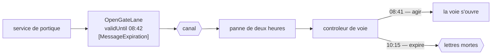

# Message Expiration

🌍 🇫🇷 Français (ce fichier) · 🇬🇧 [English](MessageExpiration-en.md)

## Intention

Message Expiration dit à partir de quand un message cesse de valoir la peine d'être suivi, de sorte qu'une
instruction périmée soit écartée plutôt qu'obéie tardivement.

## Problème

Une instruction de portique est mise en file pendant une panne de courtier de deux heures, et arrive après le
départ du camion.

Lui obéir ouvre une voie pour un véhicule qui n'est plus là. Le camion suivant dans la file franchit une voie pour
laquelle il n'avait pas été autorisé, et le terminal a admis un véhicule qu'il n'a pas contrôlé.

Le receveur n'a rien fait de mal. Il a lu une instruction valide, d'un émetteur légitime, et l'a exécutée — et il
n'y a rien dans le message, dans le canal ni dans son propre état qui aurait pu lui dire que l'instruction était
périmée. D'où il se tient, une instruction vieille de deux heures et une vieille de deux secondes se ressemblent.

## Solution

Le patron est une propriété du message qui dit quand il cesse de valoir la peine d'être suivi.

L'émetteur connaît l'échéance, parce qu'il sait à quoi sert l'instruction : l'ouverture d'une voie vaut quelque
chose pendant quelques minutes et ne vaut plus rien après. La porter sur le message est ce qui permet à un receveur
de décider, et la décision est celle que l'émetteur aurait prise.

Ce qui expire n'est pas délivré tardivement — c'est écarté, et où cela va est
[Dead Letter Channel](DeadLetterChannel-fr.md), de sorte que l'expiration soit visible plutôt que silencieuse.

## Structure



Le même message, le même receveur, deux issues différentes décidées par une seule propriété.

## Les rôles

| Rôle | Annotation | S'applique à | Ce qu'il porte |
|---|---|---|---|
| MessageExpiration | `[MessageExpiration]` | propriété, champ | La propriété après laquelle le message ne devrait pas être traité. |

Un seul rôle, sur une propriété. Ce qu'il marque est une **instruction au receveur**, ce qui est inhabituel : ce
qu'un message porte est le plus souvent de la donnée, et ceci est une règle sur la façon de traiter le reste.

## L'exemple

Extrait de [`MessageExpirationUsage.cs`](../../../../DesignPatternCatalog.Usage/EnterpriseIntegration/MessageExpirationUsage.cs).

```csharp
public string Lane { get; }

/// <summary>
///     After this, do not process.
/// </summary>
[MessageExpiration]
public DateTimeOffset ValidUntil { get; }
```

`DateTimeOffset` plutôt qu'un `TimeSpan` — un instant absolu, non une durée. Une durée devrait être comptée à
partir de quelque chose, et les deux candidats sont l'envoi du message et son arrivée ; le premier exige une
horloge que le receveur n'a pas, et le second rend une expiration impossible à atteindre, puisqu'un message retardé
de deux heures commencerait sa vie à l'arrivée.

`ValidUntil` nomme la chose plutôt que le mécanisme. Une propriété appelée `Ttl` ou `ExpiresAt` se lirait comme de
l'infrastructure ; `ValidUntil` se lit comme un fait portant sur l'instruction, ce qu'elle est.

Le résumé est un impératif — *après ceci, ne pas traiter* — parce que c'est ce qu'est la propriété. Elle ne décrit
pas le message ; elle dit au receveur quoi en faire.

La remarque énonce pourquoi le receveur ne peut pas le déduire seul : *un message resté en file pendant une panne
peut arriver après être devenu faux, et un receveur n'a aucun autre moyen de le savoir.*

## Possibilités d'application

**Employez une expiration là où agir tard est pire que ne pas agir.** Le cas du livre, et le test qui vaut d'être
appliqué : si une exécution tardive est seulement inutile, ceci est facultatif ; si elle est nuisible, non.

**Employez-la sur des instructions dont la valeur est bornée dans le temps.** Voies de portique, cotations,
retenues en attente d'une décision — une [commande](CommandMessage-fr.md) est la sorte qui en a d'ordinaire besoin.

**Laissez l'émetteur la fixer.** L'échéance découle de ce à quoi sert l'instruction, et l'émetteur est la partie
qui sait.

**Envoyez ce qui expire vers un canal de lettres mortes.** L'expiration est une issue de délivrance, et une issue
[visible](DeadLetterChannel-fr.md) vaut mieux qu'une issue silencieuse.

## Quand ne pas l'utiliser

**Ne l'employez pas sur un fait.** Un [événement](EventMessage-fr.md) qui rapporte qu'un conteneur a bougé reste
vrai deux heures plus tard ; le faire expirer jette de l'histoire parce qu'un courtier était arrêté.

**Ne l'employez pas sur des données qui se conservent.** Un [document](DocumentMessage-fr.md) vaut d'ordinaire
d'être lu tardivement, et un plan d'arrimage expiré en chemin est un plan qu'il faut maintenant redemander.

**Ne l'employez pas pour masquer un consommateur lent.** L'expiration cache alors un arriéré en le jetant, et le
symptôme disparaît avec le travail.

**Ne comptez pas sur des horloges synchronisées entre systèmes.** Une échéance absolue comparée à l'horloge propre
d'un receveur ne vaut que ce que vaut cette horloge, et un receveur qui avance de quelques minutes écarte des
instructions encore valides.

**Ne faites pas expirer en silence.** Un message qui disparaît parce qu'il était en retard et ne le dit nulle part
produit la même enquête qu'un message perdu.

**N'y voyez pas un substitut à l'idempotence.** L'expiration borne *quand* un message peut être suivi, non *combien
de fois* — une redélivrance dans la fenêtre reste une seconde exécution.

## Avantages

* Une instruction périmée est écartée plutôt qu'obéie, ce qui est tout le propos.
* La décision est celle de l'émetteur, prise là où vit la connaissance de ce à quoi sert l'instruction.
* Le receveur n'a besoin d'aucun cas particulier ni d'aucune configuration : il compare une propriété.
* Une panne cesse de produire une salve d'actions fausses au retour du courtier.
* Elle borne la durée pendant laquelle un demandeur doit garder un état pour une requête sans réponse.

## Inconvénients

* Elle dépend de l'accord des horloges entre systèmes, et elles ne s'accordent pas parfaitement.
* Une expiration trop courte jette du travail encore bon ; trop longue, et le patron n'achète rien.
* Elle peut cacher un arriéré plutôt que le révéler, en jetant la preuve.
* Elle borne le temps et non la répétition : ce n'est pas une défense contre la redélivrance.
* Une expiration sans canal de lettres mortes est une perte silencieuse avec une explication que personne ne voit.

## Liens avec les autres patrons

**`CommandMessage`** est la sorte qui en a d'ordinaire besoin, puisqu'une instruction est ce qui tourne mal quand on
l'obéit tard.

**`DeadLetterChannel`** est là où le livre met ce qui a expiré, ce qui transforme un rejet en événement observable.

**`EventMessage`** et **`DocumentMessage`** sont les sortes qui d'ordinaire ne devraient pas en porter, parce qu'un
fait et un document se conservent.

**`RequestReply`** en bénéficie deux fois : la requête expire, ce qui borne aussi la durée pendant laquelle le
demandeur doit garder un état et celle pendant laquelle un
[identifiant de corrélation](CorrelationIdentifier-fr.md) doit rester unique.

**`MessageSequence`** a besoin de quelque chose du genre, puisqu'un ensemble qui ne s'achèvera jamais occupe sinon
son receveur indéfiniment.

**`GuaranteedDelivery`** est la tension qui vaut d'être nommée : l'un garde un message jusqu'à sa délivrance,
l'autre dit que la délivrance peut arriver trop tard pour compter, et un canal qui a les deux dit *ne perds pas
ceci, et ne l'obéis pas après neuf heures*.

## Source

*Enterprise Integration Patterns*, Gregor Hohpe et Bobby Woolf, Addison-Wesley, 2003 — le chapitre sur la
construction des messages.

* [Entrée d'index](../../../generated/catalog-index.md#messageexpiration-enterprise-integration-patterns)
* [Attribut généré](../../../../DesignPatternCatalog.EnterpriseIntegration/MessageExpiration.cs)
* [Exemple](../../../../DesignPatternCatalog.Usage/EnterpriseIntegration/MessageExpirationUsage.cs)
