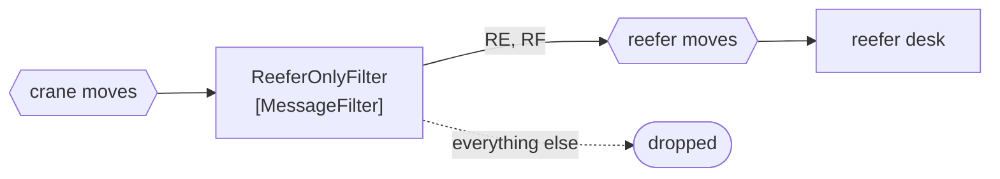

# Message Filter

🌍 🇬🇧 English (this file) · 🇫🇷 [Français](MessageFilter-fr.md)

## Intent

Message Filter discards the messages a component is not interested in, so that a receiver is spared the ones it
would only ignore.

## Problem

The reefer desk cares about refrigerated containers and nothing else.

Ninety per cent of what the crane channel carries is dry boxes. The desk receives them, looks at each one, and
drops it — which works, and costs a wake-up, a deserialisation and a decision for every message that was never
its business. At volume that is most of what the desk does.

Worse, the test is written inside the desk. A second consumer with the same interest writes the same test again,
and the two drift apart the first time the definition of *refrigerated* gains a container type.

## Solution

The pattern is a router with one output and the option of none.

What matches passes; what does not is dropped. It sits **in the channel**, so the drop happens before the
receivers — and happens once, for everyone reading that channel, rather than once per consumer.

That placement is the whole distinction from a
[selective consumer](../../../generated/catalog-index.md#selectiveconsumer-enterprise-integration-patterns), and
the sample says so outright: a filter is in the channel and drops for everyone; a selective consumer chooses for
itself and leaves the rest for others.

## Structure



One output and a dotted nothing. A router with two solid arrows is a
[content-based router](ContentBasedRouter-en.md); a filter's second arrow leads nowhere by design.

## The roles

| Role | Annotation | Applies to | What it carries |
|---|---|---|---|
| MessageFilter | `[MessageFilter]` | interface, class | The router with one output and the option of none. |

One role, and what it claims is the **discard**. That is worth annotating precisely because a discard leaves no
trace: a filter that drops too much and a channel that was quiet look identical from downstream, and the
annotation is what tells a reader that messages are expected to disappear here.

## The example

From [`MessageFilterUsage.cs`](../../../../DesignPatternCatalog.Usage/EnterpriseIntegration/MessageFilterUsage.cs).

```csharp
[MessageFilter]
public sealed class ReeferOnlyFilter {

    public bool Passes(string containerType) => containerType is "RE" or "RF";

}
```

The method returns `bool` and is called `Passes`. Not `Filter`, not `Handle`, not `void` — a predicate and
nothing else, which means the filter has nowhere to put a modified message and no second channel to send to. The
signature makes it structurally incapable of being anything but a filter.

Two container types, `RE` and `RF`, and the fact that there are two is the reason the test belongs in one place.
A third type arriving is one edit here rather than an edit in every consumer that thought it knew what
refrigerated meant.

It takes the type rather than the whole message, which keeps the filter independent of the payload's shape —
the same discipline the [Message Router](MessageRouter-en.md) page recommends about routing on headers.

The sample states the distinction that matters most: *the distinction from a selective consumer is where it
sits.*

## Applicability

**Use a message filter where a channel carries much that its readers do not want.** The book's case, and the
saving grows with the ratio.

**Use it where the same test would otherwise be written in several consumers.** One definition of *refrigerated*
rather than four that drift.

**Use it in the channel, deliberately.** Being before the receivers is the pattern; a test inside a receiver is a
different pattern with a different name.

**Keep it a predicate.** One output and the option of none is the shape, and anything more is a router.

## When not to use it

**Do not use it where different consumers want different subsets.** A filter drops for everyone, so a message one
consumer needed is gone for the others too. That case is a
[selective consumer](../../../generated/catalog-index.md#selectiveconsumer-enterprise-integration-patterns) or a
[datatype channel](DatatypeChannel-en.md) each.

**Do not use it where the dropped messages matter to somebody.** A discard is silent and unrecoverable; if a
message might be wanted later, route it somewhere rather than dropping it.

**Do not put a business rule in it.** *Is this container refrigerated* is a fact about the message; *should this
container be handled today* is a decision, and a filter that makes it discards work nobody agreed to discard.

**Do not let it modify.** A filter that also normalises the type code is a
[translator](MessageTranslator-en.md) as well, and the two jobs fail in ways that hide each other.

**Do not use it without a way to see what it dropped.** A filter that has silently stopped passing anything looks
exactly like a quiet terminal, which is why a count of what it discards is worth having — the kind of visibility
[Wire Tap](../../../generated/catalog-index.md#wiretap-enterprise-integration-patterns) exists for.

## Advantages

* Receivers are spared messages they would only ignore, once for all of them.
* The test lives in one place, so the definition cannot drift between consumers.
* It composes: a filter is a filter in the [pipes-and-filters](PipesAndFilters-en.md) sense, and drops into a
  pipeline unchanged.
* A predicate is the simplest thing in this chapter to test.
* Load downstream falls by whatever the ratio is, without any consumer changing.

## Drawbacks

* The drop is silent, and nothing downstream can tell *filtered out* from *never sent*.
* It drops for everyone, so it cannot serve consumers with different interests.
* A filter that is wrong is invisible: too strict looks like a quiet channel, too loose looks like normal
  traffic.
* It is a hop, and one whose whole purpose is to sometimes do nothing.
* Discarded messages are unrecoverable unless something else keeps them.

## Relations with other patterns

**`MessageRouter`** is the root this narrows — a filter is a router whose second destination is nowhere.

**`ContentBasedRouter`** is the sibling with several real outputs, and the shapes are close enough that the
distinction is worth stating: one chooses, the other admits.

**`SelectiveConsumer`** is the alternative when consumers want different subsets: it chooses for itself and
leaves the rest.

**`DatatypeChannel`** is the structural answer to the same problem — split the channel rather than filter it.

**`PipesAndFilters`** is the arrangement a filter lives in, and the one whose name it shares.

**`WireTap`** is what makes a filter's discards observable, since nothing else will.

## Source

*Enterprise Integration Patterns*, Gregor Hohpe and Bobby Woolf, Addison-Wesley, 2003 — the message-routing
chapter.

* [Index entry](../../../generated/catalog-index.md#messagefilter-enterprise-integration-patterns)
* [Generated attribute](../../../../DesignPatternCatalog.EnterpriseIntegration/MessageFilter.cs)
* [Example](../../../../DesignPatternCatalog.Usage/EnterpriseIntegration/MessageFilterUsage.cs)
