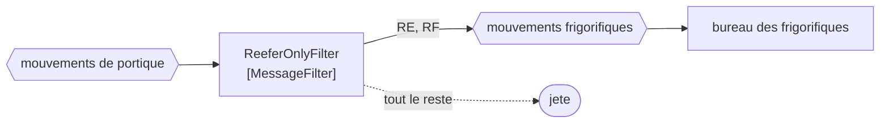

# Message Filter

🌍 🇫🇷 Français (ce fichier) · 🇬🇧 [English](MessageFilter-en.md)

## Intention

Message Filter écarte les messages qui n'intéressent pas un composant, de sorte qu'un receveur soit épargné de ceux
qu'il ne ferait qu'ignorer.

## Problème

Le bureau des frigorifiques s'intéresse aux conteneurs réfrigérés et à rien d'autre.

Quatre-vingt-dix pour cent de ce que porte le canal des portiques sont des conteneurs secs. Le bureau les reçoit,
regarde chacun d'eux, et le jette — ce qui fonctionne, et coûte un réveil, une désérialisation et une décision pour
chaque message qui ne le regardait pas. En volume, c'est l'essentiel de ce que fait le bureau.

Pire, le test est écrit à l'intérieur du bureau. Un second consommateur qui a le même intérêt réécrit le même test,
et les deux divergent dès que la définition de *réfrigéré* gagne un type de conteneur.

## Solution

Le patron est un routeur à une sortie avec la possibilité d'aucune.

Ce qui satisfait passe ; ce qui ne satisfait pas est jeté. Il siège **dans le canal**, si bien que le rejet se
produit avant les receveurs — et une fois, pour tous ceux qui lisent ce canal, plutôt qu'une fois par consommateur.

Ce placement est toute la distinction d'avec un
[consommateur sélectif](../../../generated/catalog-index.md#selectiveconsumer-enterprise-integration-patterns), et
l'exemple le dit sans détour : un filtre est dans le canal et jette pour tout le monde ; un consommateur sélectif
choisit pour lui-même et laisse le reste aux autres.

## Structure



Une sortie et un néant en pointillés. Un routeur à deux flèches pleines est un
[routeur fondé sur le contenu](ContentBasedRouter-fr.md) ; la seconde flèche d'un filtre ne mène nulle part, par
conception.

## Les rôles

| Rôle | Annotation | S'applique à | Ce qu'il porte |
|---|---|---|---|
| MessageFilter | `[MessageFilter]` | interface, classe | Le routeur à une sortie avec la possibilité d'aucune. |

Un seul rôle, et ce qu'il revendique est le **rejet**. Cela vaut d'être annoté précisément parce qu'un rejet ne
laisse aucune trace : un filtre qui jette trop et un canal qui était silencieux se ressemblent vus d'aval, et
l'annotation est ce qui dit à un lecteur qu'on s'attend ici à ce que des messages disparaissent.

## L'exemple

Extrait de [`MessageFilterUsage.cs`](../../../../DesignPatternCatalog.Usage/EnterpriseIntegration/MessageFilterUsage.cs).

```csharp
[MessageFilter]
public sealed class ReeferOnlyFilter {

    public bool Passes(string containerType) => containerType is "RE" or "RF";

}
```

La méthode rend un `bool` et s'appelle `Passes`. Ni `Filter`, ni `Handle`, ni `void` — un prédicat et rien d'autre,
ce qui veut dire que le filtre n'a nulle part où mettre un message modifié et aucun second canal où envoyer. La
signature le rend structurellement incapable d'être autre chose qu'un filtre.

Deux types de conteneurs, `RE` et `RF`, et le fait qu'il y en ait deux est la raison pour laquelle le test appartient
à un seul endroit. L'arrivée d'un troisième type est une modification ici plutôt qu'une modification dans chaque
consommateur qui croyait savoir ce que réfrigéré voulait dire.

Il prend le type plutôt que le message entier, ce qui garde le filtre indépendant de la forme de la charge utile — la
discipline même que la page de [Message Router](MessageRouter-fr.md) recommande au sujet du routage sur en-tête.

L'exemple énonce la distinction qui compte le plus : *la distinction d'avec un consommateur sélectif est où il
siège.*

## Possibilités d'application

**Employez un filtre là où un canal porte beaucoup de ce que ses lecteurs ne veulent pas.** Le cas du livre, et
l'économie croît avec le rapport.

**Employez-le là où le même test serait autrement écrit dans plusieurs consommateurs.** Une définition de
*réfrigéré* plutôt que quatre qui divergent.

**Employez-le dans le canal, délibérément.** Être avant les receveurs est le patron ; un test à l'intérieur d'un
receveur est un autre patron portant un autre nom.

**Gardez-le prédicat.** Une sortie et la possibilité d'aucune est la forme, et tout ce qui dépasse est un routeur.

## Quand ne pas l'utiliser

**Ne l'employez pas là où des consommateurs différents veulent des sous-ensembles différents.** Un filtre jette pour
tout le monde : un message dont un consommateur avait besoin a disparu pour les autres aussi. Ce cas demande un
[consommateur sélectif](../../../generated/catalog-index.md#selectiveconsumer-enterprise-integration-patterns) ou un
[canal de type](DatatypeChannel-fr.md) chacun.

**Ne l'employez pas là où les messages jetés comptent pour quelqu'un.** Un rejet est silencieux et irrécupérable ; si
un message pourrait être voulu plus tard, routez-le quelque part plutôt que de le jeter.

**N'y mettez pas de règle métier.** *Ce conteneur est-il réfrigéré* est un fait portant sur le message ; *ce conteneur
doit-il être traité aujourd'hui* est une décision, et un filtre qui la prend jette un travail que personne n'a accepté
de jeter.

**Ne le laissez pas modifier.** Un filtre qui normalise aussi le code de type est également un
[traducteur](MessageTranslator-fr.md), et les deux métiers échouent d'une façon qui masque l'autre.

**Ne l'employez pas sans moyen de voir ce qu'il a jeté.** Un filtre qui a cessé en silence de laisser passer quoi que
ce soit ressemble exactement à un terminal tranquille, ce qui est pourquoi un compte de ce qu'il écarte vaut d'être
tenu — la sorte de visibilité pour laquelle
[Wire Tap](../../../generated/catalog-index.md#wiretap-enterprise-integration-patterns) existe.

## Avantages

* Les receveurs sont épargnés des messages qu'ils ne feraient qu'ignorer, une fois pour tous.
* Le test vit à un seul endroit : la définition ne peut pas diverger entre consommateurs.
* Il se compose : un filtre est un filtre au sens de [pipes-and-filters](PipesAndFilters-fr.md), et se glisse dans
  un pipeline inchangé.
* Un prédicat est la chose la plus simple de ce chapitre à tester.
* La charge en aval baisse du rapport constaté, sans qu'aucun consommateur change.

## Inconvénients

* Le rejet est silencieux, et rien en aval ne distingue *filtré* de *jamais envoyé*.
* Il jette pour tout le monde : il ne peut pas servir des consommateurs aux intérêts différents.
* Un filtre faux est invisible : trop strict ressemble à un canal tranquille, trop laxiste ressemble à du trafic
  normal.
* C'est un saut, et un saut dont tout le propos est de parfois ne rien faire.
* Les messages écartés sont irrécupérables à moins que quelque chose d'autre les garde.

## Liens avec les autres patrons

**`MessageRouter`** est la racine que celui-ci restreint — un filtre est un routeur dont la seconde destination est
nulle part.

**`ContentBasedRouter`** est le frère aux plusieurs sorties réelles, et les formes sont assez proches pour que la
distinction vaille d'être énoncée : l'un choisit, l'autre admet.

**`SelectiveConsumer`** est l'alternative quand les consommateurs veulent des sous-ensembles différents : il choisit
pour lui-même et laisse le reste.

**`DatatypeChannel`** est la réponse structurelle au même problème — scinder le canal plutôt que le filtrer.

**`PipesAndFilters`** est l'agencement dans lequel un filtre vit, et celui dont il porte le nom.

**`WireTap`** est ce qui rend observables les rejets d'un filtre, puisque rien d'autre ne le fera.

## Source

*Enterprise Integration Patterns*, Gregor Hohpe et Bobby Woolf, Addison-Wesley, 2003 — le chapitre sur le routage
des messages.

* [Entrée d'index](../../../generated/catalog-index.md#messagefilter-enterprise-integration-patterns)
* [Attribut généré](../../../../DesignPatternCatalog.EnterpriseIntegration/MessageFilter.cs)
* [Exemple](../../../../DesignPatternCatalog.Usage/EnterpriseIntegration/MessageFilterUsage.cs)
