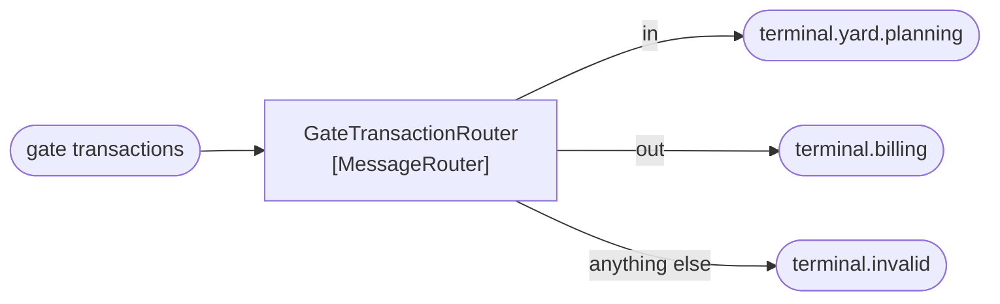

# Message Router

🌍 🇬🇧 English (this file) · 🇫🇷 [Français](MessageRouter-fr.md)

## Intent

Message Router decides where a message goes next, so that the steps of a process need not know one another's
addresses.

## Problem

A gate transaction goes to the yard planner if the container is inbound, to the billing system if it is outbound,
and to both if it is a re-handle.

Written as a condition inside the gate service, the gate knows every destination:

```csharp
if (direction == "in")  { _yardPlanner.Send(transaction); }
if (direction == "out") { _billing.Send(transaction); }
```

Every new destination is a change to the gate. And the gate — which is about weighbridges and barriers — now holds
a map of the terminal's other systems.

## Solution

The pattern puts the decision in one participant.

A router consumes a message and sends it on **unchanged**. The gate publishes once, to one channel, and the router
decides the destination — so a new destination is a change to the router and to nothing else.

The assertion the pattern makes is the *unchanged*. A router that alters what it forwards is a translator wearing
the wrong name, and an architecture rule can be written against exactly that.

## Structure



One in, several out, and the message that leaves is the message that arrived. The third arrow matters as much as
the first two: a router with no answer for an unexpected value has a message with nowhere to go.

## The roles

| Role | Annotation | Applies to | What it carries |
|---|---|---|---|
| MessageRouter | `[MessageRouter]` | interface, class | The participant that consumes a message and sends it on unchanged. |

One role, and its summary is a claim rather than a description: *it asserts that it does not modify the message*.
That is the checkable part.

## The example

From [`MessageRouterUsage.cs`](../../../../DesignPatternCatalog.Usage/EnterpriseIntegration/MessageRouterUsage.cs).

```csharp
[MessageRouter]
public sealed class GateTransactionRouter {

    public string Route(string direction) =>
        direction switch {
            "in"  => "terminal.yard.planning",
            "out" => "terminal.billing",
            _     => "terminal.invalid"
        };

}
```

The method returns a **channel name** and not a message. That is the pattern in one signature: the router's whole
output is a destination, so there is no opportunity to alter the payload even by accident.

The `_` arm is not a formality. A direction the router does not recognise goes to
[`terminal.invalid`](../../../generated/catalog-index.md#invalidmessagechannel-enterprise-integration-patterns)
rather than being dropped or throwing — which is the difference between a message you can go and look at and a
message that never existed.

The sample's remark states what the annotation is for: *the assertion is the "unchanged": a router that alters what
it forwards is a translator wearing the wrong name, and an architecture rule can be written against exactly that.*

That rule is writable because of the [Message](Message-en.md) pattern's header/body split: a router may read the
header, and a router that touches `Body` has stopped being one.

## Applicability

**Use Message Router where the destination depends on the message and the sender should not know it.** The book's
own framing is that the steps of a process need not know one another's addresses.

**Use it where destinations change more often than senders.** Adding the fourth system is a change to the router,
which is the whole return on the indirection.

**Forward without modifying.** This is part of the pattern rather than advice: a step that changes the message is a
translator, and keeping the two apart is what lets a pipeline be reasoned about.

**Decide on the header where possible.** A router that can route on a header stays independent of the payload's
format, which is what lets one router serve messages it does not understand.

## When not to use it

**Do not use it where there is one destination.** A router with a single arm is a hop that costs latency and buys
nothing; publish to the channel.

**Do not let it modify the message.** This is the pattern's one prohibition, and breaking it is invisible: a
router that enriches, normalises or reformats still works, and the pipeline can no longer be reasoned about because
no step's contract holds.

**Do not let it decide on the body.** A router that parses the payload to choose a destination is coupled to every
format that travels through it, and a new payload version breaks routing rather than processing.

**Do not use it where the decision is really a business rule.** *Which system handles a re-handle* may be routing;
*whether a re-handle is chargeable* is not, and putting the second in a router hides a domain decision in
infrastructure.

**Do not centralise all routing in one router.** The book warns about this indirectly through
[Message Broker](../../../generated/catalog-index.md#messagebroker-enterprise-integration-patterns): a single
participant that knows every destination is the map the gate was not supposed to hold, moved rather than removed.

**Do not leave the unrecognised case undefined.** A message with no matching arm must go somewhere a human can look.

## Advantages

* The sender publishes once and knows no destinations.
* A new destination is a change to one participant.
* The decision is in one readable place instead of spread across senders.
* Because the message is unchanged, the router can be inserted or removed without any other step noticing.
* Routing on the header keeps the router independent of what it carries.

## Drawbacks

* It is a hop: one more participant, one more channel, one more thing to be down.
* It becomes a place where knowledge accumulates, and a router that knows everything is a new coupling point.
* Nothing enforces the *unchanged* rule but a convention and, if written, a rule over the annotation.
* Debugging gains an indirection: where a message went is now somebody else's decision.

## Relations with other patterns

**`MessageTranslator`** is the counterpart, and the pair is the catalogue's cleanest division: one changes where,
the other changes what.

**`ContentBasedRouter`**, **`MessageFilter`**, **`DynamicRouter`**, **`RecipientList`** and **`RoutingSlip`** are
the specialised routers of the message-routing chapter — this is the root they all narrow.

**`Message`** is what makes the *unchanged* rule checkable, through its header and body annotations.

**`InvalidMessageChannel`** is where the unrecognised case goes.

**`PipesAndFilters`** is the arrangement a router usually lives in, as the step that decides rather than the step
that transforms.

## Source

*Enterprise Integration Patterns*, Gregor Hohpe and Bobby Woolf, Addison-Wesley, 2003 — chapter 3, messaging
systems.

* [Index entry](../../../generated/catalog-index.md#messagerouter-enterprise-integration-patterns)
* [Generated attribute](../../../../DesignPatternCatalog.EnterpriseIntegration/MessageRouter.cs)
* [Example](../../../../DesignPatternCatalog.Usage/EnterpriseIntegration/MessageRouterUsage.cs)
