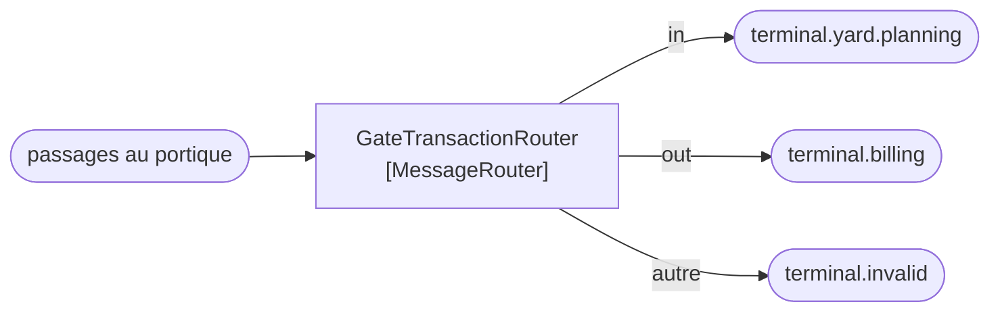

# Message Router

🌍 🇫🇷 Français (ce fichier) · 🇬🇧 [English](MessageRouter-en.md)

## Intention

Message Router décide où va ensuite un message, de sorte que les étapes d'un processus n'aient pas besoin de
connaître leurs adresses respectives.

## Problème

Un passage au portique va au planificateur de parc si le conteneur entre, à la facturation s'il sort, et aux deux
s'il s'agit d'une remanutention.

Écrit en condition dans le service du portique, le portique connaît toutes les destinations :

```csharp
if (direction == "in")  { _yardPlanner.Send(transaction); }
if (direction == "out") { _billing.Send(transaction); }
```

Chaque nouvelle destination est un changement du portique. Et le portique — dont le sujet est les pont-bascules et
les barrières — détient désormais une carte des autres systèmes du terminal.

## Solution

Le patron met la décision dans un seul participant.

Un routeur consomme un message et le transmet **inchangé**. Le portique publie une fois, sur un canal, et le routeur
décide de la destination — si bien qu'une nouvelle destination est un changement du routeur et de rien d'autre.

L'affirmation que fait le patron est cet *inchangé*. Un routeur qui altère ce qu'il transmet est un traducteur qui
porte le mauvais nom, et une règle d'architecture peut être écrite contre exactement cela.

## Structure



Un en entrée, plusieurs en sortie, et le message qui part est le message qui est arrivé. La troisième flèche compte
autant que les deux premières : un routeur sans réponse pour une valeur inattendue est un message qui n'a nulle part
où aller.

## Les rôles

| Rôle | Annotation | S'applique à | Ce qu'il porte |
|---|---|---|---|
| MessageRouter | `[MessageRouter]` | interface, classe | Le participant qui consomme un message et le transmet inchangé. |

Un seul rôle, et son résumé est une revendication plutôt qu'une description : *il affirme qu'il ne modifie pas le
message*. C'est la part contrôlable.

## L'exemple

Extrait de [`MessageRouterUsage.cs`](../../../../DesignPatternCatalog.Usage/EnterpriseIntegration/MessageRouterUsage.cs).

```csharp
[MessageRouter]
public sealed class GateTransactionRouter {

    public string Route(string direction) =>
        direction switch {
            "in"  => "terminal.yard.planning",
            "out" => "terminal.billing",
            _     => "terminal.invalid"
        };

}
```

La méthode rend un **nom de canal** et non un message. C'est le patron en une signature : la sortie entière du
routeur est une destination, donc il n'a aucune occasion d'altérer la charge utile, même par accident.

La branche `_` n'est pas une formalité. Une direction que le routeur ne reconnaît pas va vers
[`terminal.invalid`](../../../generated/catalog-index.md#invalidmessagechannel-enterprise-integration-patterns)
plutôt que d'être jetée ou de lever — ce qui est la différence entre un message qu'on peut aller regarder et un
message qui n'a jamais existé.

La remarque de l'exemple énonce à quoi sert l'annotation : *l'affirmation est cet « inchangé » : un routeur qui
altère ce qu'il transmet est un traducteur qui porte le mauvais nom, et une règle d'architecture peut être écrite
contre exactement cela.*

Cette règle est écrivable grâce à la séparation en-tête/corps du patron [Message](Message-fr.md) : un routeur peut
lire l'en-tête, et un routeur qui touche `Body` a cessé d'en être un.

## Possibilités d'application

**Employez Message Router là où la destination dépend du message et où l'émetteur ne devrait pas la connaître.** Le
cadrage propre du livre est que les étapes d'un processus n'ont pas besoin de connaître leurs adresses respectives.

**Employez-le là où les destinations changent plus souvent que les émetteurs.** Ajouter le quatrième système est un
changement du routeur, ce qui est tout le retour sur l'indirection.

**Transmettez sans modifier.** C'est une part du patron plutôt qu'un conseil : une étape qui change le message est un
traducteur, et garder les deux à part est ce qui permet de raisonner sur un pipeline.

**Décidez sur l'en-tête quand c'est possible.** Un routeur qui sait router sur un en-tête reste indépendant du
format de la charge utile, ce qui lui permet de servir des messages qu'il ne comprend pas.

## Quand ne pas l'utiliser

**Ne l'employez pas là où il n'y a qu'une destination.** Un routeur à une seule branche est un saut qui coûte de la
latence et n'achète rien ; publiez sur le canal.

**Ne le laissez pas modifier le message.** C'est l'unique interdiction du patron, et la rompre est invisible : un
routeur qui enrichit, normalise ou reformate fonctionne toujours, et le pipeline ne peut plus être raisonné parce
que le contrat d'aucune étape ne tient.

**Ne le laissez pas décider sur le corps.** Un routeur qui analyse la charge utile pour choisir une destination est
couplé à tous les formats qui le traversent, et une nouvelle version de charge utile casse le routage plutôt que le
traitement.

**Ne l'employez pas là où la décision est en réalité une règle métier.** *Quel système traite une remanutention* peut
être du routage ; *si une remanutention est facturable* ne l'est pas, et mettre la seconde dans un routeur cache une
décision de domaine dans l'infrastructure.

**Ne centralisez pas tout le routage dans un routeur.** Le livre en avertit indirectement par
[Message Broker](../../../generated/catalog-index.md#messagebroker-enterprise-integration-patterns) : un participant
unique qui connaît toutes les destinations est la carte que le portique n'était pas censé détenir, déplacée plutôt
que retirée.

**Ne laissez pas le cas non reconnu indéfini.** Un message sans branche correspondante doit aller quelque part où un
humain peut regarder.

## Avantages

* L'émetteur publie une fois et ne connaît aucune destination.
* Une nouvelle destination est un changement d'un seul participant.
* La décision est à un endroit lisible au lieu d'être dispersée chez les émetteurs.
* Le message étant inchangé, le routeur peut être inséré ou retiré sans qu'aucune autre étape le remarque.
* Router sur l'en-tête garde le routeur indépendant de ce qu'il porte.

## Inconvénients

* C'est un saut : un participant de plus, un canal de plus, une chose de plus qui peut être en panne.
* Il devient un endroit où la connaissance s'accumule, et un routeur qui sait tout est un nouveau point de couplage.
* Rien n'impose la règle de l'*inchangé* qu'une convention et, si elle est écrite, une règle portant sur
  l'annotation.
* Le débogage gagne une indirection : où est allé un message est désormais la décision de quelqu'un d'autre.

## Liens avec les autres patrons

**`MessageTranslator`** en est le pendant, et la paire est la division la plus nette du catalogue : l'un change où,
l'autre change quoi.

**`ContentBasedRouter`**, **`MessageFilter`**, **`DynamicRouter`**, **`RecipientList`** et **`RoutingSlip`** sont
les routeurs spécialisés du chapitre sur le routage — celui-ci est la racine qu'ils spécialisent
tous.

**`Message`** est ce qui rend la règle de l'*inchangé* contrôlable, par ses annotations d'en-tête et de corps.

**`InvalidMessageChannel`** est là où va le cas non reconnu.

**`PipesAndFilters`** est l'agencement dans lequel un routeur vit d'ordinaire, comme l'étape qui décide plutôt que
l'étape qui transforme.

## Source

*Enterprise Integration Patterns*, Gregor Hohpe et Bobby Woolf, Addison-Wesley, 2003 — chapitre 3, les systèmes de
messagerie.

* [Entrée d'index](../../../generated/catalog-index.md#messagerouter-enterprise-integration-patterns)
* [Attribut généré](../../../../DesignPatternCatalog.EnterpriseIntegration/MessageRouter.cs)
* [Exemple](../../../../DesignPatternCatalog.Usage/EnterpriseIntegration/MessageRouterUsage.cs)
