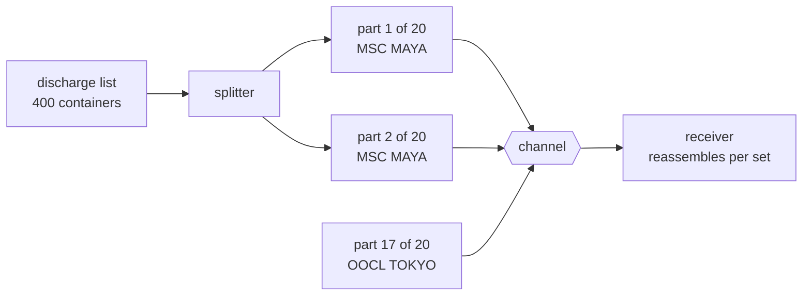

# Message Sequence

🌍 🇬🇧 English (this file) · 🇫🇷 [Français](MessageSequence-fr.md)

## Intent

Message Sequence marks each message of a set with its place and the set's extent, so that an arbitrarily large
body of data can travel as many messages and be reassembled.

## Problem

A vessel's discharge list runs to four hundred containers and will not fit one message.

Split into twenty, three things stop working at once. The parts arrive out of order, because
[competing consumers](PointToPointChannel-en.md) process concurrently. Two vessels discharging at the same time
put forty messages on one channel with nothing to tell the sets apart. And a receiver that has assembled
nineteen parts cannot tell whether the twentieth is coming or whether the sender stopped — a channel that is
quiet looks exactly like a channel whose work is done.

## Solution

The pattern is three properties, one for each of those failures.

**Which set** a message belongs to, so interleaved transfers can be told apart. **Which place** it holds, so the
parts can be reassembled in whatever order they arrive. **How many** there are, so a receiver knows the set is
complete rather than merely quiet.

They are three roles rather than one, because a set marked with only some of them fails in a way the others would
have caught, and the annotations say which of the three a message actually carries.

## Structure



Two vessels' parts on one channel, and the receiver sorts them because each part says which set, which place and
how many.

## The roles

| Role | Annotation | Applies to | What it carries |
|---|---|---|---|
| SequenceIdentifier | `[MessageSequence.SequenceIdentifier]` | property, field | The property naming the set a message belongs to. |
| Position | `[MessageSequence.Position]` | property, field | The property giving the message's place in the set. |
| Size | `[MessageSequence.Size]` | property, field | The property saying how many there are, or marking the last one. |

Three roles on one message type, which is unusual in this chapter — the other property patterns mark one field
each. Here the three go together by necessity: a position without an identifier cannot be placed, and an
identifier without a size cannot be completed.

## The example

From [`MessageSequenceUsage.cs`](../../../../DesignPatternCatalog.Usage/EnterpriseIntegration/MessageSequenceUsage.cs).

```csharp
[MessageSequence.SequenceIdentifier]
public string VesselCall { get; }
```

The identifier is a **domain value**, not a generated one. `VesselCall` already identifies the discharge — the
sample takes what the domain has rather than minting a transfer id beside it, which means a reader of the message
knows what set it belongs to without a lookup.

The remark names the failure it is written against: *without it, two large transfers interleaved on one channel
cannot be told apart.*

```csharp
[MessageSequence.Position]
public int Position { get; }
```

Position is what lets a receiver reassemble *however the parts arrive* — the sample's own phrase — which is the
point that separates this from relying on the channel. A channel that happens to preserve order still loses it
the moment a second consumer is added, and the position does not.

```csharp
[MessageSequence.Size]
public int Size { get; }
```

Size is the one people leave out, and it is the one that distinguishes finished from quiet. The sample says
exactly which other pattern asks the same question: *what lets a receiver know the set is complete rather than
merely quiet — the same question an aggregator's completeness condition asks.*

`Containers` carries the payload and is unannotated, which is the division worth noticing: three properties are
about the transfer, one is about the vessel.

## Applicability

**Use a message sequence where the data does not fit one message.** The book's case, and the reason the pattern
is in the construction chapter rather than among the routing patterns.

**Use it where several transfers share a channel.** The identifier is what keeps two vessels' parts apart, and
two vessels discharging at once is a Tuesday.

**Carry all three.** Each covers a distinct failure, and a set with two of the three fails in the way the third
would have caught.

**Prefer an identifier the domain already has.** A sequence identifier that means something makes the message
readable on its own.

## When not to use it

**Do not use it where one message fits.** Three extra properties and a reassembly step buy nothing when there is
nothing to reassemble.

**Do not use it to correlate a conversation.** A request and its reply are two messages that go together but are
not a set with an order and an extent — that is
[Correlation Identifier](CorrelationIdentifier-en.md), and using this instead invents a position and a size that
mean nothing.

**Do not rely on the channel's ordering instead.** Order that holds today because one consumer happens to be
running is order that disappears when a second is started, and nothing announces the change.

**Do not omit the size.** A receiver without it cannot distinguish a complete set from a stalled one, and will
either wait for ever or act on nineteen twentieths of a discharge list.

**Do not hold partial sets for ever.** A set whose parts never all arrive occupies the receiver indefinitely;
what bounds it is a timeout or [Message Expiration](MessageExpiration-en.md), not the pattern.

**Do not use it where each part is independently useful.** If a receiver can act on one container at a time, the
list is a stream rather than a set, and a
[Splitter](../../../generated/catalog-index.md#splitter-enterprise-integration-patterns) alone is enough.

## Advantages

* Arbitrarily large data travels as messages, without a size limit anywhere.
* Parts may arrive in any order, from any number of concurrent consumers.
* Interleaved transfers on one channel are separable without a channel each.
* Completeness is decidable, so *finished* and *quiet* are different states.
* The three annotations say which of the three facts a message actually carries.

## Drawbacks

* The receiver must hold partial sets, which is state that grows and has to be bounded.
* A set with a missing part is stuck, and nothing in the pattern says for how long.
* Three properties on every message is overhead paid per part, not per transfer.
* A size that is wrong is worse than absent, since the receiver will wait for a part that was never sent.
* Reassembly is real work, and it belongs to whoever receives rather than to the messaging system.

## Relations with other patterns

**`Splitter`** is what produces a sequence, and **`Aggregator`** is what consumes one — the routing chapter's pair
around this construction pattern.

**`Resequencer`** works from the position, and is the answer when a receiver needs the parts in order rather than
merely reassembled.

**`CorrelationIdentifier`** is the same idea for a conversation instead of a set, and the two are worth keeping
apart: a conversation has no position and no extent.

**`DocumentMessage`** is usually what a sequence carries, since a document is the kind that grows past one
message.

**`ClaimCheck`** is the alternative when the data is large: store it and send a reference, rather than splitting
it into parts.

**`MessageExpiration`** is what bounds a set that will never complete.

## Source

*Enterprise Integration Patterns*, Gregor Hohpe and Bobby Woolf, Addison-Wesley, 2003 — the message-construction
chapter.

* [Index entry](../../../generated/catalog-index.md#messagesequence-enterprise-integration-patterns)
* [Generated attribute](../../../../DesignPatternCatalog.EnterpriseIntegration/MessageSequence.cs)
* [Example](../../../../DesignPatternCatalog.Usage/EnterpriseIntegration/MessageSequenceUsage.cs)
