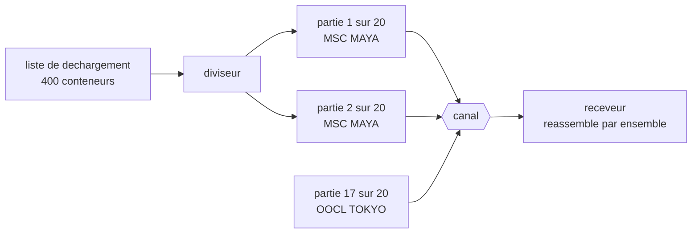

# Message Sequence

🌍 🇫🇷 Français (ce fichier) · 🇬🇧 [English](MessageSequence-en.md)

## Intention

Message Sequence marque chaque message d'un ensemble de sa place et de l'étendue de l'ensemble, de sorte qu'un corps
de données arbitrairement grand puisse voyager en plusieurs messages et être réassemblé.

## Problème

La liste de déchargement d'un navire compte quatre cents conteneurs et ne tiendra pas dans un message.

Scindée en vingt, trois choses cessent de fonctionner à la fois. Les parties arrivent dans le désordre, parce que
des [consommateurs concurrents](PointToPointChannel-fr.md) traitent en parallèle. Deux navires qui déchargent en
même temps mettent quarante messages sur un canal sans rien pour distinguer les ensembles. Et un receveur qui a
assemblé dix-neuf parties ne peut pas dire si la vingtième arrive ou si l'émetteur s'est arrêté — un canal
silencieux ressemble exactement à un canal dont le travail est fini.

## Solution

Le patron est trois propriétés, une pour chacune de ces pannes.

**Quel ensemble** un message rejoint, pour que des transferts entrelacés puissent être distingués. **Quelle place**
il occupe, pour que les parties puissent être réassemblées quel que soit leur ordre d'arrivée. **Combien** il y en
a, pour qu'un receveur sache que l'ensemble est complet plutôt que simplement silencieux.

Ce sont trois rôles plutôt qu'un, parce qu'un ensemble marqué de quelques-uns seulement échoue d'une façon que les
autres auraient attrapée, et les annotations disent lequel des trois un message porte réellement.

## Structure



Les parties de deux navires sur un canal, et le receveur les trie parce que chaque partie dit quel ensemble, quelle
place et combien.

## Les rôles

| Rôle | Annotation | S'applique à | Ce qu'il porte |
|---|---|---|---|
| SequenceIdentifier | `[MessageSequence.SequenceIdentifier]` | propriété, champ | La propriété qui nomme l'ensemble auquel un message appartient. |
| Position | `[MessageSequence.Position]` | propriété, champ | La propriété qui donne la place du message dans l'ensemble. |
| Size | `[MessageSequence.Size]` | propriété, champ | La propriété qui dit combien il y en a, ou qui marque le dernier. |

Trois rôles sur un même type de message, ce qui est inhabituel dans ce chapitre — les autres patrons de propriété
marquent un champ chacun. Ici les trois vont ensemble par nécessité : une position sans identifiant ne peut pas être
située, et un identifiant sans étendue ne peut pas être achevé.

## L'exemple

Extrait de [`MessageSequenceUsage.cs`](../../../../DesignPatternCatalog.Usage/EnterpriseIntegration/MessageSequenceUsage.cs).

```csharp
[MessageSequence.SequenceIdentifier]
public string VesselCall { get; }
```

L'identifiant est une **valeur du domaine**, non une valeur générée. `VesselCall` identifie déjà le déchargement —
l'exemple prend ce que le domaine a plutôt que de frapper un identifiant de transfert à côté, ce qui fait qu'un
lecteur du message sait à quel ensemble il appartient sans aller chercher ailleurs.

La remarque nomme la panne contre laquelle elle est écrite : *sans lui, deux grands transferts entrelacés sur un
canal ne peuvent pas être distingués.*

```csharp
[MessageSequence.Position]
public int Position { get; }
```

La position est ce qui permet à un receveur de réassembler *quel que soit l'ordre d'arrivée des parties* — la
formule propre de l'exemple — et c'est le point qui sépare ceci du fait de compter sur le canal. Un canal qui se
trouve préserver l'ordre le perd dès qu'un second consommateur est ajouté, et la position non.

```csharp
[MessageSequence.Size]
public int Size { get; }
```

L'étendue est celle qu'on oublie, et c'est elle qui distingue *fini* de *silencieux*. L'exemple dit exactement quel
autre patron pose la même question : *ce qui permet à un receveur de savoir que l'ensemble est complet plutôt que
simplement silencieux — la même question que pose la condition de complétude d'un agrégateur.*

`Containers` porte la charge utile et n'est pas annotée, et c'est la division qui vaut d'être remarquée : trois
propriétés portent sur le transfert, une porte sur le navire.

## Possibilités d'application

**Employez une séquence de messages là où les données ne tiennent pas dans un message.** Le cas du livre, et la
raison pour laquelle le patron est au chapitre de la construction plutôt que parmi les patrons de routage.

**Employez-la là où plusieurs transferts partagent un canal.** L'identifiant est ce qui tient à part les parties de
deux navires, et deux navires qui déchargent en même temps, c'est un mardi.

**Portez les trois.** Chacune couvre une panne distincte, et un ensemble qui en a deux sur trois échoue de la façon
que la troisième aurait attrapée.

**Préférez un identifiant que le domaine possède déjà.** Un identifiant de séquence qui veut dire quelque chose rend
le message lisible à lui seul.

## Quand ne pas l'utiliser

**Ne l'employez pas là où un message suffit.** Trois propriétés de plus et une étape de réassemblage n'achètent rien
quand il n'y a rien à réassembler.

**Ne l'employez pas pour corréler une conversation.** Une requête et sa réponse sont deux messages qui vont ensemble
mais ne sont pas un ensemble doté d'un ordre et d'une étendue — cela, c'est
[Correlation Identifier](CorrelationIdentifier-fr.md), et employer celui-ci à la place invente une position et une
étendue qui ne veulent rien dire.

**Ne comptez pas sur l'ordre du canal à la place.** Un ordre qui tient aujourd'hui parce qu'un seul consommateur se
trouve tourner est un ordre qui disparaît quand un second est démarré, et rien n'annonce le changement.

**N'omettez pas l'étendue.** Un receveur qui en est privé ne peut pas distinguer un ensemble complet d'un ensemble
bloqué, et soit il attendra indéfiniment, soit il agira sur dix-neuf vingtièmes d'une liste de déchargement.

**Ne gardez pas indéfiniment des ensembles partiels.** Un ensemble dont les parties n'arrivent jamais toutes occupe
le receveur sans fin ; ce qui le borne est un délai d'attente ou [Message Expiration](MessageExpiration-fr.md), non
le patron.

**Ne l'employez pas là où chaque partie est utile indépendamment.** Si un receveur peut agir sur un conteneur à la
fois, la liste est un flux plutôt qu'un ensemble, et un
[Splitter](../../../generated/catalog-index.md#splitter-enterprise-integration-patterns) seul suffit.

## Avantages

* Des données arbitrairement grandes voyagent en messages, sans limite de taille nulle part.
* Les parties peuvent arriver dans n'importe quel ordre, depuis n'importe quel nombre de consommateurs concurrents.
* Des transferts entrelacés sur un canal sont séparables sans un canal chacun.
* La complétude est décidable : *fini* et *silencieux* sont deux états différents.
* Les trois annotations disent lequel des trois faits un message porte réellement.

## Inconvénients

* Le receveur doit détenir des ensembles partiels, ce qui est un état qui croît et qu'il faut borner.
* Un ensemble auquel il manque une partie est bloqué, et rien dans le patron ne dit pour combien de temps.
* Trois propriétés sur chaque message sont un surcoût payé par partie, non par transfert.
* Une étendue fausse est pire qu'absente, puisque le receveur attendra une partie jamais envoyée.
* Le réassemblage est un vrai travail, et il appartient à qui reçoit plutôt qu'au système de messagerie.

## Liens avec les autres patrons

**`Splitter`** est ce qui produit une séquence, et **`Aggregator`** ce qui en consomme une — la paire du chapitre du
routage autour de ce patron de construction.

**`Resequencer`** travaille à partir de la position, et il est la réponse quand un receveur a besoin des parties dans
l'ordre plutôt que seulement réassemblées.

**`CorrelationIdentifier`** est la même idée pour une conversation au lieu d'un ensemble, et les deux valent d'être
tenus à part : une conversation n'a ni position ni étendue.

**`DocumentMessage`** est d'ordinaire ce qu'une séquence porte, puisqu'un document est la sorte qui dépasse un
message.

**`ClaimCheck`** est l'alternative quand les données sont grandes : les stocker et envoyer une référence, plutôt que
de les scinder en parties.

**`MessageExpiration`** est ce qui borne un ensemble qui ne s'achèvera jamais.

## Source

*Enterprise Integration Patterns*, Gregor Hohpe et Bobby Woolf, Addison-Wesley, 2003 — le chapitre sur la
construction des messages.

* [Entrée d'index](../../../generated/catalog-index.md#messagesequence-enterprise-integration-patterns)
* [Attribut généré](../../../../DesignPatternCatalog.EnterpriseIntegration/MessageSequence.cs)
* [Exemple](../../../../DesignPatternCatalog.Usage/EnterpriseIntegration/MessageSequenceUsage.cs)
