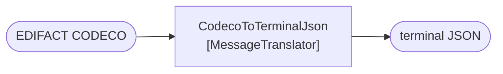

# Message Translator

🌍 🇬🇧 English (this file) · 🇫🇷 [Français](MessageTranslator-fr.md)

## Intent

Message Translator converts a message from one data format to another, so that applications with different formats
can talk without either being changed.

## Problem

The shipping line speaks EDIFACT CODECO. The terminal speaks its own JSON.

Neither will change, and neither should have to learn the other. An EDIFACT parser inside the yard planner would
make the yard planner about EDI; a JSON emitter inside the line's system is not something the terminal can ask for.

## Solution

The pattern changes the format and nothing else.

A translator takes a message in one format and produces the same message in another. It does not change the route,
it does not choose a destination, and it does not decide anything about the content beyond how it is spelled.

It is the counterpart of a [router](MessageRouter-en.md), and keeping the two apart is what lets a pipeline be
reasoned about: one step changes **where**, the other changes **what**.

## Structure



One in, one out, same message. There is no second output arrow, because a translator that chose between two
destinations would be a router.

## The roles

| Role | Annotation | Applies to | What it carries |
|---|---|---|---|
| MessageTranslator | `[MessageTranslator]` | interface, class | The participant that changes a message's format and not its route. |

One role, and its claim is the negative half: **not its route**. That is what an architecture rule can check
against, in the same way the router's claim is *unchanged*.

## The example

From [`MessageTranslatorUsage.cs`](../../../../DesignPatternCatalog.Usage/EnterpriseIntegration/MessageTranslatorUsage.cs).

```csharp
[MessageTranslator]
public sealed class CodecoToTerminalJson {

    public string Translate(string edifact) {
        // ... one format in, another out; the destination is somebody else's decision
        return "{}";
    }

}
```

One parameter, one return, and no channel anywhere in the signature. The comment states the division exactly: *the
destination is somebody else's decision.*

That absence is the whole check. A translator that took a channel, returned a channel name, or published to one has
stopped being a translator — and because the signature has no room for any of those, the shape enforces what the
annotation claims.

The class name is the transformation: `CodecoToTerminalJson`, from and to. A translator named after its consumer
(`YardPlannerTranslator`) would have coupled a format conversion to a destination, which is the coupling the pattern
removes.

The sample's remark places the pattern against its counterpart: *the counterpart of a router, and keeping the two
apart is what lets a pipeline be reasoned about: one step changes where, the other changes what.*

## Applicability

**Use Message Translator where two applications use different formats and neither will change.** The book presents
this as the ordinary condition of integration rather than an exception.

**Use it where the difference is one of format rather than of meaning.** CODECO and the terminal's JSON say the
same thing two ways, which is what makes a translation possible at all.

**Change the format and not the route.** This is part of the pattern: the destination is decided elsewhere, and a
translator that also routes makes both steps unreasonable.

**Consider a canonical format when there are many.** The book's own answer to *n* formats is
[Canonical Data Model](../../../generated/catalog-index.md#canonicaldatamodel-enterprise-integration-patterns) —
translate each format to one middle language rather than writing every pair.

## When not to use it

**Do not use it where the two applications mean different things.** A translator can rename a field; it cannot
reconcile two models that disagree about what a container is. That is
[Bounded Context](../domain-driven-design/BoundedContext-en.md)'s subject, and the honest answer there is a
[translator with a whole layer around it](../domain-driven-design/AnticorruptionLayer-en.md).

**Do not let it route.** A translator that publishes to a channel has taken a decision that belongs to a router,
and neither step's contract holds afterwards.

**Do not let it enrich.** Adding data the source did not carry is
[Content Enricher](../../../generated/catalog-index.md#contentenricher-enterprise-integration-patterns) — a
different pattern with a different dependency, since enriching needs a source of the missing data and translating
does not.

**Do not write a translator per pair when the pairs multiply.** Four formats mean twelve directed translations, and
that is the count at which a canonical model costs less than the pairs.

**Do not put business rules in it.** A translation that drops records, or maps two source values onto one target
because *the terminal does not care about the difference*, has made a domain decision inside infrastructure — and it
will be found by somebody reading the output.

## Advantages

* Neither application changes, and neither learns the other's format.
* The conversion lives in one reviewable place, named after what it converts.
* It composes: a translator is a filter, so it drops into a pipeline without any other step knowing.
* Because it does not route, it can be inserted anywhere the format needs changing.

## Drawbacks

* A pair of formats is a translator, and *n* formats are *n*(*n*−1) of them unless a canonical model is introduced.
* It is a hop, with the latency and the failure mode of one.
* Every format change upstream is a change here, and the translator is where version skew shows up first.
* Nothing prevents it from enriching, filtering or routing except the convention the annotation records.

## Relations with other patterns

**`MessageRouter`** is the counterpart, and the pair is the catalogue's cleanest division of labour.

**`CanonicalDataModel`** is the answer when the number of formats makes pairwise translation untenable.

**`Normalizer`** is a translator for the case where many source formats must become one, and
**`ContentEnricher`** and **`ContentFilter`** are the two that change *how much* rather than *how*.

**`EnvelopeWrapper`** is a translation of the packaging rather than of the payload.

**`AnticorruptionLayer`**, in the Domain-Driven Design catalogue, is what a translator becomes when the difference
is one of model rather than of format: a facade, a translator and an adapter, with the translator the only part that
knows both sides.

## Source

*Enterprise Integration Patterns*, Gregor Hohpe and Bobby Woolf, Addison-Wesley, 2003 — chapter 3, messaging
systems.

* [Index entry](../../../generated/catalog-index.md#messagetranslator-enterprise-integration-patterns)
* [Generated attribute](../../../../DesignPatternCatalog.EnterpriseIntegration/MessageTranslator.cs)
* [Example](../../../../DesignPatternCatalog.Usage/EnterpriseIntegration/MessageTranslatorUsage.cs)
