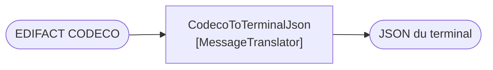

# Message Translator

🌍 🇫🇷 Français (ce fichier) · 🇬🇧 [English](MessageTranslator-en.md)

## Intention

Message Translator convertit un message d'un format de données vers un autre, de sorte que des applications aux
formats différents puissent se parler sans qu'aucune soit changée.

## Problème

L'armateur parle EDIFACT CODECO. Le terminal parle son propre JSON.

Aucun ne changera, et aucun ne devrait avoir à apprendre l'autre. Un analyseur EDIFACT dans le planificateur de parc
ferait du planificateur une affaire d'EDI ; un émetteur JSON dans le système de l'armateur n'est pas quelque chose que
le terminal peut demander.

## Solution

Le patron change le format et rien d'autre.

Un traducteur prend un message dans un format et produit le même message dans un autre. Il ne change pas la route, il
ne choisit pas de destination, et il ne décide rien du contenu au-delà de son orthographe.

Il est le pendant d'un [routeur](MessageRouter-fr.md), et garder les deux à part est ce qui permet de raisonner sur un
pipeline : une étape change **où**, l'autre change **quoi**.

## Structure



Un en entrée, un en sortie, le même message. Il n'y a pas de seconde flèche de sortie, parce qu'un traducteur qui
choisirait entre deux destinations serait un routeur.

## Les rôles

| Rôle | Annotation | S'applique à | Ce qu'il porte |
|---|---|---|---|
| MessageTranslator | `[MessageTranslator]` | interface, classe | Le participant qui change le format d'un message et non sa route. |

Un seul rôle, et sa revendication est la moitié négative : **non sa route**. C'est ce contre quoi une règle
d'architecture peut vérifier, de la même façon que la revendication du routeur est l'*inchangé*.

## L'exemple

Extrait de [`MessageTranslatorUsage.cs`](../../../../DesignPatternCatalog.Usage/EnterpriseIntegration/MessageTranslatorUsage.cs).

```csharp
[MessageTranslator]
public sealed class CodecoToTerminalJson {

    public string Translate(string edifact) {
        // ... one format in, another out; the destination is somebody else's decision
        return "{}";
    }

}
```

Un paramètre, un retour, et aucun canal dans la signature. Le commentaire énonce la division exactement : *la
destination est la décision de quelqu'un d'autre.*

Cette absence est tout le contrôle. Un traducteur qui prendrait un canal, rendrait un nom de canal, ou publierait sur
un canal a cessé d'être un traducteur — et parce que la signature n'a de place pour aucun des trois, la forme impose
ce que l'annotation revendique.

Le nom de la classe est la transformation : `CodecoToTerminalJson`, de et vers. Un traducteur nommé d'après son
consommateur (`YardPlannerTranslator`) aurait couplé une conversion de format à une destination, soit le couplage que
le patron retire.

La remarque de l'exemple situe le patron face à son pendant : *le pendant d'un routeur, et garder les deux à part est
ce qui permet de raisonner sur un pipeline : une étape change où, l'autre change quoi.*

## Possibilités d'application

**Employez Message Translator là où deux applications emploient des formats différents et où aucune ne changera.** Le
livre présente cela comme la condition ordinaire de l'intégration plutôt que comme une exception.

**Employez-le là où la différence est de format plutôt que de sens.** CODECO et le JSON du terminal disent la même
chose de deux façons, ce qui est ce qui rend une traduction possible.

**Changez le format et non la route.** C'est une part du patron : la destination est décidée ailleurs, et un traducteur
qui route aussi rend les deux étapes inanalysables.

**Envisagez un format canonique quand ils sont nombreux.** La réponse propre du livre à *n* formats est
[Canonical Data Model](../../../generated/catalog-index.md#canonicaldatamodel-enterprise-integration-patterns) —
traduire chaque format vers une langue intermédiaire plutôt que d'écrire chaque paire.

## Quand ne pas l'utiliser

**Ne l'employez pas là où les deux applications entendent des choses différentes.** Un traducteur peut renommer un
champ ; il ne peut pas réconcilier deux modèles qui ne s'accordent pas sur ce qu'est un conteneur. C'est le sujet de
[Bounded Context](../domain-driven-design/BoundedContext-fr.md), et la réponse honnête là-bas est un
[traducteur avec une couche entière autour](../domain-driven-design/AnticorruptionLayer-fr.md).

**Ne le laissez pas router.** Un traducteur qui publie sur un canal a pris une décision qui appartient à un routeur, et
le contrat d'aucune des deux étapes ne tient ensuite.

**Ne le laissez pas enrichir.** Ajouter des données que la source ne portait pas, c'est
[Content Enricher](../../../generated/catalog-index.md#contentenricher-enterprise-integration-patterns) — un patron
différent avec une dépendance différente, puisque enrichir demande une source de la donnée manquante et traduire non.

**N'écrivez pas un traducteur par paire quand les paires se multiplient.** Quatre formats font douze traductions
orientées, et c'est le compte à partir duquel un modèle canonique coûte moins que les paires.

**N'y mettez pas de règles métier.** Une traduction qui écarte des enregistrements, ou qui projette deux valeurs source
sur une seule cible parce que *le terminal ne fait pas la différence*, a pris une décision de domaine dans
l'infrastructure — et elle sera trouvée par quelqu'un qui lit la sortie.

## Avantages

* Aucune application ne change, et aucune n'apprend le format de l'autre.
* La conversion vit à un seul endroit relisible, nommé d'après ce qu'elle convertit.
* Il compose : un traducteur est un filtre, il se glisse donc dans un pipeline sans qu'aucune autre étape le sache.
* Comme il ne route pas, il peut être inséré partout où le format doit changer.

## Inconvénients

* Une paire de formats est un traducteur, et *n* formats en font *n*(*n*−1) à moins d'introduire un modèle canonique.
* C'est un saut, avec la latence et le mode de défaillance d'un saut.
* Chaque changement de format en amont est un changement ici, et le traducteur est l'endroit où la dérive de version
  se voit en premier.
* Rien ne l'empêche d'enrichir, de filtrer ou de router, sinon la convention que l'annotation consigne.

## Liens avec les autres patrons

**`MessageRouter`** est le pendant, et la paire est la division du travail la plus nette du catalogue.

**`CanonicalDataModel`** est la réponse quand le nombre de formats rend la traduction par paires intenable.

**`Normalizer`** est un traducteur pour le cas où de nombreux formats source doivent devenir un seul, et
**`ContentEnricher`** et **`ContentFilter`** sont les deux qui changent *combien* plutôt que *comment*.

**`EnvelopeWrapper`** est une traduction de l'emballage plutôt que de la charge utile.

**`AnticorruptionLayer`**, dans le catalogue Domain-Driven Design, est ce que devient un traducteur quand la
différence est de modèle et non de format : une façade, un traducteur et un adaptateur, le traducteur étant la seule
part qui connaisse les deux côtés.

## Source

*Enterprise Integration Patterns*, Gregor Hohpe et Bobby Woolf, Addison-Wesley, 2003 — chapitre 3, les systèmes de
messagerie.

* [Entrée d'index](../../../generated/catalog-index.md#messagetranslator-enterprise-integration-patterns)
* [Attribut généré](../../../../DesignPatternCatalog.EnterpriseIntegration/MessageTranslator.cs)
* [Exemple](../../../../DesignPatternCatalog.Usage/EnterpriseIntegration/MessageTranslatorUsage.cs)
