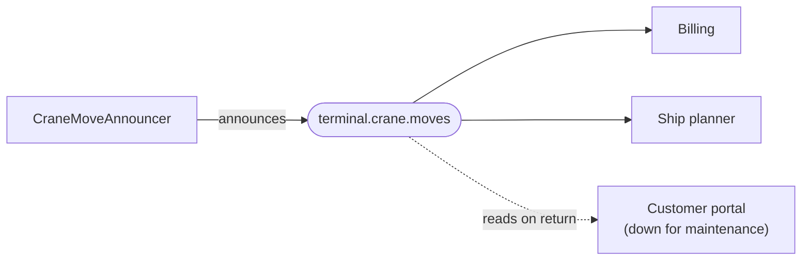

# Messaging

🌍 🇬🇧 English (this file) · 🇫🇷 [Français](Messaging-fr.md)

## Intent

Messaging integrates applications by sending packets of data over channels, so that the sender is decoupled from
the receiver in time as well as in technology.

## Problem

Every crane move, gate transaction and yard shuffle at the terminal is of interest to somebody: the billing
system, the ship planner, the customer portal.

None of the three needs to be told at the moment it happens, and none should be able to stop a crane by being
unavailable. A synchronous call to all three would make a lift wait for the slowest, and a portal down for
maintenance would block the quay.

## Solution

The pattern sends packets over channels, and nobody waits.

Each move is announced as a message on a channel. The billing system, the ship planner and the customer portal
each read what interests them, on their own schedule, and a portal down for maintenance misses nothing once it
comes back.

Sender and receiver are decoupled in technology and — which matters more here — in time. The publisher names a
channel and not a recipient, so a new consumer costs the publisher nothing.

This is the style the rest of this catalogue elaborates: the other sixty-one entries all presuppose that
integration happens by message.

## Structure



The publisher's arrow stops at the channel. It does not know there are three consumers, and the dashed one
missing nothing is the property the style is chosen for.

## The roles

| Role | Annotation | Applies to | What it carries |
|---|---|---|---|
| Messaging | `[Messaging]` | interface, class, assembly | The participant that sends or receives messages rather than calling or sharing. |

One role, on either end. Assembly is a legitimate target and often the honest one: the claim *this application
integrates by messaging* is usually true of a whole application rather than of one class.

## The example

From [`MessagingUsage.cs`](../../../../DesignPatternCatalog.Usage/EnterpriseIntegration/MessagingUsage.cs).

```csharp
[Messaging]
public sealed class CraneMoveAnnouncer {

    public void Announce(string containerNumber, string fromSlot, string toSlot) {
        // ... hands the message to an endpoint; who reads it is not this class's business
    }

}
```

`void`, and no parameter naming a recipient. Both absences are the pattern.

`void` says nobody is waiting: there is no answer to return, because the announcement is complete once it has been
handed over. And no recipient appears anywhere in the signature — the sample's comment is exact about why: *who
reads it is not this class's business.*

The comment also names what the class does *not* do: it hands the message to an endpoint. Serialising, connecting,
retrying and acknowledging all live behind [Message Endpoint](MessageEndpoint-en.md), which is why this class has
no field and no dependency visible here.

The sample's remark states the payoff: *the publisher names a channel and not a recipient, so a new consumer costs
the publisher nothing.*

## Applicability

**Use Messaging where the sender must not wait for the receiver.** The decoupling in time is the style's
distinguishing property, and the reason a portal under maintenance cannot stop a crane.

**Use Messaging where the number of interested parties may change.** A fourth consumer is a subscription, not a
change to the publisher.

**Use Messaging where the two applications share no technology.** Like a file, a message crosses a technology
boundary; unlike a file, it does so promptly.

**Use Messaging where reliability must be arranged rather than assumed.** The book's own point is that a messaging
system can guarantee delivery, retry and store — which a call cannot.

The book's comparison of the four styles is what this rests on: messaging gives the timeliness of a call and the
decoupling of a file, and the price is everything the rest of the catalogue is about.

## When not to use it

**Do not use it where the caller needs the answer to continue.** The crane's release check is
[Remote Procedure Invocation](RemoteProcedureInvocation-en.md)'s case, and forcing it through a channel means
either blocking on a reply — which is a call wearing a costume — or lifting a container that should not have
moved.

**Do not use it where the two views must agree at every instant.** Messaging is eventually consistent by
construction: between the announcement and the consumption, the two sides disagree. Where they must not, the
book's answer is [Shared Database](SharedDatabase-en.md).

**Do not underestimate what it costs to operate.** This is the honest counterweight to the style's popularity: a
messaging integration needs channels, endpoints, dead-letter handling, poison-message policy, monitoring and an
answer to *what if it arrives twice*. Sixty-one of the entries in this catalogue exist because those questions
are real.

**Do not use it where ordering is essential and unexamined.** Messages can arrive out of order, and the style
does not fix that — [Resequencer](../../../generated/catalog-index.md#resequencer-enterprise-integration-patterns)
exists because it happens.

**Do not use it as a synchronous call with extra steps.** A publisher that blocks waiting for a consumer has paid
for messaging and bought coupling.

## Advantages

* The sender does not wait, so a slow or absent consumer cannot stop it.
* A consumer that was down misses nothing once it returns.
* A new consumer costs the publisher nothing — it names a channel, not recipients.
* Sender and receiver share no technology, and neither needs the other to be running.
* Reliability, retry and ordering become things the infrastructure can be asked for rather than hoped for.

## Drawbacks

* Consistency is eventual, and the window is not under the sender's control.
* Debugging spans processes: what happened to one message is a question no single log answers.
* Delivery guarantees, duplicates and ordering all become decisions somebody has to take.
* The operational surface is large — which is why this catalogue has sixty-five entries and not four.

## Relations with other patterns

**`FileTransfer`**, **`SharedDatabase`** and **`RemoteProcedureInvocation`** are the other three styles, and the
four are meant to be read as one choice.

**`MessageChannel`**, **`Message`**, **`MessageEndpoint`**, **`MessageRouter`**, **`MessageTranslator`** and
**`PipesAndFilters`** are the six root patterns this style is built from — the rest of the catalogue elaborates
those.

**`RequestReply`** is how messaging answers a question, for the cases where an answer is genuinely needed.

## Source

*Enterprise Integration Patterns*, Gregor Hohpe and Bobby Woolf, Addison-Wesley, 2003 — chapter 2, integration
styles.

* [Index entry](../../../generated/catalog-index.md#messaging-enterprise-integration-patterns)
* [Generated attribute](../../../../DesignPatternCatalog.EnterpriseIntegration/Messaging.cs)
* [Example](../../../../DesignPatternCatalog.Usage/EnterpriseIntegration/MessagingUsage.cs)
