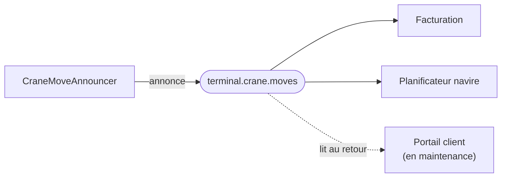

# Messaging

🌍 🇫🇷 Français (ce fichier) · 🇬🇧 [English](Messaging-en.md)

## Intention

Messaging intègre des applications en envoyant des paquets de données sur des canaux, de sorte que l'émetteur soit
découplé du receveur dans le temps autant que dans la technologie.

## Problème

Chaque mouvement de portique, chaque passage au portique et chaque remaniement de parc intéresse quelqu'un au
terminal : la facturation, le planificateur navire, le portail client.

Aucun des trois n'a besoin d'être averti à l'instant où cela se produit, et aucun ne devrait pouvoir arrêter un
portique en étant indisponible. Un appel synchrone aux trois ferait attendre un levage sur le plus lent, et un
portail en maintenance bloquerait le quai.

## Solution

Le patron envoie des paquets sur des canaux, et personne n'attend.

Chaque mouvement est annoncé comme un message sur un canal. La facturation, le planificateur navire et le portail
client lisent chacun ce qui l'intéresse, à son propre rythme, et un portail en maintenance ne rate rien dès qu'il
revient.

Émetteur et receveur sont découplés dans la technologie et — ce qui compte davantage ici — dans le temps.
L'éditeur nomme un canal et non un destinataire : un nouveau consommateur ne coûte rien à l'éditeur.

C'est le style que le reste de ce catalogue développe : les soixante et une autres entrées présupposent toutes que
l'intégration se fait par message.

## Structure



La flèche de l'éditeur s'arrête au canal. Il ne sait pas qu'il y a trois consommateurs, et celui en pointillé qui
ne rate rien est la propriété pour laquelle le style est choisi.

## Les rôles

| Rôle | Annotation | S'applique à | Ce qu'il porte |
|---|---|---|---|
| Messaging | `[Messaging]` | interface, classe, assembly | Le participant qui envoie ou reçoit des messages plutôt que d'appeler ou de partager. |

Un seul rôle, à l'un ou l'autre bout. L'assembly est une cible légitime et souvent la plus honnête : la
revendication *cette application s'intègre par messages* est d'ordinaire vraie d'une application entière plutôt que
d'une classe.

## L'exemple

Extrait de [`MessagingUsage.cs`](../../../../DesignPatternCatalog.Usage/EnterpriseIntegration/MessagingUsage.cs).

```csharp
[Messaging]
public sealed class CraneMoveAnnouncer {

    public void Announce(string containerNumber, string fromSlot, string toSlot) {
        // ... hands the message to an endpoint; who reads it is not this class's business
    }

}
```

`void`, et aucun paramètre nommant un destinataire. Les deux absences sont le patron.

`void` dit que personne n'attend : il n'y a pas de réponse à rendre, parce que l'annonce est complète dès qu'elle a
été remise. Et aucun destinataire n'apparaît dans la signature — le commentaire de l'exemple est exact sur le
pourquoi : *qui la lit n'est pas l'affaire de cette classe.*

Le commentaire nomme aussi ce que la classe ne fait *pas* : elle remet le message à un point de terminaison.
Sérialiser, se connecter, réessayer et acquitter vivent tous derrière
[Message Endpoint](MessageEndpoint-fr.md), et c'est pourquoi cette classe n'a ici ni champ ni dépendance visible.

La remarque de l'exemple énonce le gain : *l'éditeur nomme un canal et non un destinataire, donc un nouveau
consommateur ne coûte rien à l'éditeur.*

## Possibilités d'application

**Employez Messaging là où l'émetteur ne doit pas attendre le receveur.** Le découplage dans le temps est la
propriété distinctive du style, et la raison pour laquelle un portail en maintenance ne peut pas arrêter un
portique.

**Employez Messaging là où le nombre de parties intéressées peut changer.** Un quatrième consommateur est un
abonnement, non un changement de l'éditeur.

**Employez Messaging là où les deux applications ne partagent aucune technologie.** Comme un fichier, un message
traverse une frontière technologique ; contrairement à un fichier, il le fait promptement.

**Employez Messaging là où la fiabilité doit être organisée plutôt que supposée.** Le propos du livre est qu'un
système de messagerie peut garantir la livraison, réessayer et stocker — ce qu'un appel ne peut pas.

La comparaison des quatre styles par le livre est ce sur quoi cela repose : la messagerie donne la fraîcheur d'un
appel et le découplage d'un fichier, et le prix est tout ce dont traite le reste du catalogue.

## Quand ne pas l'utiliser

**Ne l'employez pas là où l'appelant a besoin de la réponse pour continuer.** Le contrôle de mainlevée du portique
relève de [Remote Procedure Invocation](RemoteProcedureInvocation-fr.md), et le forcer dans un canal signifie soit
bloquer sur une réponse — un appel déguisé — soit lever un conteneur qui n'aurait pas dû bouger.

**Ne l'employez pas là où les deux vues doivent s'accorder à chaque instant.** La messagerie est à cohérence
différée par construction : entre l'annonce et la consommation, les deux côtés divergent. Là où ils ne doivent
pas, la réponse du livre est [Shared Database](SharedDatabase-fr.md).

**Ne sous-estimez pas ce qu'elle coûte à exploiter.** C'est le contrepoids honnête à la popularité du style : une
intégration par messages a besoin de canaux, de points de terminaison, d'un traitement des lettres mortes, d'une
politique pour les messages empoisonnés, de supervision et d'une réponse à *et si cela arrive deux fois*.
Soixante et une des entrées de ce catalogue existent parce que ces questions sont réelles.

**Ne l'employez pas là où l'ordre est essentiel et non examiné.** Les messages peuvent arriver dans le désordre, et
le style n'y remédie pas — [Resequencer](../../../generated/catalog-index.md#resequencer-enterprise-integration-patterns)
existe parce que cela se produit.

**Ne l'employez pas comme un appel synchrone avec des étapes en plus.** Un éditeur qui bloque en attendant un
consommateur a payé la messagerie et acheté du couplage.

## Avantages

* L'émetteur n'attend pas : un consommateur lent ou absent ne peut pas l'arrêter.
* Un consommateur qui était en panne ne rate rien dès qu'il revient.
* Un nouveau consommateur ne coûte rien à l'éditeur — celui-ci nomme un canal, pas des destinataires.
* Émetteur et receveur ne partagent aucune technologie, et aucun n'a besoin que l'autre tourne.
* Fiabilité, réessai et ordre deviennent des choses qu'on peut demander à l'infrastructure plutôt qu'espérer.

## Inconvénients

* La cohérence est différée, et la fenêtre n'est pas sous le contrôle de l'émetteur.
* Le débogage traverse les processus : ce qui est arrivé à un message est une question à laquelle aucun journal
  seul ne répond.
* Garanties de livraison, doublons et ordre deviennent tous des décisions que quelqu'un doit prendre.
* La surface d'exploitation est vaste — c'est pourquoi ce catalogue a soixante-cinq entrées et non quatre.

## Liens avec les autres patrons

**`FileTransfer`**, **`SharedDatabase`** et **`RemoteProcedureInvocation`** sont les trois autres styles, et les
quatre se lisent comme un seul choix.

**`MessageChannel`**, **`Message`**, **`MessageEndpoint`**, **`MessageRouter`**, **`MessageTranslator`** et
**`PipesAndFilters`** sont les six patrons racines dont ce style est fait — le reste du catalogue les développe.

**`RequestReply`** est la façon dont la messagerie répond à une question, pour les cas où une réponse est
réellement nécessaire.

## Source

*Enterprise Integration Patterns*, Gregor Hohpe et Bobby Woolf, Addison-Wesley, 2003 — chapitre 2, les styles
d'intégration.

* [Entrée d'index](../../../generated/catalog-index.md#messaging-enterprise-integration-patterns)
* [Attribut généré](../../../../DesignPatternCatalog.EnterpriseIntegration/Messaging.cs)
* [Exemple](../../../../DesignPatternCatalog.Usage/EnterpriseIntegration/MessagingUsage.cs)
