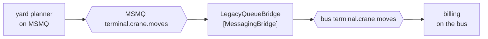

# Messaging Bridge

🌍 🇬🇧 English (this file) · 🇫🇷 [Français](MessagingBridge-fr.md)

## Intent

Messaging Bridge connects two messaging systems so that a message available on one is available on the other,
without either being aware of the other.

## Problem

The terminal is moving from MSMQ to a cloud bus, and the move takes eighteen months.

That figure is not a failure of planning. Eleven applications publish or consume, several are vendor systems on
their own release schedules, and one is the customs interface, whose change window is negotiated with a government
agency. During those eighteen months both messaging systems exist, and a crane move published to one has to be
readable on the other.

The alternative is a single weekend in which everything moves at once — which is the arrangement everyone agrees
to avoid and nobody can quite avoid without something like this.

## Solution

The pattern is a participant that consumes from one messaging system and publishes to the other.

A bridge takes a message off a channel in MSMQ and publishes it, unchanged, to the corresponding channel on the
bus. Applications on either side keep talking to the messaging system they already know. Neither is aware the
bridge exists, and neither is aware the other system does.

The value is in the schedule rather than in the design: the bridge is what makes *retire the old system
gradually* a real option, one application at a time.

## Structure



Both ends of the bridge are channels, and the two applications are at the far ends knowing nothing of each other's
transport.

## The roles

| Role | Annotation | Applies to | What it carries |
|---|---|---|---|
| MessagingBridge | `[MessagingBridge]` | interface, class | The participant that consumes from one messaging system and publishes to another. |

One role, and it names the participant that knows both systems — the only one that does. That singularity is worth
annotating precisely because a migration tends to grow more of them than anyone intended.

## The example

From [`MessagingBridgeUsage.cs`](../../../../DesignPatternCatalog.Usage/EnterpriseIntegration/MessagingBridgeUsage.cs).

```csharp
[MessagingBridge]
public sealed class LegacyQueueBridge {

    public void Forward() {
        // ... take from MSMQ, publish to the bus, unchanged
    }

}
```

`Forward` is one method with no parameters and no return, and that is right for what it is: the bridge is not
called with a message, it goes and gets one. Both channels are its own knowledge, not its caller's.

The word doing the work in the comment is **unchanged**. A bridge that reformats has become a
[Message Translator](MessageTranslator-en.md) as well, and then a migration also carries a format change — two
changes at once, each hiding the other's bugs. Keeping the bridge to *move it across* is what keeps the migration
reviewable.

The name is `LegacyQueueBridge`, which says which side is the old one. A bridge named for neither side gives a
reader no way to tell which direction the terminal is travelling in.

The sample states why the pattern exists at all: *it exists because two messaging systems are rarely replaced at
once, and it is what makes a gradual retirement possible.*

## Applicability

**Use a messaging bridge during a migration between messaging systems.** This is the book's case and the common
one: both systems exist for a while, and the bridge is what makes *a while* acceptable.

**Use it to join messaging systems that will both remain.** Two divisions, two brokers, one acquisition — a bridge
is cheaper than agreeing on one system.

**Forward unchanged.** Keeping transport and format as separate changes is what lets either be reviewed.

**Expect it to be temporary, and say so.** A bridge introduced for a migration should have an end, and naming it
for the side being retired is a small way of recording that.

## When not to use it

**Do not use it to connect an application that knows nothing of messaging.** That is
[Channel Adapter](ChannelAdapter-en.md): one side there is an application's own interface, not a channel.

**Do not let it translate.** A bridge that also changes format is doing two jobs, and when a message arrives wrong
on the far side there is no way to tell which job did it. Put a translator on one side of it if the format must
change.

**Do not let it route.** A bridge that decides which channel a message goes to on the far side has become a
[Message Router](MessageRouter-en.md) across a system boundary, which is the hardest kind of routing to observe.

**Do not build a loop.** Two bridges forwarding the same channel in both directions will forward a message back to
where it came from, forever, and the second bridge is usually added by somebody who did not know the first
existed.

**Do not expect it to carry the guarantees across.** A durable channel bridged to a non-durable one is not
durable, and a point-to-point channel bridged into a publish-subscribe one has changed how many receivers get the
message. The book's channel properties do not survive a bridge by themselves.

**Do not let it become permanent by inattention.** A bridge that outlives its migration is a component nobody owns
in the middle of everything, which is the failure mode of this pattern rather than a misuse of it.

## Advantages

* Two messaging systems can coexist, so a migration can be done one application at a time.
* Neither side is modified, and neither learns of the other.
* The knowledge of both systems is concentrated in one named participant.
* A retirement gets a schedule instead of a weekend.

## Drawbacks

* It is a hop, with the latency and the failure mode of one, and it is a hop nobody's diagram has.
* Channel properties — durability, delivery kind, ordering — do not cross it unless somebody makes them.
* Two bridges can form a loop, and a loop of messages is discovered by its effects.
* It is a component in the middle with no application owner, which is how it becomes permanent.
* Debugging spans two messaging systems, and their traces do not line up.

## Relations with other patterns

**`ChannelAdapter`** is the same shape with an application on one side instead of a second messaging system.

**`MessageTranslator`** is what a bridge must not become, and what to put beside it when the format really must
change.

**`MessageChannel`** is what both ends are, which is what distinguishes this from an adapter.

**`GuaranteedDelivery`** and the two delivery kinds are the properties a bridge can silently drop, since the far
channel's guarantees are its own.

**`Messaging`** is the style on both sides — the bridge is the pattern for the case where the style is present
twice.

## Source

*Enterprise Integration Patterns*, Gregor Hohpe and Bobby Woolf, Addison-Wesley, 2003 — the messaging-channels
chapter.

* [Index entry](../../../generated/catalog-index.md#messagingbridge-enterprise-integration-patterns)
* [Generated attribute](../../../../DesignPatternCatalog.EnterpriseIntegration/MessagingBridge.cs)
* [Example](../../../../DesignPatternCatalog.Usage/EnterpriseIntegration/MessagingBridgeUsage.cs)
