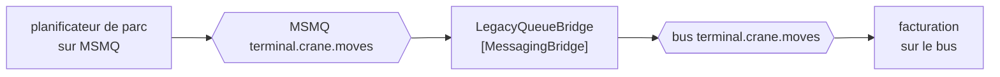

# Messaging Bridge

🌍 🇫🇷 Français (ce fichier) · 🇬🇧 [English](MessagingBridge-en.md)

## Intention

Messaging Bridge relie deux systèmes de messagerie de sorte qu'un message disponible sur l'un soit disponible sur
l'autre, sans qu'aucun ait conscience de l'autre.

## Problème

Le terminal passe de MSMQ à un bus dans le nuage, et le passage prend dix-huit mois.

Ce chiffre n'est pas un défaut de planification. Onze applications émettent ou consomment, plusieurs sont des
systèmes de fournisseurs avec leurs propres calendriers de livraison, et l'une est l'interface douanière, dont la
fenêtre de changement se négocie avec une administration. Pendant ces dix-huit mois les deux systèmes de messagerie
existent, et un mouvement de portique publié sur l'un doit être lisible sur l'autre.

L'alternative est un seul week-end où tout bascule d'un coup — l'agencement que tout le monde s'accorde à éviter et
que personne n'évite tout à fait sans quelque chose comme ceci.

## Solution

Le patron est un participant qui consomme sur un système de messagerie et publie sur l'autre.

Un pont prend un message sur un canal dans MSMQ et le publie, inchangé, sur le canal correspondant du bus. Les
applications de chaque côté continuent de parler au système de messagerie qu'elles connaissent déjà. Aucune ne sait
que le pont existe, et aucune ne sait que l'autre système existe.

La valeur est dans le calendrier plutôt que dans la conception : le pont est ce qui fait de *retirer l'ancien
système progressivement* une véritable option, une application à la fois.

## Structure



Les deux bouts du pont sont des canaux, et les deux applications sont aux extrémités sans rien savoir du transport
de l'autre.

## Les rôles

| Rôle | Annotation | S'applique à | Ce qu'il porte |
|---|---|---|---|
| MessagingBridge | `[MessagingBridge]` | interface, classe | Le participant qui consomme sur un système de messagerie et publie sur un autre. |

Un seul rôle, et il nomme le participant qui connaît les deux systèmes — le seul qui les connaisse. Cette unicité
vaut d'être annotée précisément parce qu'une migration tend à en faire naître plus que quiconque n'avait prévu.

## L'exemple

Extrait de [`MessagingBridgeUsage.cs`](../../../../DesignPatternCatalog.Usage/EnterpriseIntegration/MessagingBridgeUsage.cs).

```csharp
[MessagingBridge]
public sealed class LegacyQueueBridge {

    public void Forward() {
        // ... take from MSMQ, publish to the bus, unchanged
    }

}
```

`Forward` est une méthode sans paramètre et sans retour, et c'est juste pour ce qu'elle est : le pont n'est pas
appelé avec un message, il va en chercher un. Les deux canaux sont sa connaissance, non celle de son appelant.

Le mot qui travaille dans le commentaire est **inchangé**. Un pont qui reformate est devenu aussi un
[Message Translator](MessageTranslator-fr.md), et alors une migration porte également un changement de format — deux
changements à la fois, chacun cachant les bogues de l'autre. Garder le pont à *le faire traverser* est ce qui garde
la migration relisible.

Le nom est `LegacyQueueBridge`, qui dit quel côté est l'ancien. Un pont nommé d'après aucun des deux côtés ne donne
au lecteur aucun moyen de savoir dans quel sens le terminal voyage.

L'exemple énonce la raison d'être du patron : *il existe parce que deux systèmes de messagerie sont rarement
remplacés d'un coup, et c'est ce qui rend un retrait progressif possible.*

## Possibilités d'application

**Employez un pont de messagerie pendant une migration entre systèmes de messagerie.** C'est le cas du livre et le
cas courant : les deux systèmes existent un temps, et le pont est ce qui rend *un temps* acceptable.

**Employez-le pour joindre des systèmes de messagerie qui vont tous deux rester.** Deux divisions, deux courtiers,
une acquisition — un pont coûte moins cher que de s'accorder sur un seul système.

**Transmettez sans modifier.** Garder le transport et le format comme deux changements distincts est ce qui permet
de relire l'un ou l'autre.

**Attendez-vous à ce qu'il soit temporaire, et dites-le.** Un pont introduit pour une migration devrait avoir une
fin, et le nommer d'après le côté qu'on retire est une petite façon de le consigner.

## Quand ne pas l'utiliser

**Ne l'employez pas pour relier une application qui ne connaît rien à la messagerie.** C'est
[Channel Adapter](ChannelAdapter-fr.md) : un côté y est l'interface propre d'une application, non un canal.

**Ne le laissez pas traduire.** Un pont qui change aussi le format fait deux métiers, et quand un message arrive
faux de l'autre côté, il n'y a aucun moyen de dire lequel des deux l'a fait. Mettez un traducteur d'un côté de lui
si le format doit changer.

**Ne le laissez pas router.** Un pont qui décide vers quel canal va un message de l'autre côté est devenu un
[Message Router](MessageRouter-fr.md) à travers une frontière de système, ce qui est le routage le plus difficile à
observer.

**Ne bâtissez pas de boucle.** Deux ponts qui transmettent le même canal dans les deux sens renverront un message
là d'où il vient, indéfiniment, et le second pont est d'ordinaire ajouté par quelqu'un qui ne savait pas que le
premier existait.

**N'attendez pas qu'il fasse traverser les garanties.** Un canal durable ponté vers un canal non durable n'est pas
durable, et un canal point à point ponté vers un canal de publication-abonnement a changé le nombre de receveurs qui
obtiennent le message. Les propriétés de canal du livre ne survivent pas à un pont d'elles-mêmes.

**Ne le laissez pas devenir permanent par inattention.** Un pont qui survit à sa migration est un composant que
personne ne possède au milieu de tout, ce qui est le mode de défaillance de ce patron plutôt qu'un mésusage.

## Avantages

* Deux systèmes de messagerie peuvent coexister : une migration peut se faire une application à la fois.
* Aucun côté n'est modifié, et aucun n'apprend l'existence de l'autre.
* La connaissance des deux systèmes est concentrée dans un participant nommé.
* Un retrait obtient un calendrier au lieu d'un week-end.

## Inconvénients

* C'est un saut, avec la latence et le mode de défaillance d'un saut, et c'est un saut qu'aucun diagramme n'a.
* Les propriétés de canal — durabilité, sorte de délivrance, ordre — ne le traversent pas à moins que quelqu'un ne
  s'en occupe.
* Deux ponts peuvent former une boucle, et une boucle de messages se découvre par ses effets.
* C'est un composant au milieu, sans propriétaire applicatif, ce qui est la façon dont il devient permanent.
* Le débogage s'étend sur deux systèmes de messagerie, et leurs traces ne s'alignent pas.

## Liens avec les autres patrons

**`ChannelAdapter`** est la même forme avec une application d'un côté au lieu d'un second système de messagerie.

**`MessageTranslator`** est ce qu'un pont ne doit pas devenir, et ce qu'il faut mettre à côté de lui quand le format
doit vraiment changer.

**`MessageChannel`** est ce que sont ses deux bouts, ce qui distingue celui-ci d'un adaptateur.

**`GuaranteedDelivery`** et les deux sortes de délivrance sont les propriétés qu'un pont peut laisser tomber
discrètement, puisque les garanties du canal d'en face sont les siennes.

**`Messaging`** est le style des deux côtés — le pont est le patron du cas où le style est présent deux fois.

## Source

*Enterprise Integration Patterns*, Gregor Hohpe et Bobby Woolf, Addison-Wesley, 2003 — le chapitre sur les canaux
de messagerie.

* [Entrée d'index](../../../generated/catalog-index.md#messagingbridge-enterprise-integration-patterns)
* [Attribut généré](../../../../DesignPatternCatalog.EnterpriseIntegration/MessagingBridge.cs)
* [Exemple](../../../../DesignPatternCatalog.Usage/EnterpriseIntegration/MessagingBridgeUsage.cs)
