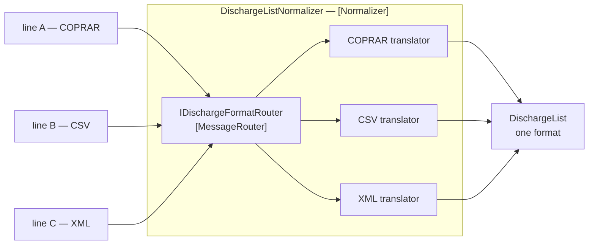

# Normalizer

🌍 🇬🇧 English (this file) · 🇫🇷 [Français](Normalizer-fr.md)

## Intent

Normalizer routes each incoming format through a translator of its own so that messages meaning the same thing
arrive in one format, whatever the sender chose to send.

## Problem

Forty shipping lines send the terminal a discharge list.

One sends EDIFACT COPRAR. One sends a CSV with no header row. One sends XML against a schema it never published.
They all mean the same thing: these containers come off this vessel.

Forty formats reaching the terminal's own code means forty parsers inside it, or one parser with forty branches,
and either way the terminal knows about forty carriers' data conventions. The forty-first line is a change to the
terminal.

## Solution

The pattern is an assembly, not a mechanism.

A [router](MessageRouter-en.md) recognises which format arrived, and a [translator](MessageTranslator-en.md) per
format turns it into the one the terminal works in. Nothing downstream sees more than one format.

Being an assembly is the thing to understand about it: **the parts inside wear `MessageRouter` and
`MessageTranslator` themselves, and this annotation names the whole.** It is the same decision the catalogue makes
for [Composed Message Processor](ComposedMessageProcessor-en.md), and for the same reason — a role per constituent
would count the same participant twice, and a codebase with three normalizers could no longer say how many
translators it has.

## Structure



The box is the pattern; the router and the translators inside it are patterns of their own.

## The roles

| Role | Annotation | Applies to | What it carries |
|---|---|---|---|
| Normalizer | `[Normalizer]` | interface, class | The participant that turns many equivalent formats into one. |

One role for the assembly, and none for the parts. The parts are annotated where they are declared, so a rule
asking *how many translators does this codebase have* gets forty-plus-however-many-others, and a rule asking *how
many normalizers* gets one.

## The example

From [`NormalizerUsage.cs`](../../../../DesignPatternCatalog.Usage/EnterpriseIntegration/NormalizerUsage.cs).

The two constituents, each wearing its own pattern:

```csharp
[MessageRouter]
public interface IDischargeFormatRouter {

    string FormatOf(ReadOnlyMemory<byte> payload);

}
```

```csharp
[MessageTranslator]
public interface IDischargeTranslator {

    DischargeList Translate(ReadOnlyMemory<byte> payload);

}
```

`FormatOf` returns a format name and not a translator. That keeps the router a router — it decides *which*, and
the mapping from a format name to the participant that handles it is the normalizer's, not the router's.

`ReadOnlyMemory<byte>` rather than `string` is the sample being careful: a normalizer that had to decode text
before recognising a format would have made an encoding decision before knowing which encoding applied, which is
exactly the guess the pattern removes.

The assembly:

```csharp
public DischargeList Normalize(ReadOnlyMemory<byte> payload) {
    return _translators[_router.FormatOf(payload)].Translate(payload);
}
```

One line, and it does nothing but compose the two. That is the pattern's honest size: a normalizer that grew a
body would be doing work its constituents should be doing, and the annotation would stop describing it.

Both constituents arrive by constructor injection, and the translators come as a dictionary keyed by format name.
The sample states what that buys: *the router picks the format and a translator does the work, which is why a
forty-first line costs a translator and no edit here.*

## Applicability

**Use a normalizer where many senders mean the same thing in different formats.** The book's case, and the
ordinary condition of any integration with an industry rather than with one partner.

**Use it where the formats are genuinely equivalent.** They must all be translatable to one thing; formats that
say different things are not a normalization problem but a
[bounded context](../domain-driven-design/BoundedContext-en.md) one.

**Let a new format be a new translator.** If adding one means editing the normalizer, the composition is not doing
its job.

**Name the whole.** It is what stops the router-and-translators arrangement being reinvented per integration.

## When not to use it

**Do not use it for two formats.** Two translators and a condition is smaller than a router, a dictionary and an
assembly.

**Do not use it where the formats mean different things.** A translator can rename a field; it cannot reconcile
two carriers that disagree about what a discharge is. That is
[Anticorruption Layer](../domain-driven-design/AnticorruptionLayer-en.md)'s territory.

**Do not let the normalizer acquire a body.** Work that appears in the assembly rather than in a constituent is
work the annotations no longer describe.

**Do not skip the canonical format.** A normalizer whose output is one carrier's format has made that carrier the
standard, and the fortieth line is now translated into the first line's vocabulary — which is what
[Canonical Data Model](CanonicalDataModel-en.md) exists to avoid.

**Do not leave the unrecognised format undefined.** A payload the router cannot place has to go somewhere a human
can look, which is [Invalid Message Channel](InvalidMessageChannel-en.md).

**Do not use it where the number of formats is really a number of meanings.** Forty formats of one thing is this
pattern; forty things is forty integrations.

## Advantages

* Nothing downstream sees more than one format.
* A new sender costs one translator and no change to the assembly.
* Each translator is small, testable and about exactly one carrier's conventions.
* The parts keep their own annotations, so translators and routers stay countable.
* The recognition step is separate from the conversion, so a format that is recognised but not yet supported is a
  distinct, visible state.

## Drawbacks

* It is a router, a dictionary and n translators for what a reader might expect to be one class.
* Format recognition is guesswork on somebody else's file, and it is where the surprises are.
* Forty translators is forty things to maintain as carriers change their formats.
* The canonical output format becomes a shared contract, with everything that implies.
* The assembly hides the fan-out, so a failure inside one translator surfaces as a normalizer failure.

## Relations with other patterns

**`MessageRouter`** and **`MessageTranslator`** are what it is made of, and they carry their own annotations
inside it.

**`ComposedMessageProcessor`** is the catalogue's other assembly, and it gets one role for exactly the same
reason.

**`CanonicalDataModel`** is what a normalizer should translate *into* — the two are usually adopted together, since
normalizing into one application's format only moves the problem.

**`MessageTranslator`**'s page states the arithmetic this answers: *n* formats are *n*(*n*−1) pairwise
translations, and a middle language is what replaces them.

**`InvalidMessageChannel`** is where a payload no translator claims has to go.

## Source

*Enterprise Integration Patterns*, Gregor Hohpe and Bobby Woolf, Addison-Wesley, 2003 — the message-transformation
chapter.

* [Index entry](../../../generated/catalog-index.md#normalizer-enterprise-integration-patterns)
* [Generated attribute](../../../../DesignPatternCatalog.EnterpriseIntegration/Normalizer.cs)
* [Example](../../../../DesignPatternCatalog.Usage/EnterpriseIntegration/NormalizerUsage.cs)
