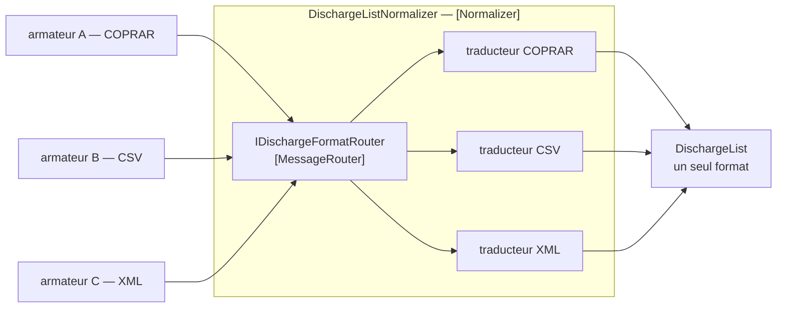

# Normalizer

🌍 🇫🇷 Français (ce fichier) · 🇬🇧 [English](Normalizer-en.md)

## Intention

Normalizer fait passer chaque format entrant par un traducteur qui lui est propre, de sorte que des messages
voulant dire la même chose arrivent dans un seul format, quel que soit celui que l'émetteur a choisi.

## Problème

Quarante armateurs envoient au terminal une liste de déchargement.

L'un envoie de l'EDIFACT COPRAR. L'un envoie un CSV sans ligne d'en-tête. L'un envoie du XML conforme à un schéma
qu'il n'a jamais publié. Tous veulent dire la même chose : ces conteneurs descendent de ce navire.

Quarante formats qui atteignent le code propre du terminal, ce sont quarante analyseurs à l'intérieur, ou un
analyseur à quarante branches, et dans les deux cas le terminal connaît les conventions de données de quarante
transporteurs. Le quarante-et-unième armateur est un changement du terminal.

## Solution

Le patron est un assemblage, non un mécanisme.

Un [routeur](MessageRouter-fr.md) reconnaît quel format est arrivé, et un [traducteur](MessageTranslator-fr.md) par
format le transforme en celui dans lequel le terminal travaille. Rien en aval ne voit plus d'un format.

Être un assemblage est ce qu'il faut comprendre de lui : **les parties à l'intérieur portent elles-mêmes
`MessageRouter` et `MessageTranslator`, et cette annotation nomme le tout.** C'est la même décision que le catalogue
prend pour [Composed Message Processor](ComposedMessageProcessor-fr.md), et pour la même raison — un rôle par
constituant compterait deux fois le même participant, et un code qui aurait trois normaliseurs ne pourrait plus dire
combien de traducteurs il possède.

## Structure



La boîte est le patron ; le routeur et les traducteurs à l'intérieur sont des patrons à part entière.

## Les rôles

| Rôle | Annotation | S'applique à | Ce qu'il porte |
|---|---|---|---|
| Normalizer | `[Normalizer]` | interface, classe | Le participant qui transforme de nombreux formats équivalents en un seul. |

Un rôle pour l'assemblage, et aucun pour les parties. Les parties sont annotées là où elles sont déclarées, si bien
qu'une règle demandant *combien de traducteurs ce code possède-t-il* obtient quarante et quelques, et une règle
demandant *combien de normaliseurs* en obtient un.

## L'exemple

Extrait de [`NormalizerUsage.cs`](../../../../DesignPatternCatalog.Usage/EnterpriseIntegration/NormalizerUsage.cs).

Les deux constituants, chacun portant son propre patron :

```csharp
[MessageRouter]
public interface IDischargeFormatRouter {

    string FormatOf(ReadOnlyMemory<byte> payload);

}
```

```csharp
[MessageTranslator]
public interface IDischargeTranslator {

    DischargeList Translate(ReadOnlyMemory<byte> payload);

}
```

`FormatOf` rend un nom de format et non un traducteur. Cela garde le routeur routeur — il décide *lequel*, et la
correspondance d'un nom de format vers le participant qui le traite appartient au normaliseur, non au routeur.

`ReadOnlyMemory<byte>` plutôt que `string` est l'exemple qui reste prudent : un normaliseur obligé de décoder du
texte avant de reconnaître un format aurait pris une décision d'encodage avant de savoir quel encodage s'applique,
ce qui est exactement la devinette que le patron retire.

L'assemblage :

```csharp
public DischargeList Normalize(ReadOnlyMemory<byte> payload) {
    return _translators[_router.FormatOf(payload)].Translate(payload);
}
```

Une ligne, et elle ne fait rien d'autre que composer les deux. C'est la taille honnête du patron : un normaliseur
qui aurait pris du corps ferait un travail que ses constituants devraient faire, et l'annotation cesserait de le
décrire.

Les deux constituants arrivent par injection dans le constructeur, et les traducteurs viennent comme un dictionnaire
indexé par nom de format. L'exemple énonce ce que cela achète : *le routeur choisit le format et un traducteur fait
le travail, ce qui est pourquoi un quarante-et-unième armateur coûte un traducteur et aucune modification ici.*

## Possibilités d'application

**Employez un normaliseur là où de nombreux émetteurs disent la même chose dans des formats différents.** Le cas du
livre, et la condition ordinaire de toute intégration avec une profession plutôt qu'avec un partenaire.

**Employez-le là où les formats sont réellement équivalents.** Ils doivent tous être traduisibles vers une même
chose ; des formats qui disent des choses différentes ne sont pas un problème de normalisation mais un problème de
[contexte borné](../domain-driven-design/BoundedContext-fr.md).

**Faites qu'un nouveau format soit un nouveau traducteur.** Si en ajouter un oblige à modifier le normaliseur, la
composition ne fait pas son métier.

**Nommez le tout.** C'est ce qui empêche l'agencement routeur-et-traducteurs d'être réinventé à chaque intégration.

## Quand ne pas l'utiliser

**Ne l'employez pas pour deux formats.** Deux traducteurs et une condition font moins qu'un routeur, un dictionnaire
et un assemblage.

**Ne l'employez pas là où les formats disent des choses différentes.** Un traducteur peut renommer un champ ; il ne
peut pas réconcilier deux transporteurs qui ne s'accordent pas sur ce qu'est un déchargement. C'est le territoire de
la [couche anticorruption](../domain-driven-design/AnticorruptionLayer-fr.md).

**Ne laissez pas le normaliseur prendre du corps.** Un travail qui apparaît dans l'assemblage plutôt que dans un
constituant est un travail que les annotations ne décrivent plus.

**Ne sautez pas le format canonique.** Un normaliseur dont la sortie est le format d'un transporteur a fait de ce
transporteur la norme, et le quarantième armateur est désormais traduit dans le vocabulaire du premier — ce que
[Canonical Data Model](CanonicalDataModel-fr.md) existe pour éviter.

**Ne laissez pas le format non reconnu indéfini.** Une charge utile que le routeur ne sait pas situer doit aller
quelque part où un humain peut regarder, c'est-à-dire [Invalid Message Channel](InvalidMessageChannel-fr.md).

**Ne l'employez pas là où le nombre de formats est en réalité un nombre de sens.** Quarante formats d'une même chose,
c'est ce patron ; quarante choses, ce sont quarante intégrations.

## Avantages

* Rien en aval ne voit plus d'un format.
* Un nouvel émetteur coûte un traducteur et aucun changement de l'assemblage.
* Chaque traducteur est petit, testable et porte exactement sur les conventions d'un transporteur.
* Les parties gardent leurs propres annotations : traducteurs et routeurs restent dénombrables.
* L'étape de reconnaissance est séparée de la conversion, si bien qu'un format reconnu mais non encore pris en charge
  est un état distinct et visible.

## Inconvénients

* C'est un routeur, un dictionnaire et *n* traducteurs là où un lecteur pourrait attendre une classe.
* La reconnaissance de format est une devinette sur le fichier d'autrui, et c'est là que sont les surprises.
* Quarante traducteurs font quarante choses à maintenir à mesure que les transporteurs changent leurs formats.
* Le format canonique de sortie devient un contrat partagé, avec tout ce que cela implique.
* L'assemblage cache l'éventail : une panne dans un traducteur se manifeste comme une panne du normaliseur.

## Liens avec les autres patrons

**`MessageRouter`** et **`MessageTranslator`** sont ce dont il est fait, et ils portent leurs propres annotations à
l'intérieur de lui.

**`ComposedMessageProcessor`** est l'autre assemblage du catalogue, et il reçoit un rôle unique pour exactement la
même raison.

**`CanonicalDataModel`** est ce vers quoi un normaliseur devrait traduire — les deux s'adoptent d'ordinaire ensemble,
puisque normaliser vers le format d'une application ne fait que déplacer le problème.

**La page de `MessageTranslator`** énonce l'arithmétique à laquelle celui-ci répond : *n* formats font *n*(*n*−1)
traductions deux à deux, et une langue intermédiaire est ce qui les remplace.

**`InvalidMessageChannel`** est là où doit aller une charge utile qu'aucun traducteur ne revendique.

## Source

*Enterprise Integration Patterns*, Gregor Hohpe et Bobby Woolf, Addison-Wesley, 2003 — le chapitre sur la
transformation des messages.

* [Entrée d'index](../../../generated/catalog-index.md#normalizer-enterprise-integration-patterns)
* [Attribut généré](../../../../DesignPatternCatalog.EnterpriseIntegration/Normalizer.cs)
* [Exemple](../../../../DesignPatternCatalog.Usage/EnterpriseIntegration/NormalizerUsage.cs)
