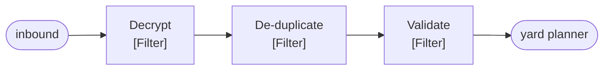

# Pipes and Filters

🌍 🇬🇧 English (this file) · 🇫🇷 [Français](PipesAndFilters-fr.md)

## Intent

Pipes and Filters divides a larger processing task into a sequence of independent steps joined by channels, so
that a step can be reordered, reused or replaced without the others knowing.

## Problem

An inbound EDI manifest has to be decrypted, de-duplicated, validated against the booking list and only then
handed to the yard planner.

Written as one method, the four concerns are impossible to test apart:

```csharp
public void Handle(string manifest) {
    string plain = Decrypt(manifest);
    if (_seen.Contains(Hash(plain))) { return; }
    if (!ValidAgainstBookings(plain)) { throw new …; }
    _yardPlanner.Accept(plain);
}
```

And the day somebody needs validation without de-duplication, the method grows a flag.

## Solution

The pattern makes each step independent and the order a fact stated in one place.

Each concern becomes a filter that reads a message and writes a message, knowing nothing of what precedes or
follows it. The steps are joined by pipes — channels rather than method calls — which is what decouples them in
time as well as in code.

The order lives in the pipeline, and nowhere else. Rearranging the sequence is editing one list rather than
rewriting who calls whom.

## Structure



Four filters, three pipes between them, and no filter with an arrow to a named neighbour. Each one reads from
whatever is upstream and writes to whatever is downstream, which is why the sequence can be reordered.

## The roles

| Role | Annotation | Applies to | What it carries |
|---|---|---|---|
| Filter | `[PipesAndFilters.Filter]` | interface, class | One processing step. It knows nothing of what precedes or follows it. |
| Pipe | `[PipesAndFilters.Pipe]` | interface, class | The channel joining two steps. A participant rather than a call, which is what decouples them in time. |
| Pipeline | `[PipesAndFilters.Pipeline(Filter = typeof(…))]` | interface, class, assembly | The assembled sequence, and the only participant that knows the order. |

Three roles, and the third is the one worth noticing: the pipeline names its filter type, so the annotation says
which steps belong to this pipeline rather than to another.

## The example

From [`PipesAndFiltersUsage.cs`](../../../../DesignPatternCatalog.Usage/EnterpriseIntegration/PipesAndFiltersUsage.cs).

```csharp
[PipesAndFilters.Filter]
public interface IManifestFilter {

    string Process(string message);

}
```

`string` in, `string` out. The uniformity is the pattern: because every step has the same signature, any step can
follow any other, and that is what makes the sequence rearrangeable.

The sample's remark says what the shape buys: *it knows nothing of what precedes or follows it, which is the
property that lets the sequence be rearranged without editing a step.*

```csharp
[PipesAndFilters.Pipe]
public interface IManifestPipe {

    void Put(string message);

    string? Take();

}
```

Put and take, with the take nullable because there may be nothing there yet. This is the half most often skipped:
a pipeline built from direct method calls has filters but no pipes, and the steps are then coupled in time —
filter two runs when filter one returns, not when a message is ready.

The remark is exact: *a participant rather than a method call, which is what decouples the steps in time.*

```csharp
[PipesAndFilters.Pipeline(Filter = typeof(IManifestFilter))]
public sealed class ManifestPipeline {

    private readonly IReadOnlyList<IManifestFilter> _steps;

    public ManifestPipeline(IReadOnlyList<IManifestFilter> steps) { _steps = steps; }

    public string Run(string message) {
        foreach (IManifestFilter step in _steps) { message = step.Process(message); }

        return message;
    }

}
```

The order is a `IReadOnlyList` supplied at construction, and `Run` is a fold over it. Nothing in the pipeline
knows what the steps do, and nothing in the steps knows their position — which is the whole arrangement in nine
lines.

Note that this pipeline calls its filters directly rather than through the pipes it declares. That is the sample
being honest about a spectrum: the book's pattern admits both, and an in-process pipeline that keeps the filter
boundary but drops the temporal decoupling still gets the reordering benefit. The pipe interface is there for the
version that needs the other half.

## Applicability

**Use Pipes and Filters where a task divides into steps that can be understood separately.** The book's own
criterion is independence: a step that needs to know what ran before it is not a filter.

**Use it where the steps may be reordered, reused or replaced.** That is what the uniform signature buys, and the
reason the day somebody wants validation without de-duplication is a change to a list.

**Use pipes — channels — rather than calls where the steps must be decoupled in time.** The book treats this as
part of the pattern rather than an implementation choice: it is what lets one step be replaced while another runs.

**Use it where the steps can scale differently.** With real channels between them, a slow filter can be given more
instances without the others knowing.

## When not to use it

**Do not use it where the steps are not independent.** A filter that needs the result of two steps back, or that
must know whether validation happened, has a dependency the pattern cannot express — and forcing it through means
smuggling state in the message.

**Do not use it where the sequence never changes and the steps are trivial.** Four private methods called in order
are readable, testable and cheaper; the pattern earns its cost when the arrangement varies.

**Do not use it where the uniform signature would lie.** `string` in and `string` out is honest here because a
manifest is text at every stage. A pipeline whose steps genuinely take and return different types is a sequence of
translators, and pretending otherwise buys the reordering property and loses the type checking.

**Do not use it where latency matters and the pipes are real.** Every pipe is a hop, and a chain of five channels
is five queueing delays — which the in-process form avoids and the decoupled form does not.

**Do not scatter the order.** The pipeline is the only participant that should know the sequence; a filter that
knows its successor has put the order back into the steps, and the annotation on the pipeline is then a claim that
is no longer true.

## Advantages

* Each step is understandable and testable on its own, with two strings and no infrastructure.
* The order is stated in one place, so rearranging it is editing a list.
* A step can be reused in another pipeline, because it knows nothing about this one.
* With real pipes, steps are decoupled in time and can scale independently.
* A new step is an addition rather than a modification.

## Drawbacks

* Uniformity of signature is bought by weakening it: `string` in and `string` out type-checks nothing about what a
  step expects.
* Real pipes cost latency, one hop per step.
* Errors are harder to place: a failure four steps in has passed through three others, and the message that
  arrived is not the message that was sent.
* A pipeline of trivial steps is more machinery than the four method calls it replaced.

## Relations with other patterns

**`MessageChannel`** is what a pipe is, and the reason a pipe is a participant rather than a call.

**`MessageRouter`** and **`MessageTranslator`** are both filters in this sense, and the catalogue's distinction
between them — one changes where, the other changes what — is what keeps a pipeline reasonable.

**`ComposedMessageProcessor`** and **`ScatterGather`** are pipelines with a shape: they split, process in
parallel, and rejoin.

**`ProcessManager`** is the alternative when the order is not fixed — a pipeline states one sequence, a process
manager decides the next step each time.

**`Chain of Responsibility`**, in the Gang of Four catalogue, is the neighbouring object-level pattern, and differs
in that a handler which accepts a request ends it while a filter always passes something on.

## Source

*Enterprise Integration Patterns*, Gregor Hohpe and Bobby Woolf, Addison-Wesley, 2003 — chapter 3, messaging
systems.

* [Index entry](../../../generated/catalog-index.md#pipesandfilters-enterprise-integration-patterns)
* [Generated attribute](../../../../DesignPatternCatalog.EnterpriseIntegration/PipesAndFilters.cs)
* [Example](../../../../DesignPatternCatalog.Usage/EnterpriseIntegration/PipesAndFiltersUsage.cs)
