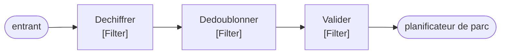

# Pipes and Filters

🌍 🇫🇷 Français (ce fichier) · 🇬🇧 [English](PipesAndFilters-en.md)

## Intention

Pipes and Filters divise une tâche de traitement en une séquence d'étapes indépendantes reliées par des canaux, de
sorte qu'une étape puisse être réordonnée, réutilisée ou remplacée sans que les autres le sachent.

## Problème

Un manifeste EDI entrant doit être déchiffré, dédoublonné, validé contre la liste des réservations et seulement
ensuite remis au planificateur de parc.

Écrit en une méthode, les quatre préoccupations sont impossibles à tester séparément :

```csharp
public void Handle(string manifest) {
    string plain = Decrypt(manifest);
    if (_seen.Contains(Hash(plain))) { return; }
    if (!ValidAgainstBookings(plain)) { throw new …; }
    _yardPlanner.Accept(plain);
}
```

Et le jour où quelqu'un a besoin de la validation sans le dédoublonnage, la méthode se dote d'un drapeau.

## Solution

Le patron rend chaque étape indépendante et fait de l'ordre un fait énoncé à un seul endroit.

Chaque préoccupation devient un filtre qui lit un message et écrit un message, sans rien savoir de ce qui le
précède ni de ce qui le suit. Les étapes sont reliées par des tuyaux — des canaux plutôt que des appels de méthode
—, ce qui les découple dans le temps autant que dans le code.

L'ordre vit dans le pipeline, et nulle part ailleurs. Réarranger la séquence est une modification d'une liste plutôt
qu'une réécriture de qui appelle qui.

## Structure



Quatre filtres, trois tuyaux entre eux, et aucun filtre avec une flèche vers un voisin nommé. Chacun lit ce qui est
en amont et écrit vers ce qui est en aval, et c'est pourquoi la séquence peut être réordonnée.

## Les rôles

| Rôle | Annotation | S'applique à | Ce qu'il porte |
|---|---|---|---|
| Filter | `[PipesAndFilters.Filter]` | interface, classe | Une étape de traitement. Elle ne sait rien de ce qui la précède ni de ce qui la suit. |
| Pipe | `[PipesAndFilters.Pipe]` | interface, classe | Le canal qui joint deux étapes. Un participant plutôt qu'un appel, ce qui les découple dans le temps. |
| Pipeline | `[PipesAndFilters.Pipeline(Filter = typeof(…))]` | interface, classe, assembly | La séquence assemblée, et le seul participant qui connaisse l'ordre. |

Trois rôles, et le troisième mérite l'attention : le pipeline nomme son type de filtre, si bien que l'annotation dit
quelles étapes appartiennent à ce pipeline plutôt qu'à un autre.

## L'exemple

Extrait de [`PipesAndFiltersUsage.cs`](../../../../DesignPatternCatalog.Usage/EnterpriseIntegration/PipesAndFiltersUsage.cs).

```csharp
[PipesAndFilters.Filter]
public interface IManifestFilter {

    string Process(string message);

}
```

`string` en entrée, `string` en sortie. L'uniformité est le patron : parce que chaque étape a la même signature,
n'importe quelle étape peut suivre n'importe quelle autre, et c'est ce qui rend la séquence réarrangeable.

La remarque de l'exemple dit ce que la forme achète : *elle ne sait rien de ce qui la précède ni de ce qui la suit,
ce qui est la propriété qui permet de réarranger la séquence sans modifier une étape.*

```csharp
[PipesAndFilters.Pipe]
public interface IManifestPipe {

    void Put(string message);

    string? Take();

}
```

Déposer et prendre, avec un prendre nullable parce qu'il peut n'y avoir encore rien. C'est la moitié qu'on saute le
plus souvent : un pipeline bâti d'appels directs a des filtres et pas de tuyaux, et les étapes sont alors couplées
dans le temps — le filtre deux tourne quand le filtre un rend, non quand un message est prêt.

La remarque est exacte : *un participant plutôt qu'un appel de méthode, ce qui découple les étapes dans le temps.*

```csharp
[PipesAndFilters.Pipeline(Filter = typeof(IManifestFilter))]
public sealed class ManifestPipeline {

    private readonly IReadOnlyList<IManifestFilter> _steps;

    public ManifestPipeline(IReadOnlyList<IManifestFilter> steps) { _steps = steps; }

    public string Run(string message) {
        foreach (IManifestFilter step in _steps) { message = step.Process(message); }

        return message;
    }

}
```

L'ordre est un `IReadOnlyList` fourni à la construction, et `Run` est un repli dessus. Rien dans le pipeline ne sait
ce que font les étapes, et rien dans les étapes ne connaît sa position — tout l'agencement en neuf lignes.

Noter que ce pipeline appelle ses filtres directement plutôt qu'à travers les tuyaux qu'il déclare. C'est l'exemple
qui joue franc jeu sur un continuum : le patron du livre admet les deux, et un pipeline en processus qui garde la
frontière des filtres tout en abandonnant le découplage temporel obtient malgré tout le bénéfice du réordonnancement.
L'interface de tuyau est là pour la version qui a besoin de l'autre moitié.

## Possibilités d'application

**Employez Pipes and Filters là où une tâche se divise en étapes compréhensibles séparément.** Le critère propre du
livre est l'indépendance : une étape qui a besoin de savoir ce qui a tourné avant elle n'est pas un filtre.

**Employez-le là où les étapes peuvent être réordonnées, réutilisées ou remplacées.** C'est ce que la signature
uniforme achète, et la raison pour laquelle le jour où quelqu'un veut la validation sans le dédoublonnage est une
modification de liste.

**Employez des tuyaux — des canaux — plutôt que des appels là où les étapes doivent être découplées dans le temps.**
Le livre traite cela comme une part du patron plutôt qu'un choix d'implémentation : c'est ce qui permet de remplacer
une étape pendant qu'une autre tourne.

**Employez-le là où les étapes peuvent monter en charge différemment.** Avec de vrais canaux entre elles, un filtre
lent peut recevoir plus d'instances sans que les autres le sachent.

## Quand ne pas l'utiliser

**Ne l'employez pas là où les étapes ne sont pas indépendantes.** Un filtre qui a besoin du résultat de deux étapes
plus tôt, ou qui doit savoir si la validation a eu lieu, a une dépendance que le patron ne sait pas exprimer — et
l'y forcer suppose de faire passer de l'état en fraude dans le message.

**Ne l'employez pas là où la séquence ne change jamais et où les étapes sont triviales.** Quatre méthodes privées
appelées dans l'ordre sont lisibles, testables et moins chères ; le patron rentabilise son coût quand l'agencement
varie.

**Ne l'employez pas là où la signature uniforme mentirait.** `string` en entrée et `string` en sortie est honnête ici
parce qu'un manifeste est du texte à chaque étape. Un pipeline dont les étapes prennent et rendent réellement des
types différents est une suite de traducteurs, et prétendre le contraire achète le réordonnancement et perd la
vérification de types.

**Ne l'employez pas là où la latence compte et où les tuyaux sont réels.** Chaque tuyau est un saut, et une chaîne de
cinq canaux fait cinq attentes en file — ce que la forme en processus évite et que la forme découplée non.

**Ne dispersez pas l'ordre.** Le pipeline est le seul participant qui devrait connaître la séquence ; un filtre qui
connaît son successeur a remis l'ordre dans les étapes, et l'annotation sur le pipeline est alors une revendication
qui n'est plus vraie.

## Avantages

* Chaque étape est compréhensible et testable seule, avec deux chaînes et aucune infrastructure.
* L'ordre est énoncé à un seul endroit : le réarranger est une modification de liste.
* Une étape est réutilisable dans un autre pipeline, puisqu'elle ne sait rien de celui-ci.
* Avec de vrais tuyaux, les étapes sont découplées dans le temps et montent en charge indépendamment.
* Une nouvelle étape est un ajout plutôt qu'une modification.

## Inconvénients

* L'uniformité de signature s'achète en l'affaiblissant : `string` en entrée et en sortie ne vérifie rien de ce
  qu'une étape attend.
* De vrais tuyaux coûtent en latence, un saut par étape.
* Les erreurs sont plus difficiles à situer : un échec à la quatrième étape a traversé trois autres, et le message
  arrivé n'est pas le message envoyé.
* Un pipeline d'étapes triviales est plus de machinerie que les quatre appels de méthode qu'il a remplacés.

## Liens avec les autres patrons

**`MessageChannel`** est ce qu'est un tuyau, et la raison pour laquelle un tuyau est un participant plutôt qu'un
appel.

**`MessageRouter`** et **`MessageTranslator`** sont tous deux des filtres en ce sens, et la distinction que le
catalogue fait entre eux — l'un change où, l'autre change quoi — est ce qui garde un pipeline raisonnable.

**`ComposedMessageProcessor`** et **`ScatterGather`** sont des pipelines à forme particulière : ils scindent,
traitent en parallèle, et rejoignent.

**`ProcessManager`** est la solution de rechange quand l'ordre n'est pas fixé — un pipeline énonce une séquence, un
gestionnaire de processus décide de l'étape suivante à chaque fois.

**`Chain of Responsibility`**, dans le catalogue du Gang of Four, est le patron voisin au niveau objet, et diffère en
ceci qu'un gestionnaire qui accepte une requête y met fin là où un filtre transmet toujours quelque chose.

## Source

*Enterprise Integration Patterns*, Gregor Hohpe et Bobby Woolf, Addison-Wesley, 2003 — chapitre 3, les systèmes de
messagerie.

* [Entrée d'index](../../../generated/catalog-index.md#pipesandfilters-enterprise-integration-patterns)
* [Attribut généré](../../../../DesignPatternCatalog.EnterpriseIntegration/PipesAndFilters.cs)
* [Exemple](../../../../DesignPatternCatalog.Usage/EnterpriseIntegration/PipesAndFiltersUsage.cs)
