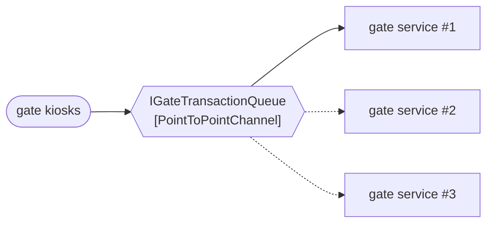

# Point-to-Point Channel

🌍 🇬🇧 English (this file) · 🇫🇷 [Français](PointToPointChannel-fr.md)

## Intent

Point-to-Point Channel delivers each message to exactly one receiver, so that competing consumers can share a
load without any message being handled twice.

## Problem

Four instances of the gate service read the same channel, because one instance cannot absorb a Monday morning.

That is the reason to run four. The risk is the reason it is hard: if two instances read the same gate
transaction, one truck is admitted twice, and the second admission looks exactly like the first. Nothing in the
gate service can detect it, because from inside an instance a message read once is a message read once.

The property has to belong to the channel. A receiver cannot establish it, and four receivers agreeing to be
careful is not a mechanism.

## Solution

The pattern is the assertion that exactly one receiver gets each message.

A point-to-point channel may have any number of consumers, and it delivers to one of them. Which one is not
specified and does not matter — that indifference is the whole benefit, because it means a fifth instance can be
started without any receiver being told.

The declaration matters more here than the implementation. A team scaling a consumer horizontally is relying on
this property whether or not anyone has written it down, and the annotation is where it gets written down.

## Structure



Three arrows leave the channel and one of them is solid: the message went to the first instance this time, and
the dotted two are the instances that did not get it. Redraw the diagram for the next message and a different
arrow is solid.

## The roles

| Role | Annotation | Applies to | What it carries |
|---|---|---|---|
| PointToPointChannel | `[PointToPointChannel]` | interface, class | The channel whose message is consumed once, however many receivers listen. |

One role, and what it carries is a guarantee rather than a shape: *consumed once, however many receivers
listen*. Two channels with identical signatures differ only in this, which is why it is worth annotating.

## The example

From [`PointToPointChannelUsage.cs`](../../../../DesignPatternCatalog.Usage/EnterpriseIntegration/PointToPointChannelUsage.cs).

```csharp
[PointToPointChannel]
public interface IGateTransactionQueue {

    string? Take();

}
```

One method, and it is a *take* rather than a *read*. The name is the pattern: taking removes, and a message that
has been removed cannot be taken again by the instance next to it.

`string?` returning null is an empty queue, which is the ordinary state of a channel between trucks rather than
a failure — the same convention [Message Endpoint](MessageEndpoint-en.md)'s `Receive` uses.

What the interface does not have is a subscriber list, a consumer identity or a partition key. There is nothing
to configure per consumer because consumers are interchangeable, and that interchangeability is the property
being claimed.

The sample states the reason the claim is worth making: *that is the assertion, and it is the one a consumer
relies on in order to scale by adding an instance.*

## Applicability

**Use a point-to-point channel for a command, or for work that must happen once.** Admitting a truck, billing a
lift, releasing a container — each is an instruction with one correct number of executions.

**Use it to scale a consumer by adding instances.** This is the pattern's practical purpose: the channel makes
several receivers behave as one, so capacity becomes a matter of how many are running.

**Use it where the receivers are interchangeable.** The channel does not say which instance gets a message,
so any instance has to be able to handle any message.

## When not to use it

**Do not use it for an event.** A vessel's departure interests billing, customs and the portal at once, and a
point-to-point channel would give it to whichever asked first and leave the other two ignorant. That is
[Publish-Subscribe Channel](PublishSubscribeChannel-en.md)'s job, and the choice between the two is the first
one to make about any channel.

**Do not assume the order the messages were sent in.** Several consumers taking from one channel process
concurrently, so two messages sent in order can finish out of order. Where order matters the book's answer is
[Resequencer](../../../generated/catalog-index.md#resequencer-enterprise-integration-patterns) rather than a
hope about timing.

**Do not read exactly-once as at-least-once.** A consumer that crashes after taking and before finishing may see
the message again on redelivery. The channel's assertion is about consumers competing, not about failure, and
the pattern for tolerating the difference is
[Idempotent Receiver](../../../generated/catalog-index.md#idempotentreceiver-enterprise-integration-patterns).

**Do not use it where the consumers are not interchangeable.** If instance three must handle the reefer
containers, the channel is being asked to route, and routing is
[Message Router](MessageRouter-en.md)'s work rather than a channel's.

## Advantages

* A message is handled once, which is what a command requires.
* Capacity is a matter of how many instances are running, and adding one changes no code.
* The sender knows nothing of receivers, and neither do the receivers of each other.
* The guarantee is the channel's, so no receiver has to be careful for it to hold.

## Drawbacks

* Only one receiver gets the message, so a second interested party needs a second channel or a different kind.
* Concurrent consumers process concurrently, and order is lost unless something restores it.
* Exactly-once between competing consumers is not exactly-once under failure, and the difference is where
  double-billing hides.
* A slow consumer holds a message while the others idle, since the channel has already given it away.

## Relations with other patterns

**`PublishSubscribeChannel`** is the alternative, and the pair is the first decision about any channel: one
receiver or all of them.

**`MessageChannel`** is the root both specialise — this one narrows it by saying how many receivers a message
reaches.

**`CompetingConsumers`** is the endpoint pattern that makes use of this: several consumers on one
point-to-point channel is exactly what that pattern arranges.

**`CommandMessage`** is what usually travels here, because a command with two executions is a defect and this
channel is what prevents it.

**`IdempotentReceiver`** is what covers the gap between competing consumers and failure, and a receiver on this
channel that cannot tolerate a redelivery is relying on more than the channel promises.

**`Resequencer`** is the answer where several consumers have destroyed an order that mattered.

## Source

*Enterprise Integration Patterns*, Gregor Hohpe and Bobby Woolf, Addison-Wesley, 2003 — the messaging-channels
chapter.

* [Index entry](../../../generated/catalog-index.md#pointtopointchannel-enterprise-integration-patterns)
* [Generated attribute](../../../../DesignPatternCatalog.EnterpriseIntegration/PointToPointChannel.cs)
* [Example](../../../../DesignPatternCatalog.Usage/EnterpriseIntegration/PointToPointChannelUsage.cs)
