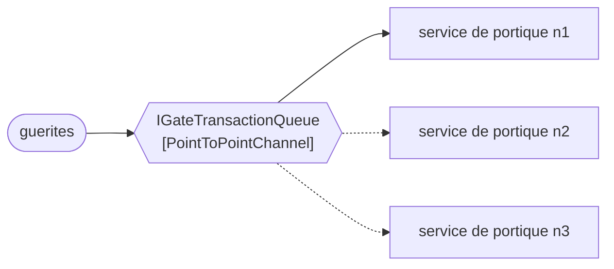

# Point-to-Point Channel

🌍 🇫🇷 Français (ce fichier) · 🇬🇧 [English](PointToPointChannel-en.md)

## Intention

Point-to-Point Channel délivre chaque message à exactement un receveur, de sorte que des consommateurs
concurrents puissent se partager une charge sans qu'aucun message soit traité deux fois.

## Problème

Quatre instances du service de portique lisent le même canal, parce qu'une seule instance n'absorbe pas un lundi
matin.

C'est la raison d'en faire tourner quatre. Le risque est la raison pour laquelle c'est difficile : si deux
instances lisent le même passage au portique, un camion est admis deux fois, et la seconde admission ressemble
exactement à la première. Rien dans le service de portique ne peut la détecter, parce que de l'intérieur d'une
instance un message lu une fois est un message lu une fois.

La propriété doit appartenir au canal. Un receveur ne peut pas l'établir, et quatre receveurs qui conviennent
d'être prudents ne sont pas un mécanisme.

## Solution

Le patron est l'affirmation qu'exactement un receveur obtient chaque message.

Un canal point à point peut avoir un nombre quelconque de consommateurs, et il délivre à l'un d'eux. Lequel n'est
pas spécifié et n'a pas d'importance — cette indifférence est tout le bénéfice, puisqu'elle signifie qu'une
cinquième instance peut être démarrée sans qu'aucun receveur en soit averti.

La déclaration compte ici davantage que l'implémentation. Une équipe qui met un consommateur à l'échelle
horizontalement s'appuie sur cette propriété, que quelqu'un l'ait écrite ou non, et l'annotation est l'endroit où
elle s'écrit.

## Structure



Trois flèches quittent le canal et l'une d'elles est pleine : le message est allé à la première instance cette
fois-ci, et les deux pointillées sont les instances qui ne l'ont pas eu. Redessiner le diagramme pour le message
suivant, et c'est une autre flèche qui est pleine.

## Les rôles

| Rôle | Annotation | S'applique à | Ce qu'il porte |
|---|---|---|---|
| PointToPointChannel | `[PointToPointChannel]` | interface, classe | Le canal dont le message est consommé une fois, quel que soit le nombre de receveurs à l'écoute. |

Un seul rôle, et ce qu'il porte est une garantie plutôt qu'une forme : *consommé une fois, quel que soit le
nombre de receveurs à l'écoute*. Deux canaux de signatures identiques ne diffèrent que par cela, ce qui est
pourquoi cela vaut d'être annoté.

## L'exemple

Extrait de [`PointToPointChannelUsage.cs`](../../../../DesignPatternCatalog.Usage/EnterpriseIntegration/PointToPointChannelUsage.cs).

```csharp
[PointToPointChannel]
public interface IGateTransactionQueue {

    string? Take();

}
```

Une seule méthode, et c'est un *take* plutôt qu'un *read*. Le nom est le patron : prendre retire, et un message
qui a été retiré ne peut pas être pris de nouveau par l'instance d'à côté.

Un `string?` qui rend `null` est une file vide, ce qui est l'état ordinaire d'un canal entre deux camions plutôt
qu'un échec — la convention même qu'emploie le `Receive` de [Message Endpoint](MessageEndpoint-fr.md).

Ce que l'interface n'a pas, c'est une liste d'abonnés, une identité de consommateur ou une clé de partition. Il
n'y a rien à configurer par consommateur parce que les consommateurs sont interchangeables, et cette
interchangeabilité est la propriété revendiquée.

L'exemple énonce la raison pour laquelle la revendication vaut d'être faite : *c'est l'affirmation, et c'est
celle sur laquelle un consommateur s'appuie pour monter en charge en ajoutant une instance.*

## Possibilités d'application

**Employez un canal point à point pour une commande, ou pour un travail qui doit avoir lieu une fois.** Admettre
un camion, facturer une levée, libérer un conteneur — chacun est une instruction dont le nombre correct
d'exécutions est un.

**Employez-le pour mettre un consommateur à l'échelle en ajoutant des instances.** C'est le but pratique du
patron : le canal fait que plusieurs receveurs se comportent comme un seul, si bien que la capacité devient une
question de combien tournent.

**Employez-le là où les receveurs sont interchangeables.** Le canal ne dit pas quelle instance reçoit un message,
donc n'importe laquelle doit pouvoir traiter n'importe lequel.

## Quand ne pas l'utiliser

**Ne l'employez pas pour un événement.** Le départ d'un navire intéresse à la fois la facturation, la douane et
le portail, et un canal point à point le donnerait à celui qui a demandé le premier en laissant les deux autres
dans l'ignorance. C'est l'affaire de [Publish-Subscribe Channel](PublishSubscribeChannel-fr.md), et le choix
entre les deux est le premier à faire au sujet de n'importe quel canal.

**Ne supposez pas l'ordre dans lequel les messages ont été envoyés.** Plusieurs consommateurs qui prennent sur un
canal traitent concurremment, donc deux messages envoyés dans l'ordre peuvent finir dans le désordre. Là où
l'ordre compte, la réponse du livre est
[Resequencer](../../../generated/catalog-index.md#resequencer-enterprise-integration-patterns) plutôt qu'un
espoir sur les temps d'exécution.

**Ne lisez pas *exactement une fois* comme *au moins une fois*.** Un consommateur qui tombe après avoir pris et
avant d'avoir fini peut revoir le message à la redélivrance. L'affirmation du canal porte sur des consommateurs
en concurrence, non sur la panne, et le patron pour tolérer la différence est
[Idempotent Receiver](../../../generated/catalog-index.md#idempotentreceiver-enterprise-integration-patterns).

**Ne l'employez pas là où les consommateurs ne sont pas interchangeables.** Si l'instance trois doit traiter les
conteneurs frigorifiques, on demande au canal de router, et le routage est l'affaire de
[Message Router](MessageRouter-fr.md) plutôt que celle d'un canal.

## Avantages

* Un message est traité une fois, ce qu'exige une commande.
* La capacité est une question du nombre d'instances qui tournent, et en ajouter une ne change aucun code.
* L'émetteur ne connaît aucun receveur, et les receveurs ne se connaissent pas entre eux.
* La garantie est celle du canal : aucun receveur n'a besoin d'être prudent pour qu'elle tienne.

## Inconvénients

* Un seul receveur obtient le message : un deuxième intéressé demande un deuxième canal ou un canal d'une autre
  sorte.
* Des consommateurs concurrents traitent concurremment, et l'ordre est perdu à moins que quelque chose le
  rétablisse.
* *Exactement une fois* entre consommateurs en concurrence n'est pas *exactement une fois* en cas de panne, et
  c'est dans cet écart que se cache la double facturation.
* Un consommateur lent détient un message pendant que les autres attendent, puisque le canal l'a déjà donné.

## Liens avec les autres patrons

**`PublishSubscribeChannel`** est l'alternative, et la paire est la première décision au sujet de n'importe quel
canal : un receveur ou tous.

**`MessageChannel`** est la racine que les deux spécialisent — celui-ci la restreint en disant combien de
receveurs un message atteint.

**`CompetingConsumers`** est le patron de point de terminaison qui s'en sert : plusieurs consommateurs sur un
canal point à point, c'est exactement ce que ce patron organise.

**`CommandMessage`** est ce qui voyage d'ordinaire ici, parce qu'une commande exécutée deux fois est un défaut et
que ce canal est ce qui l'empêche.

**`IdempotentReceiver`** est ce qui couvre l'écart entre consommateurs en concurrence et panne, et un receveur
sur ce canal qui ne tolère pas une redélivrance s'appuie sur plus que ce que le canal promet.

**`Resequencer`** est la réponse là où plusieurs consommateurs ont détruit un ordre qui comptait.

## Source

*Enterprise Integration Patterns*, Gregor Hohpe et Bobby Woolf, Addison-Wesley, 2003 — le chapitre sur les canaux
de messagerie.

* [Entrée d'index](../../../generated/catalog-index.md#pointtopointchannel-enterprise-integration-patterns)
* [Attribut généré](../../../../DesignPatternCatalog.EnterpriseIntegration/PointToPointChannel.cs)
* [Exemple](../../../../DesignPatternCatalog.Usage/EnterpriseIntegration/PointToPointChannelUsage.cs)
