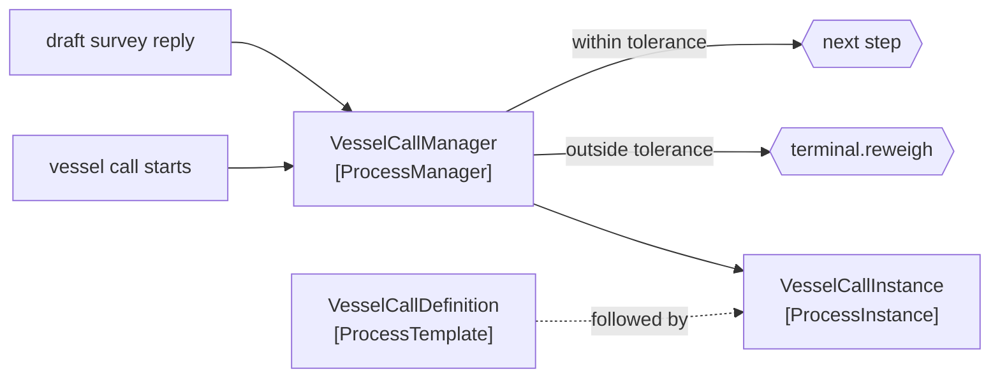

# Process Manager

🌍 🇬🇧 English (this file) · 🇫🇷 [Français](ProcessManager-fr.md)

## Intent

Process Manager keeps the state of a multi-step process in one participant, so that a sequence with branches and
joins can be decided as it goes rather than fixed when it starts.

## Problem

A vessel call is a process with branches.

If the draft survey disagrees with the manifest by more than a tolerance, a reweigh is inserted and the load plan
is recomputed. Otherwise the call proceeds. Which of the two happens is not knowable when the call starts — it
depends on what the survey said, which is a reply that has not arrived yet.

A [routing slip](RoutingSlip-en.md) cannot decide that. Its itinerary is computed once, before the journey, and a
route that must branch on a reply has nothing to compute from at the moment the slip is written.

## Solution

The pattern holds the state and decides as it goes.

One participant receives each reply and chooses the next step from what it says. A tolerance breached inserts a
reweigh; a tolerance met advances to the next step in the definition. The decision is made when the information
exists rather than before it does.

The trade is stated rather than discovered: **it can branch, and it is a participant that holds state and can
become a bottleneck.** That is the whole choice against a routing slip, and the sample says so on the face of it.

## Structure



Every reply comes back to the manager, which is both the pattern's power and the bottleneck it warns about.

## The roles

| Role | Annotation | Applies to | What it carries |
|---|---|---|---|
| ProcessManager | `[ProcessManager.ProcessManager]` | interface, class | The central participant that receives each reply and decides the next step. |
| ProcessInstance | `[ProcessManager.ProcessInstance]` | interface, class | One running occurrence of the process, holding where it has got to. |
| ProcessTemplate | `[ProcessManager.ProcessTemplate]` | interface, class | The definition the instances follow. |

Three roles, and the separation between them is the pattern's structural advice. **The instance is separate from
the manager because a manager serves many at once** — conflating them is how a process manager becomes a
single-threaded one, which the sample names outright.

## The example

From [`ProcessManagerUsage.cs`](../../../../DesignPatternCatalog.Usage/EnterpriseIntegration/ProcessManagerUsage.cs).

The template first — the definition, not a class per process:

```csharp
[ProcessManager.ProcessTemplate]
public sealed class VesselCallDefinition {

    public VesselCallDefinition(IReadOnlyList<string> steps, decimal draftTolerance) {
        Steps           = steps;
        DraftTolerance  = draftTolerance;
    }
```

Steps *and* the tolerance live here. That is the point of a template: changing how a vessel call runs — a
different tolerance, an extra step — is configuration rather than a new class. The sample names the analogy
precisely: *the same knowledge-level move a
[posting rule](../../../generated/catalog-index.md#postingrule-accounting-patterns) makes for money.*

Then the instance, holding only where it has got to:

```csharp
[ProcessManager.ProcessInstance]
public sealed class VesselCallInstance {
```

`Step` is `internal set` — the instance holds the position, the manager advances it, and nothing outside either
can. That is the separation made structural rather than merely documented.

Then the manager, and the branch:

```csharp
public string? OnReply(string vesselCall, decimal draftDifference) {
    VesselCallInstance instance = _running[vesselCall];
    if (draftDifference > instance.Definition.DraftTolerance) { return "terminal.reweigh"; }

    instance.Step++;

    return instance.Step < instance.Definition.Steps.Count ? instance.Definition.Steps[instance.Step] : null;
}
```

`OnReply` is the whole pattern in one signature: a reply comes in, a next destination goes out. It is not
`Run()`, and it does not loop — a process manager does not drive the process, it answers each reply with a
decision, which is what lets it serve many calls at once.

The branch returns `terminal.reweigh` **without advancing `Step`**. The reweigh is inserted rather than
substituted, so the process resumes where it was once the reweigh is done. That single omitted increment is the
difference between a detour and a skipped step.

`null` at the end means the process is finished — an ordinary return value, as in the routing slip's `Next()`.

`_running` is a dictionary held in memory, and that is the sample's honest limit: everything in it is lost on a
restart, and a real process manager persists its instances.

## Applicability

**Use a process manager where the next step depends on what the replies said.** The single distinction from a
[routing slip](RoutingSlip-en.md), and the only thing that justifies the state.

**Use it where the process has branches or joins.** A straight sequence does not need one.

**Use it where you must know what is in progress.** The manager holds every running instance, so *how many vessel
calls are awaiting a draft survey* is answerable — which a routing slip cannot do.

**Separate the instance from the manager.** One manager, many instances; conflating them makes a process engine
that handles one thing at a time.

**Keep the definition as a template.** Changing how a process runs should be configuration, not a class.

## When not to use it

**Do not use it where the route is knowable at the start.** A [routing slip](RoutingSlip-en.md) has no state, no
bottleneck and nothing to restart, and it does everything a fixed sequence needs.

**Do not use it without persisting the instances.** A manager that restarts empty has abandoned every process in
flight, and the vessels do not know they were abandoned.

**Do not let it accumulate the domain.** A process manager that decides *whether a reweigh is chargeable* has
taken a domain decision into infrastructure; it should decide the next step and nothing about the business.

**Do not let it become the estate's coordinator.** Every process routed through one participant is a bottleneck
by construction, and the sample says so rather than leaving it to be found.

**Do not use it for a two-step process.** The template, the instance, the store and the manager are all cost, and
two steps can call each other.

**Do not lose instances that will never complete.** A process awaiting a reply that never comes stays in the
dictionary for ever — the same failure as an [aggregator](Aggregator-en.md)'s completeness condition, and it needs
the same answer.

## Advantages

* The next step can depend on what the replies said, which no fixed itinerary can express.
* Branches and joins are expressible, and readable in one place.
* Work in progress is answerable: the manager holds every running instance.
* The definition is a template, so changing a process is configuration.
* One manager serves many instances concurrently, when the two are kept apart.

## Drawbacks

* It holds state, so it must be persisted or everything in flight is lost on restart.
* It is a bottleneck by construction: every reply of every process passes through it.
* Instances that never complete accumulate, and nothing in the pattern bounds them.
* It concentrates knowledge of the whole process in one participant, which is what a routing slip avoids.
* It is substantially more machinery than a routing slip, for a benefit only branching justifies.

## Relations with other patterns

**`RoutingSlip`** is the alternative, and the choice is one question: does the next step depend on the replies.

**`Aggregator`** shares the state problem, and a join in a process manager is an aggregation with the same
completeness question.

**`CorrelationIdentifier`** is what lets a reply find its instance, and a process manager without one cannot tell
whose survey has arrived.

**`CommandMessage`** is what a manager usually emits, and **`RequestReply`** is the shape of each step.

**`ComposedMessageProcessor`** is the fan-out-and-join composite, and this is what to use when the steps are a
process rather than a fan-out.

**`PostingRule`**, in the Accounting Patterns catalogue, is the same knowledge-level move applied to money: a
definition that is data rather than a class per case.

## Source

*Enterprise Integration Patterns*, Gregor Hohpe and Bobby Woolf, Addison-Wesley, 2003 — the message-routing
chapter.

* [Index entry](../../../generated/catalog-index.md#processmanager-enterprise-integration-patterns)
* [Generated attribute](../../../../DesignPatternCatalog.EnterpriseIntegration/ProcessManager.cs)
* [Example](../../../../DesignPatternCatalog.Usage/EnterpriseIntegration/ProcessManagerUsage.cs)
