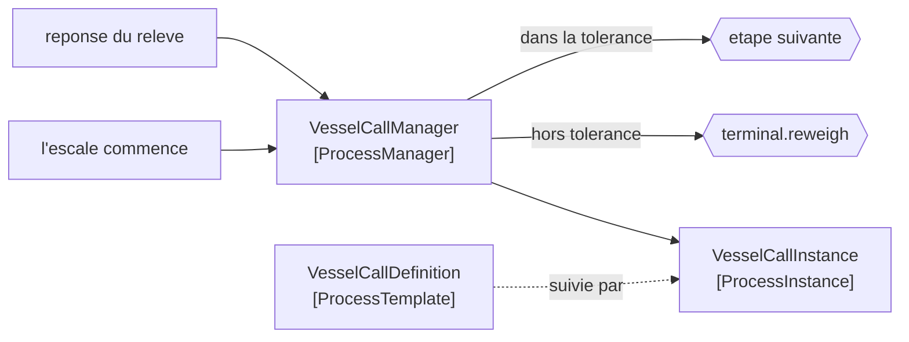

# Process Manager

🌍 🇫🇷 Français (ce fichier) · 🇬🇧 [English](ProcessManager-en.md)

## Intention

Process Manager garde l'état d'un processus à plusieurs étapes dans un seul participant, de sorte qu'une séquence
avec embranchements et jonctions puisse être décidée à mesure plutôt que fixée au départ.

## Problème

Une escale de navire est un processus avec des embranchements.

Si le tirant d'eau relevé s'écarte du manifeste de plus d'une tolérance, une repesée est insérée et le plan de
chargement est recalculé. Sinon l'escale poursuit. Lequel des deux se produit n'est pas connaissable au début de
l'escale — cela dépend de ce que le relevé a dit, qui est une réponse pas encore arrivée.

Une [feuille de route](RoutingSlip-fr.md) ne peut pas décider cela. Son itinéraire est calculé une fois, avant le
voyage, et une route qui doit s'embrancher selon une réponse n'a rien sur quoi calculer au moment où la feuille est
écrite.

## Solution

Le patron détient l'état et décide à mesure.

Un participant reçoit chaque réponse et choisit l'étape suivante d'après ce qu'elle dit. Une tolérance dépassée
insère une repesée ; une tolérance respectée avance à l'étape suivante de la définition. La décision est prise quand
l'information existe plutôt qu'avant.

L'échange est énoncé plutôt que découvert : **il peut s'embrancher, et c'est un participant qui détient un état et
peut devenir un goulot.** C'est tout le choix face à une feuille de route, et l'exemple le dit d'emblée.

## Structure



Chaque réponse revient au gestionnaire, ce qui est à la fois la puissance du patron et le goulot dont il avertit.

## Les rôles

| Rôle | Annotation | S'applique à | Ce qu'il porte |
|---|---|---|---|
| ProcessManager | `[ProcessManager.ProcessManager]` | interface, classe | Le participant central qui reçoit chaque réponse et décide l'étape suivante. |
| ProcessInstance | `[ProcessManager.ProcessInstance]` | interface, classe | Une occurrence en cours du processus, qui détient où elle en est. |
| ProcessTemplate | `[ProcessManager.ProcessTemplate]` | interface, classe | La définition que suivent les instances. |

Trois rôles, et la séparation entre eux est le conseil structurel du patron. **L'instance est séparée du
gestionnaire parce qu'un gestionnaire en sert plusieurs à la fois** — les confondre est la façon dont un gestionnaire
de processus devient monotâche, ce que l'exemple nomme sans détour.

## L'exemple

Extrait de [`ProcessManagerUsage.cs`](../../../../DesignPatternCatalog.Usage/EnterpriseIntegration/ProcessManagerUsage.cs).

Le modèle d'abord — la définition, non une classe par processus :

```csharp
[ProcessManager.ProcessTemplate]
public sealed class VesselCallDefinition {

    public VesselCallDefinition(IReadOnlyList<string> steps, decimal draftTolerance) {
        Steps           = steps;
        DraftTolerance  = draftTolerance;
    }
```

Les étapes *et* la tolérance vivent ici. C'est le propos d'un modèle : changer la façon dont une escale se déroule —
une autre tolérance, une étape de plus — est de la configuration plutôt qu'une nouvelle classe. L'exemple nomme
l'analogie avec précision : *le même mouvement au niveau de la connaissance qu'une
[règle de comptabilisation](../../../generated/catalog-index.md#postingrule-accounting-patterns) fait pour
l'argent.*

Puis l'instance, qui ne détient que là où elle en est :

```csharp
[ProcessManager.ProcessInstance]
public sealed class VesselCallInstance {
```

`Step` est en `internal set` — l'instance détient la position, le gestionnaire l'avance, et rien à l'extérieur des
deux ne le peut. C'est la séparation rendue structurelle plutôt que simplement documentée.

Puis le gestionnaire, et l'embranchement :

```csharp
public string? OnReply(string vesselCall, decimal draftDifference) {
    VesselCallInstance instance = _running[vesselCall];
    if (draftDifference > instance.Definition.DraftTolerance) { return "terminal.reweigh"; }

    instance.Step++;

    return instance.Step < instance.Definition.Steps.Count ? instance.Definition.Steps[instance.Step] : null;
}
```

`OnReply` est tout le patron en une signature : une réponse entre, une destination suivante sort. Ce n'est pas
`Run()`, et cela ne boucle pas — un gestionnaire de processus ne pilote pas le processus, il répond à chaque réponse
par une décision, ce qui lui permet de servir plusieurs escales à la fois.

L'embranchement rend `terminal.reweigh` **sans avancer `Step`**. La repesée est insérée plutôt que substituée : le
processus reprend là où il était une fois la repesée faite. Cette unique incrémentation omise est la différence entre
un détour et une étape sautée.

`null` à la fin veut dire que le processus est terminé — une valeur de retour ordinaire, comme le `Next()` de la
feuille de route.

`_running` est un dictionnaire tenu en mémoire, et c'est la limite honnête de l'exemple : tout ce qu'il contient est
perdu au redémarrage, et un vrai gestionnaire de processus persiste ses instances.

## Possibilités d'application

**Employez un gestionnaire de processus là où l'étape suivante dépend de ce que les réponses ont dit.** L'unique
distinction d'avec une [feuille de route](RoutingSlip-fr.md), et la seule chose qui justifie l'état.

**Employez-le là où le processus a des embranchements ou des jonctions.** Une séquence droite n'en a pas besoin.

**Employez-le là où vous devez savoir ce qui est en cours.** Le gestionnaire détient chaque instance en cours :
*combien d'escales attendent un relevé de tirant d'eau* est répondable — ce qu'une feuille de route ne permet pas.

**Séparez l'instance du gestionnaire.** Un gestionnaire, plusieurs instances ; les confondre fait un moteur de
processus qui traite une chose à la fois.

**Gardez la définition comme modèle.** Changer la façon dont un processus se déroule devrait être de la
configuration, non une classe.

## Quand ne pas l'utiliser

**Ne l'employez pas là où la route est connaissable au départ.** Une [feuille de route](RoutingSlip-fr.md) n'a aucun
état, aucun goulot et rien à redémarrer, et elle fait tout ce dont une séquence fixe a besoin.

**Ne l'employez pas sans persister les instances.** Un gestionnaire qui redémarre vide a abandonné chaque processus
en vol, et les navires ne savent pas qu'ils ont été abandonnés.

**Ne le laissez pas accumuler le domaine.** Un gestionnaire de processus qui décide *si une repesée est facturable* a
emporté une décision de domaine dans l'infrastructure ; il devrait décider l'étape suivante et rien du métier.

**Ne le laissez pas devenir le coordinateur du parc.** Chaque processus routé par un participant unique est un goulot
par construction, et l'exemple le dit plutôt que de le laisser découvrir.

**Ne l'employez pas pour un processus à deux étapes.** Le modèle, l'instance, le stockage et le gestionnaire sont
tous du coût, et deux étapes peuvent s'appeler.

**Ne perdez pas des instances qui ne s'achèveront jamais.** Un processus qui attend une réponse qui ne vient jamais
reste indéfiniment dans le dictionnaire — la même panne que la condition de complétude d'un
[agrégateur](Aggregator-fr.md), et elle demande la même réponse.

## Avantages

* L'étape suivante peut dépendre de ce que les réponses ont dit, ce qu'aucun itinéraire fixe n'exprime.
* Embranchements et jonctions sont exprimables, et lisibles à un seul endroit.
* Le travail en cours est répondable : le gestionnaire détient chaque instance en cours.
* La définition est un modèle : changer un processus est de la configuration.
* Un gestionnaire sert plusieurs instances concurremment, quand les deux sont tenus à part.

## Inconvénients

* Il détient un état : il doit être persisté ou tout ce qui est en vol est perdu au redémarrage.
* C'est un goulot par construction : chaque réponse de chaque processus passe par lui.
* Les instances qui ne s'achèvent jamais s'accumulent, et rien dans le patron ne les borne.
* Il concentre la connaissance du processus entier dans un participant, ce qu'une feuille de route évite.
* C'est nettement plus de machinerie qu'une feuille de route, pour un bénéfice que seul l'embranchement justifie.

## Liens avec les autres patrons

**`RoutingSlip`** est l'alternative, et le choix tient à une question : l'étape suivante dépend-elle des réponses.

**`Aggregator`** partage le problème de l'état, et une jonction dans un gestionnaire de processus est une agrégation
avec la même question de complétude.

**`CorrelationIdentifier`** est ce qui permet à une réponse de retrouver son instance, et un gestionnaire de processus
qui en manque ne sait pas de qui est le relevé qui vient d'arriver.

**`CommandMessage`** est ce qu'un gestionnaire émet d'ordinaire, et **`RequestReply`** est la forme de chaque étape.

**`ComposedMessageProcessor`** est le composite en éventail et jonction, et celui-ci est ce qu'il faut employer quand
les étapes sont un processus plutôt qu'un éventail.

**`PostingRule`**, dans le catalogue Accounting Patterns, est le même mouvement au niveau de la connaissance appliqué
à l'argent : une définition qui est une donnée plutôt qu'une classe par cas.

## Source

*Enterprise Integration Patterns*, Gregor Hohpe et Bobby Woolf, Addison-Wesley, 2003 — le chapitre sur le routage
des messages.

* [Entrée d'index](../../../generated/catalog-index.md#processmanager-enterprise-integration-patterns)
* [Attribut généré](../../../../DesignPatternCatalog.EnterpriseIntegration/ProcessManager.cs)
* [Exemple](../../../../DesignPatternCatalog.Usage/EnterpriseIntegration/ProcessManagerUsage.cs)
