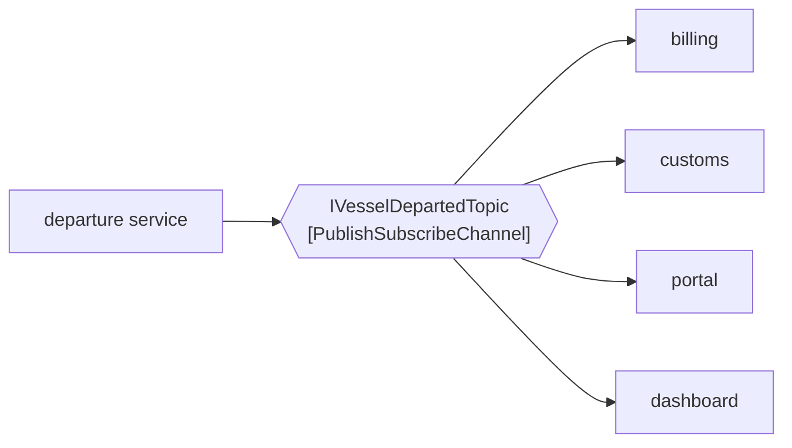

# Publish-Subscribe Channel

🌍 🇬🇧 English (this file) · 🇫🇷 [Français](PublishSubscribeChannel-fr.md)

## Intent

Publish-Subscribe Channel delivers a copy of each message to every subscriber, so that an event reaches all
interested parties and the sender learns of none of them.

## Problem

A vessel departs. Billing wants to know, so does the customs interface, so does the customer portal, and so does
the performance dashboard.

Written as calls, the departure code names all four:

```csharp
_billing.VesselDeparted(vesselCall);
_customs.VesselDeparted(vesselCall);
_portal.VesselDeparted(vesselCall);
_dashboard.VesselDeparted(vesselCall);
```

Next quarter there is a fifth, which does not exist yet, and adding it is a change to the departure code — code
whose subject is vessels leaving, and which now holds a list of everything in the terminal that cares.

## Solution

The pattern is a channel that copies.

The publisher sends one message to one channel. The channel delivers a copy to every subscriber, and the
publisher is never told how many there are. Adding the fifth subscriber is a change to the fifth subscriber.

That asymmetry is the point. Where [Point-to-Point Channel](PointToPointChannel-en.md) says *exactly one of
you*, this says *all of you*, and the two together are the first decision to make about any channel.

## Structure



Every arrow out of the channel is solid, and the publisher's single arrow in does not change when a fifth is
added below.

## The roles

| Role | Annotation | Applies to | What it carries |
|---|---|---|---|
| PublishSubscribeChannel | `[PublishSubscribeChannel]` | interface, class | The channel that copies its message to each subscriber. |

One role, and like its counterpart it carries a delivery guarantee rather than a shape. The two annotations are
what distinguish channels whose signatures may be identical.

## The example

From [`PublishSubscribeChannelUsage.cs`](../../../../DesignPatternCatalog.Usage/EnterpriseIntegration/PublishSubscribeChannelUsage.cs).

```csharp
[PublishSubscribeChannel]
public interface IVesselDepartedTopic {

    void Publish(string vesselCall);

}
```

`Publish` returns nothing, and that emptiness is the pattern. There is no count of subscribers to return, no
acknowledgement to wait for, and nothing the publisher could do with either — a publisher that learns how many
received the message has learned something it must then be trusted not to use.

The name is the event, not the audience: `IVesselDepartedTopic`, a topic about a departure. A channel named
`IBillingNotifications` would have named one subscriber in the type the other three also read.

There is no `Subscribe` method here either. Subscription is arranged outside this interface, which keeps the
publisher's view of the channel to the one thing it does.

The sample states the consequence exactly: *a sender writes nothing when a subscriber is added, which is what
makes this the channel for events rather than for commands.*

## Applicability

**Use a publish-subscribe channel for an event — something that happened.** A departure, an arrival, a weight
recorded. The publisher is reporting rather than instructing, so the number of listeners is not its concern.

**Use it where the set of interested parties grows.** This is the practical payoff: the fifth subscriber costs
the publisher nothing, and the tenth costs it nothing either.

**Use it where every subscriber needs its own copy.** Four systems each drawing their own conclusion from one
departure is four copies, not four attempts at the same one.

**Use it to keep the publisher ignorant.** The book's framing is that the sender learns of none of them, and a
publisher that knows its subscribers has the coupling back.

## When not to use it

**Do not use it for a command.** *Admit this truck* delivered to every subscriber is the truck admitted four
times. A command needs [Point-to-Point Channel](PointToPointChannel-en.md), and confusing the two is the
expensive mistake in this pair.

**Do not use it where a reply is expected.** `Publish` returning void is not an oversight; a publisher that
needs an answer wants
[Request-Reply](../../../generated/catalog-index.md#requestreply-enterprise-integration-patterns), and grafting
one onto a topic means deciding which of four replies is the answer.

**Do not assume a subscriber that was absent will catch up.** A subscriber not listening when the message was
published may simply never see it; that is
[Durable Subscriber](../../../generated/catalog-index.md#durablesubscriber-enterprise-integration-patterns)'s
subject, and it is a decision rather than a default.

**Do not scale a subscriber by starting a second copy of it.** Two instances of the billing service subscribed
to one topic both get every departure, which is two invoices. Scaling a subscriber means a point-to-point
channel behind its subscription, not another subscription.

**Do not use it where the subscribers must not see everything.** Every subscriber gets every message, so a
channel carrying something one of them should not read is a channel that needs splitting rather than filtering
at the far end.

## Advantages

* The publisher writes no code when a subscriber is added, and none when one is removed.
* Each subscriber gets its own copy and can do what it likes with it.
* The set of interested parties can be changed while the system runs, without touching the source of the event.
* It matches how events are actually consumed: several conclusions from one fact.

## Drawbacks

* The publisher cannot know whether anybody is listening, which makes *nobody subscribed* look exactly like
  *everything is fine*.
* Load grows with subscribers, and a slow subscriber is a cost the publisher never sees.
* A subscriber cannot be scaled by adding another subscription, so the two channel kinds usually appear
  together.
* Ordering and delivery become per-subscriber questions, which multiplies the ways one message can be handled
  wrongly.
* Nobody owns the message once it is published, so tracing where a fact went takes
  [Message History](../../../generated/catalog-index.md#messagehistory-enterprise-integration-patterns) or
  something like it.

## Relations with other patterns

**`PointToPointChannel`** is the counterpart, and the choice between them is the first decision about any
channel: all of you, or exactly one of you.

**`MessageChannel`** is the root both specialise.

**`EventMessage`** is what travels here, and the pairing is not a coincidence: an event is a fact, and a fact can
be told to any number of parties without changing.

**`DurableSubscriber`** is what a subscriber becomes when missing a message while it was down is not acceptable.

**`Messaging`** is the style whose *decoupled in time as well as in technology* claim this channel makes most
visible, since the publisher does not even learn who was there.

**`WireTap`** and **`MessageHistory`** are the system-management answers to this channel's cost — that nobody
owns a published message once it is gone.

## Source

*Enterprise Integration Patterns*, Gregor Hohpe and Bobby Woolf, Addison-Wesley, 2003 — the messaging-channels
chapter.

* [Index entry](../../../generated/catalog-index.md#publishsubscribechannel-enterprise-integration-patterns)
* [Generated attribute](../../../../DesignPatternCatalog.EnterpriseIntegration/PublishSubscribeChannel.cs)
* [Example](../../../../DesignPatternCatalog.Usage/EnterpriseIntegration/PublishSubscribeChannelUsage.cs)
