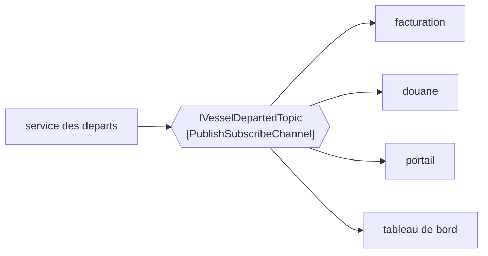

# Publish-Subscribe Channel

🌍 🇫🇷 Français (ce fichier) · 🇬🇧 [English](PublishSubscribeChannel-en.md)

## Intention

Publish-Subscribe Channel délivre une copie de chaque message à chaque abonné, de sorte qu'un événement atteigne
tous les intéressés et que l'émetteur n'en connaisse aucun.

## Problème

Un navire part. La facturation veut le savoir, l'interface douanière aussi, le portail client aussi, et le
tableau de bord de performance aussi.

Écrit en appels, le code du départ nomme les quatre :

```csharp
_billing.VesselDeparted(vesselCall);
_customs.VesselDeparted(vesselCall);
_portal.VesselDeparted(vesselCall);
_dashboard.VesselDeparted(vesselCall);
```

Le trimestre prochain il y en a un cinquième, qui n'existe pas encore, et l'ajouter est un changement du code du
départ — un code dont le sujet est les navires qui partent, et qui détient désormais la liste de tout ce qui,
dans le terminal, s'y intéresse.

## Solution

Le patron est un canal qui copie.

L'émetteur envoie un message à un canal. Le canal en délivre une copie à chaque abonné, et l'émetteur n'apprend
jamais combien il y en a. Ajouter le cinquième abonné est un changement du cinquième abonné.

Cette asymétrie est le propos. Là où [Point-to-Point Channel](PointToPointChannel-fr.md) dit *exactement l'un
d'entre vous*, celui-ci dit *vous tous*, et les deux ensemble sont la première décision à prendre au sujet de
n'importe quel canal.

## Structure



Toutes les flèches qui sortent du canal sont pleines, et l'unique flèche entrante de l'émetteur ne change pas
quand un cinquième est ajouté en dessous.

## Les rôles

| Rôle | Annotation | S'applique à | Ce qu'il porte |
|---|---|---|---|
| PublishSubscribeChannel | `[PublishSubscribeChannel]` | interface, classe | Le canal qui copie son message à chaque abonné. |

Un seul rôle et, comme son pendant, il porte une garantie de délivrance plutôt qu'une forme. Les deux annotations
sont ce qui distingue des canaux dont les signatures peuvent être identiques.

## L'exemple

Extrait de [`PublishSubscribeChannelUsage.cs`](../../../../DesignPatternCatalog.Usage/EnterpriseIntegration/PublishSubscribeChannelUsage.cs).

```csharp
[PublishSubscribeChannel]
public interface IVesselDepartedTopic {

    void Publish(string vesselCall);

}
```

`Publish` ne rend rien, et ce vide est le patron. Il n'y a pas de compte d'abonnés à rendre, pas d'acquittement à
attendre, et rien que l'émetteur pourrait faire de l'un ou de l'autre — un émetteur qui apprend combien ont reçu
le message a appris quelque chose qu'il faut ensuite lui faire confiance de ne pas employer.

Le nom est l'événement, non l'auditoire : `IVesselDepartedTopic`, un sujet portant sur un départ. Un canal nommé
`IBillingNotifications` aurait nommé un abonné dans le type que les trois autres lisent aussi.

Il n'y a pas non plus de méthode `Subscribe` ici. L'abonnement s'organise hors de cette interface, ce qui réduit
la vue qu'a l'émetteur du canal à la seule chose qu'il fait.

L'exemple énonce la conséquence exactement : *un émetteur n'écrit rien quand un abonné est ajouté, ce qui fait de
celui-ci le canal des événements plutôt que celui des commandes.*

## Possibilités d'application

**Employez un canal de publication-abonnement pour un événement — quelque chose qui a eu lieu.** Un départ, une
arrivée, un poids relevé. L'émetteur rapporte plutôt qu'il n'ordonne, donc le nombre d'écoutants ne le regarde
pas.

**Employez-le là où l'ensemble des intéressés grandit.** C'est le gain pratique : le cinquième abonné ne coûte
rien à l'émetteur, et le dixième non plus.

**Employez-le là où chaque abonné a besoin de sa propre copie.** Quatre systèmes qui tirent chacun leur
conclusion d'un départ, ce sont quatre copies et non quatre tentatives sur la même.

**Employez-le pour garder l'émetteur ignorant.** Le cadrage du livre est que l'émetteur n'en connaît aucun, et un
émetteur qui connaît ses abonnés a retrouvé le couplage.

## Quand ne pas l'utiliser

**Ne l'employez pas pour une commande.** *Admets ce camion* délivré à chaque abonné, c'est le camion admis quatre
fois. Une commande demande [Point-to-Point Channel](PointToPointChannel-fr.md), et confondre les deux est
l'erreur coûteuse de cette paire.

**Ne l'employez pas là où une réponse est attendue.** Le `void` de `Publish` n'est pas un oubli ; un émetteur qui
a besoin d'une réponse veut
[Request-Reply](../../../generated/catalog-index.md#requestreply-enterprise-integration-patterns), et en greffer
un sur un sujet oblige à décider laquelle de quatre réponses est la réponse.

**Ne supposez pas qu'un abonné absent rattrapera.** Un abonné qui n'écoutait pas au moment de la publication peut
simplement ne jamais voir le message ; c'est le sujet de
[Durable Subscriber](../../../generated/catalog-index.md#durablesubscriber-enterprise-integration-patterns), et
c'est une décision plutôt qu'un défaut.

**Ne mettez pas un abonné à l'échelle en démarrant une seconde copie.** Deux instances du service de facturation
abonnées à un sujet reçoivent toutes deux chaque départ, ce qui fait deux factures. Mettre un abonné à l'échelle
demande un canal point à point derrière son abonnement, non un second abonnement.

**Ne l'employez pas là où les abonnés ne doivent pas tout voir.** Chaque abonné reçoit chaque message : un canal
qui porte quelque chose que l'un d'eux ne devrait pas lire est un canal à scinder plutôt qu'à filtrer à
l'arrivée.

## Avantages

* L'émetteur n'écrit aucun code quand un abonné est ajouté, ni quand un abonné est retiré.
* Chaque abonné reçoit sa propre copie et en fait ce qu'il veut.
* L'ensemble des intéressés peut être changé pendant que le système tourne, sans toucher à la source de
  l'événement.
* Cela correspond à la façon dont les événements sont réellement consommés : plusieurs conclusions à partir d'un
  seul fait.

## Inconvénients

* L'émetteur ne peut pas savoir si quelqu'un écoute, ce qui fait que *personne n'est abonné* ressemble exactement
  à *tout va bien*.
* La charge croît avec les abonnés, et un abonné lent est un coût que l'émetteur ne voit jamais.
* Un abonné ne peut pas être mis à l'échelle en ajoutant un abonnement, si bien que les deux sortes de canaux
  apparaissent d'ordinaire ensemble.
* L'ordre et la délivrance deviennent des questions par abonné, ce qui multiplie les façons de mal traiter un
  même message.
* Personne ne possède le message une fois publié : retracer où un fait est allé demande
  [Message History](../../../generated/catalog-index.md#messagehistory-enterprise-integration-patterns) ou
  quelque chose du genre.

## Liens avec les autres patrons

**`PointToPointChannel`** est le pendant, et le choix entre les deux est la première décision au sujet de
n'importe quel canal : vous tous, ou exactement l'un d'entre vous.

**`MessageChannel`** est la racine que les deux spécialisent.

**`EventMessage`** est ce qui voyage ici, et l'appariement n'est pas un hasard : un événement est un fait, et un
fait peut être dit à un nombre quelconque de parties sans changer.

**`DurableSubscriber`** est ce que devient un abonné quand manquer un message pendant son arrêt n'est pas
acceptable.

**`Messaging`** est le style dont ce canal rend la revendication — *découplé dans le temps autant que dans la
technologie* — la plus visible, puisque l'émetteur n'apprend même pas qui était là.

**`WireTap`** et **`MessageHistory`** sont les réponses d'exploitation au coût de ce canal : que personne ne
possède un message publié une fois qu'il est parti.

## Source

*Enterprise Integration Patterns*, Gregor Hohpe et Bobby Woolf, Addison-Wesley, 2003 — le chapitre sur les canaux
de messagerie.

* [Entrée d'index](../../../generated/catalog-index.md#publishsubscribechannel-enterprise-integration-patterns)
* [Attribut généré](../../../../DesignPatternCatalog.EnterpriseIntegration/PublishSubscribeChannel.cs)
* [Exemple](../../../../DesignPatternCatalog.Usage/EnterpriseIntegration/PublishSubscribeChannelUsage.cs)
