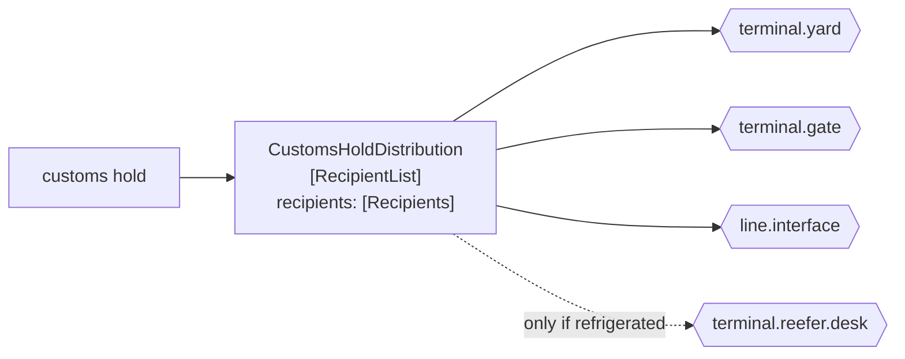

# Recipient List

🌍 🇬🇧 English (this file) · 🇫🇷 [Français](RecipientList-fr.md)

## Intent

Recipient List sends a message to a set of destinations the sender computes, so that who receives it is decided
per message rather than by a subscription.

## Problem

A customs hold on a container must reach the yard, the gate, the shipping line and — only if the box is
refrigerated — the reefer desk.

Three of the four are always right and the fourth depends on the message. A
[publish-subscribe channel](PublishSubscribeChannel-en.md) cannot express that: a subscription is a standing
decision, so the reefer desk either receives every hold and drops most of them, or receives none.

A [content-based router](ContentBasedRouter-en.md) cannot express it either, because it chooses exactly one
destination and this needs three or four at once.

## Solution

The pattern computes the recipients per message and sends a copy to each.

The set is a function of the message. Three always, plus one when the container is refrigerated — the decision is
the sender's, made once, for this message.

The second half of the pattern is that the computed set is **exposed**. Making the recipients answerable is what
turns the routing decision into something auditable rather than a side effect nobody can inspect afterwards.

## Structure



Three solid arrows and one that depends on the message. That dotted arrow is the whole reason a subscription
cannot do this.

## The roles

| Role | Annotation | Applies to | What it carries |
|---|---|---|---|
| RecipientList | `[RecipientList.RecipientList]` | interface, class | The participant that computes the recipients of one message and sends a copy to each. |
| Recipients | `[RecipientList.Recipients]` | property, method | The destinations computed for this message. |

Two roles, and the second is the unusual one: it annotates the **computation's result**, so that the decision can
be inspected. Most routing patterns leave their decision implicit in a return value; this one insists that the
set is a thing you can ask for.

## The example

From [`RecipientListUsage.cs`](../../../../DesignPatternCatalog.Usage/EnterpriseIntegration/RecipientListUsage.cs).

```csharp
[RecipientList.Recipients]
public IReadOnlyList<string> RecipientsFor(bool refrigerated) {
    List<string> to = new() { "terminal.yard", "terminal.gate", "line.interface" };
    if (refrigerated) { to.Add("terminal.reefer.desk"); }

    return to;
}
```

The method is called `RecipientsFor` and it **returns** the list rather than sending to it. That separation is
what the second annotation is protecting: a method that computed and sent in one step would leave nothing to
inspect, and *who did this hold go to* would be answerable only by reading logs at each destination.

Three fixed and one conditional, which is the honest shape of most real recipient lists — a core that is always
right and a tail that depends. Writing it this way makes the conditional part visible instead of hiding it inside
a rule engine.

`IReadOnlyList<string>` returns channel names, not systems. The list is addressable directly, so nothing between
the computation and the sending has to resolve anything.

The sample states what distinguishes it from a subscription: *unlike a publish-subscribe channel the decision is
the sender's and per message, which is what lets it depend on the message's content.*

## Applicability

**Use a recipient list where the set of destinations depends on the message.** The book's case, and the one
neither a subscription nor a single-destination router can serve.

**Use it where the sender legitimately owns the decision.** A customs hold's distribution is a rule about
customs holds, and the participant that computes it should be the one that knows.

**Expose the computed set.** This is the pattern's own emphasis, and it is what makes a misrouting reviewable
after the fact.

**Compute channel names, not system identities.** A list that has to be resolved before it can be used has moved
the coupling rather than removed it.

## When not to use it

**Do not use it where a subscription would do.** If every interested party wants every message,
[Publish-Subscribe Channel](PublishSubscribeChannel-en.md) achieves the same delivery with the sender knowing
nobody — and this pattern's whole cost is that the sender knows everybody.

**Do not use it where exactly one destination is right.** That is a
[content-based router](ContentBasedRouter-en.md), and a recipient list of one is a router with extra machinery.

**Do not let the list become the estate's topology.** A recipient list that names fourteen channels has
accumulated the map that [Message Broker](MessageBroker-en.md) is at least honest about holding.

**Do not put a domain decision in it.** *Which systems are told about a hold* may be distribution; *whether a
hold applies* is not, and computing the second here buries it.

**Do not compute it and forget to record it.** A recipient list whose set is not observable makes a partial
delivery undiagnosable: the yard has the hold, the gate does not, and nothing says whether the gate was ever on
the list.

**Do not assume the copies succeed together.** Four sends are four opportunities to fail, and the pattern says
nothing about what to do when the third one does.

## Advantages

* The destination set can depend on the message, which a subscription cannot.
* The decision is made once, in one participant, rather than by each receiver filtering.
* Exposing the set makes the routing auditable after the fact.
* A recipient that should not have got a message is a fault in one readable computation.
* It composes with the other routers: the list can itself be computed from content.

## Drawbacks

* The sender knows the destinations, which is the coupling publish-subscribe removes.
* Adding a recipient is a change here, unlike a subscription.
* Several sends per message means partial delivery is possible and unhandled by the pattern.
* The list grows, and a long one is the estate's topology in a method.
* Nothing checks the computed names, so a typo routes nowhere and reports nothing.

## Relations with other patterns

**`PublishSubscribeChannel`** is the alternative when the set does not depend on the message, and the trade is
exactly *who decides*: a subscriber there, the sender here.

**`ContentBasedRouter`** is the single-destination sibling — same decision, one output instead of several.

**`WireTap`** narrows this in the catalogue: a wire tap is a recipient list of two, the real destination and an
observer. That relation is one of the four the catalogue records
([ADR-0030](../../for-maintainers/adr/0030-relate-only-the-narrowings-a-work-states-outright.md)).

**`Splitter`** also turns one message into several, and the difference is worth keeping straight: a splitter
sends *parts* to one place, a recipient list sends *the whole* to several.

**`ScatterGather`** is this pattern plus the replies — send to several and assemble what comes back.

**`MessageBroker`** is where a recipient list's knowledge ends up when it grows past a few destinations.

## Source

*Enterprise Integration Patterns*, Gregor Hohpe and Bobby Woolf, Addison-Wesley, 2003 — the message-routing
chapter.

* [Index entry](../../../generated/catalog-index.md#recipientlist-enterprise-integration-patterns)
* [Generated attribute](../../../../DesignPatternCatalog.EnterpriseIntegration/RecipientList.cs)
* [Example](../../../../DesignPatternCatalog.Usage/EnterpriseIntegration/RecipientListUsage.cs)
