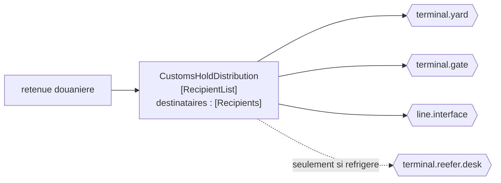

# Recipient List

🌍 🇫🇷 Français (ce fichier) · 🇬🇧 [English](RecipientList-en.md)

## Intention

Recipient List envoie un message vers un ensemble de destinations que l'émetteur calcule, de sorte que qui le reçoit
soit décidé message par message plutôt que par un abonnement.

## Problème

Une retenue douanière sur un conteneur doit atteindre le parc, le portique, l'armateur et — seulement si le conteneur
est réfrigéré — le bureau des frigorifiques.

Trois des quatre sont toujours justes et le quatrième dépend du message. Un
[canal de publication-abonnement](PublishSubscribeChannel-fr.md) ne sait pas exprimer cela : un abonnement est une
décision permanente, donc le bureau des frigorifiques reçoit soit toutes les retenues en jetant la plupart, soit
aucune.

Un [routeur fondé sur le contenu](ContentBasedRouter-fr.md) ne sait pas l'exprimer non plus, parce qu'il choisit
exactement une destination et qu'il en faut ici trois ou quatre à la fois.

## Solution

Le patron calcule les destinataires message par message et envoie une copie à chacun.

L'ensemble est une fonction du message. Trois toujours, plus un quand le conteneur est réfrigéré — la décision est
celle de l'émetteur, prise une fois, pour ce message.

La seconde moitié du patron est que l'ensemble calculé est **exposé**. Rendre les destinataires interrogeables est ce
qui transforme la décision de routage en quelque chose d'auditable plutôt qu'en un effet de bord que personne ne peut
inspecter après coup.

## Structure



Trois flèches pleines et une qui dépend du message. Cette flèche en pointillés est toute la raison pour laquelle un
abonnement ne sait pas faire cela.

## Les rôles

| Rôle | Annotation | S'applique à | Ce qu'il porte |
|---|---|---|---|
| RecipientList | `[RecipientList.RecipientList]` | interface, classe | Le participant qui calcule les destinataires d'un message et envoie une copie à chacun. |
| Recipients | `[RecipientList.Recipients]` | propriété, méthode | Les destinations calculées pour ce message. |

Deux rôles, et le second est l'inhabituel : il annote le **résultat du calcul**, pour que la décision puisse être
inspectée. La plupart des patrons de routage laissent leur décision implicite dans une valeur de retour ; celui-ci
exige que l'ensemble soit une chose qu'on peut demander.

## L'exemple

Extrait de [`RecipientListUsage.cs`](../../../../DesignPatternCatalog.Usage/EnterpriseIntegration/RecipientListUsage.cs).

```csharp
[RecipientList.Recipients]
public IReadOnlyList<string> RecipientsFor(bool refrigerated) {
    List<string> to = new() { "terminal.yard", "terminal.gate", "line.interface" };
    if (refrigerated) { to.Add("terminal.reefer.desk"); }

    return to;
}
```

La méthode s'appelle `RecipientsFor` et elle **rend** la liste plutôt que d'y envoyer. Cette séparation est ce que la
seconde annotation protège : une méthode qui calculerait et enverrait d'un même mouvement ne laisserait rien à
inspecter, et *à qui cette retenue est-elle allée* ne serait répondable qu'en lisant les journaux de chaque
destination.

Trois fixes et un conditionnel, ce qui est la forme honnête de la plupart des vraies listes de destinataires : un
noyau toujours juste et une queue qui dépend. L'écrire ainsi rend la part conditionnelle visible au lieu de la cacher
dans un moteur de règles.

`IReadOnlyList<string>` rend des noms de canaux, non des systèmes. La liste est adressable directement : rien entre
le calcul et l'envoi n'a à résoudre quoi que ce soit.

L'exemple énonce ce qui la distingue d'un abonnement : *contrairement à un canal de publication-abonnement, la
décision est celle de l'émetteur et par message, ce qui lui permet de dépendre du contenu du message.*

## Possibilités d'application

**Employez une liste de destinataires là où l'ensemble des destinations dépend du message.** Le cas du livre, et
celui que ni un abonnement ni un routeur à destination unique ne savent servir.

**Employez-la là où l'émetteur possède légitimement la décision.** La distribution d'une retenue douanière est une
règle portant sur les retenues douanières, et le participant qui la calcule devrait être celui qui sait.

**Exposez l'ensemble calculé.** C'est l'insistance propre du patron, et c'est ce qui rend un mauvais acheminement
relisible après coup.

**Calculez des noms de canaux, non des identités de systèmes.** Une liste qu'il faut résoudre avant de pouvoir s'en
servir a déplacé le couplage plutôt que de le retirer.

## Quand ne pas l'utiliser

**Ne l'employez pas là où un abonnement suffirait.** Si chaque intéressé veut chaque message,
[Publish-Subscribe Channel](PublishSubscribeChannel-fr.md) obtient la même délivrance sans que l'émetteur connaisse
personne — et tout le coût de ce patron est que l'émetteur connaît tout le monde.

**Ne l'employez pas là où exactement une destination est la bonne.** C'est un
[routeur fondé sur le contenu](ContentBasedRouter-fr.md), et une liste de destinataires à un élément est un routeur
avec de la machinerie en trop.

**Ne laissez pas la liste devenir la topologie du parc.** Une liste de destinataires qui nomme quatorze canaux a
accumulé la carte que [Message Broker](MessageBroker-fr.md) est au moins honnête de détenir.

**N'y mettez pas de décision de domaine.** *Quels systèmes sont informés d'une retenue* peut être de la distribution ;
*si une retenue s'applique* ne l'est pas, et calculer le second ici l'enterre.

**Ne la calculez pas sans la consigner.** Une liste de destinataires dont l'ensemble n'est pas observable rend une
délivrance partielle indiagnosticable : le parc a la retenue, le portique non, et rien ne dit si le portique était
seulement sur la liste.

**Ne supposez pas que les copies réussissent ensemble.** Quatre envois sont quatre occasions d'échouer, et le patron
ne dit rien de ce qu'il faut faire quand le troisième échoue.

## Avantages

* L'ensemble des destinations peut dépendre du message, ce qu'un abonnement ne permet pas.
* La décision est prise une fois, dans un participant, plutôt que par chaque receveur qui filtre.
* Exposer l'ensemble rend le routage auditable après coup.
* Un destinataire qui n'aurait pas dû recevoir un message est une faute dans un calcul lisible.
* Elle se compose avec les autres routeurs : la liste peut elle-même être calculée à partir du contenu.

## Inconvénients

* L'émetteur connaît les destinations, ce qui est le couplage que la publication-abonnement retire.
* Ajouter un destinataire est un changement ici, contrairement à un abonnement.
* Plusieurs envois par message rendent la délivrance partielle possible, et le patron ne la traite pas.
* La liste grandit, et une liste longue est la topologie du parc dans une méthode.
* Rien ne vérifie les noms calculés : une faute de frappe n'achemine nulle part et ne signale rien.

## Liens avec les autres patrons

**`PublishSubscribeChannel`** est l'alternative quand l'ensemble ne dépend pas du message, et l'échange est
exactement *qui décide* : un abonné là-bas, l'émetteur ici.

**`ContentBasedRouter`** est le frère à destination unique — même décision, une sortie au lieu de plusieurs.

**`WireTap`** restreint celui-ci dans le catalogue : une prise est une liste de destinataires à deux, la vraie
destination et un observateur. Cette relation est l'une des quatre que le catalogue enregistre
([ADR-0030](../../for-maintainers/adr/0030-relate-only-the-narrowings-a-work-states-outright.md)).

**`Splitter`** transforme lui aussi un message en plusieurs, et la différence vaut d'être tenue au clair : un diviseur
envoie des *parties* à un seul endroit, une liste de destinataires envoie *le tout* à plusieurs.

**`ScatterGather`** est ce patron plus les réponses — envoyer à plusieurs et rassembler ce qui revient.

**`MessageBroker`** est là où finit la connaissance d'une liste de destinataires quand elle dépasse quelques
destinations.

## Source

*Enterprise Integration Patterns*, Gregor Hohpe et Bobby Woolf, Addison-Wesley, 2003 — le chapitre sur le routage
des messages.

* [Entrée d'index](../../../generated/catalog-index.md#recipientlist-enterprise-integration-patterns)
* [Attribut généré](../../../../DesignPatternCatalog.EnterpriseIntegration/RecipientList.cs)
* [Exemple](../../../../DesignPatternCatalog.Usage/EnterpriseIntegration/RecipientListUsage.cs)
