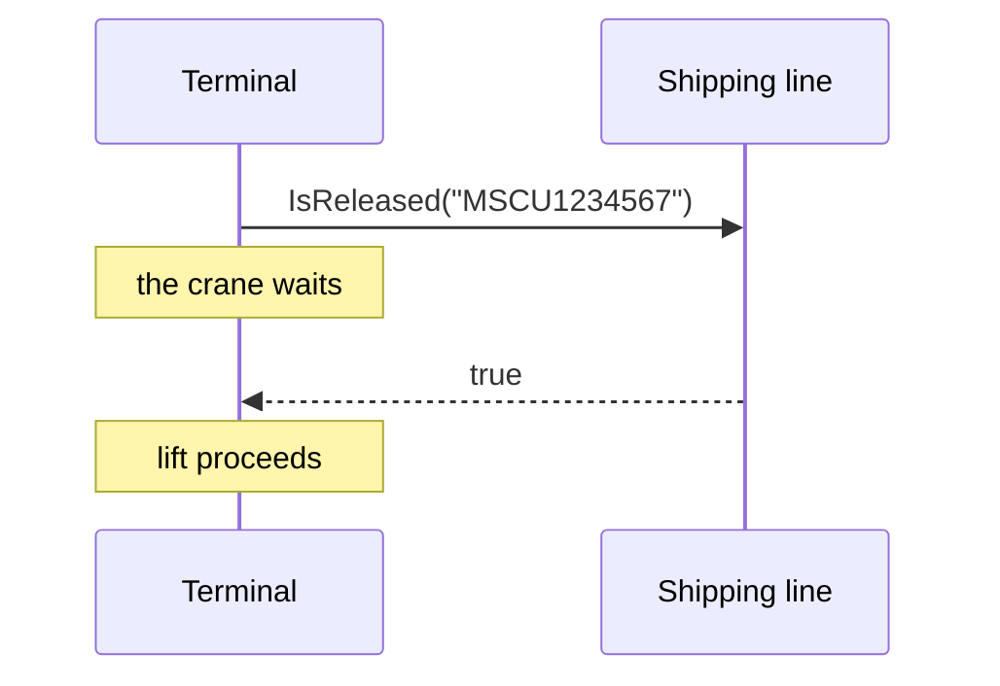

# Remote Procedure Invocation

🌍 🇬🇧 English (this file) · 🇫🇷 [Français](RemoteProcedureInvocation-fr.md)

## Intent

Remote Procedure Invocation integrates applications by letting one call a procedure the other exposes, so that
data and behaviour travel together and the caller learns the answer at once.

## Problem

Before a crane lifts a container onto a ship, the terminal asks the line whether the container is released — no
hold, paid, documents in order.

That answer is needed now: the crane is waiting. A file written overnight cannot answer it, a shared schema would
mean the terminal reading the line's own tables, and a message published to a channel might be answered in a
minute or in an hour.

## Solution

The pattern lets the caller wait.

One application exposes a procedure; the other calls it and receives an answer before continuing. Data and
behaviour travel together — the call does not merely fetch a record, it asks a question the other side computes.

The coupling in time is the point, not an oversight. The caller must not proceed without the answer, so it is
correct that it cannot.

## Structure



A sequence diagram rather than a flow, because the ordering is the pattern. The note is where the cost is: that
wait is real, and so is what happens to it if the line is down.

## The roles

| Role | Annotation | Applies to | What it carries |
|---|---|---|---|
| RemoteProcedureInvocation | `[RemoteProcedureInvocation]` | interface, class, assembly | The participant that exposes or calls the remote procedure. |

One role for both ends. Annotating the *interface* rather than a client class is what the sample does, and it is
the right target here: the interface is the contract, and it is what makes the remoteness a declared fact rather
than something discovered by reading an implementation.

## The example

From [`RemoteProcedureInvocationUsage.cs`](../../../../DesignPatternCatalog.Usage/EnterpriseIntegration/RemoteProcedureInvocationUsage.cs).

```csharp
[RemoteProcedureInvocation]
public interface IReleaseCheck {

    bool IsReleased(string containerNumber);

}
```

One method, one boolean, and nothing about HTTP, retries or timeouts. That absence is deliberate: the interface
is the application's view of the question, and the transport belongs behind it.

What the annotation adds is the one fact the signature hides. `IsReleased` looks exactly like a local call — and
the difference is that this one can be slow, can fail for reasons that have nothing to do with the container, and
requires another organisation's system to be up. A reader who does not know that will call it in a loop.

The sample's remark is the whole applicability in two sentences: *the caller waits and the callee must be up.
That is what buys an answer before the lift, and it is why the same shape would be wrong for anything that can be
answered later.*

## Applicability

**Use Remote Procedure Invocation where the caller must not proceed without the answer.** The book presents the
synchronous coupling as this style's defining property, and the release check is the case that wants it.

**Use it where behaviour, not merely data, has to cross.** The line does not hand over its holds table; it answers
a question it computes, which is what distinguishes this from the two data-sharing styles.

**Use it where the applications can agree on an interface and both be available.** That is a stronger requirement
than a file and a weaker one than a schema.

## When not to use it

**Do not use it where the answer can wait.** This is the misuse the book warns about most, and the reason
[Messaging](Messaging-en.md) is the style the rest of the catalogue elaborates: a call that did not need to be
synchronous has bought coupling and paid for it with availability.

**Do not use it across an unreliable link without deciding what a failure means.** The caller waits, so the
caller inherits the callee's downtime, its latency and its overload. The crane needs an answer; it also needs a
policy for the day the line's system is unreachable, and the interface above does not have one.

**Do not use it in a loop over many items.** Each call pays the round trip, and a pattern that is right for one
container is wrong for a ship's manifest — the book's own remedy there is a batch, which is another style.

**Do not let it hide behind a local-looking signature and nothing else.** `IsReleased(string)` reads as a
property access. The annotation exists because the cost is invisible at the call site, and without something
saying so, a caller reasonably treats it as free.

**Do not use it where the two sides must not know each other's interface.** A shared interface is a tighter
contract than a shared file format: it names operations, not just data.

## Advantages

* The answer arrives before the caller continues, which is the only thing that serves a waiting crane.
* Behaviour crosses, not just data, so the other side keeps its own rules and its own tables.
* The contract is an interface, which is checkable at compile time on both sides.
* Encapsulation survives: the line's holds table is never exposed.

## Drawbacks

* The caller is coupled to the callee in time: it waits, and it fails when the callee is down.
* Latency is the caller's problem, and it multiplies over a loop.
* The synchronous shape is easy to reach for where it is not needed, and the cost only appears under load or
  outage.
* A local-looking signature hides a remote cost, so callers misjudge it.

## Relations with other patterns

**`FileTransfer`**, **`SharedDatabase`** and **`Messaging`** are the other three styles, and the four are meant to
be read as one choice.

**`Messaging`** is what to reach for when the answer can wait — and **`RequestReply`** is how messaging answers a
question when it must, without the caller blocking.

**`MessagingGateway`** is the endpoint pattern that gives a messaging integration the same local-looking
interface this style has by nature.

## Source

*Enterprise Integration Patterns*, Gregor Hohpe and Bobby Woolf, Addison-Wesley, 2003 — chapter 2, integration
styles.

* [Index entry](../../../generated/catalog-index.md#remoteprocedureinvocation-enterprise-integration-patterns)
* [Generated attribute](../../../../DesignPatternCatalog.EnterpriseIntegration/RemoteProcedureInvocation.cs)
* [Example](../../../../DesignPatternCatalog.Usage/EnterpriseIntegration/RemoteProcedureInvocationUsage.cs)
