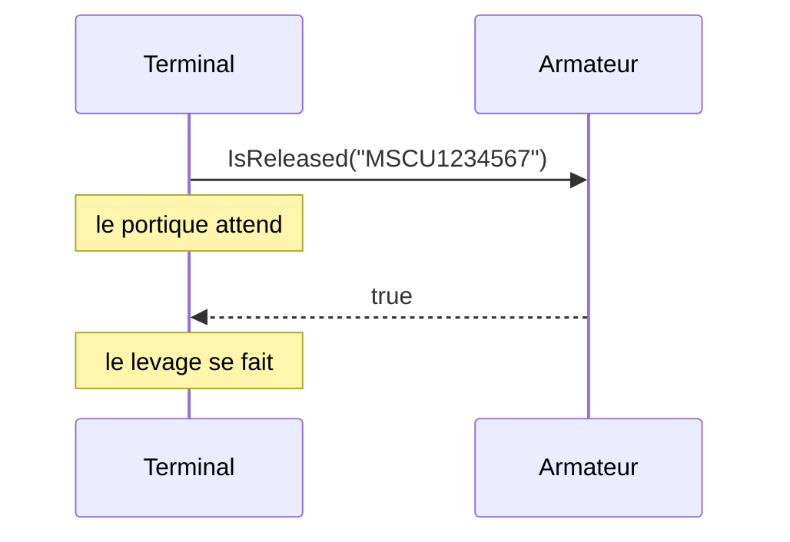

# Remote Procedure Invocation

🌍 🇫🇷 Français (ce fichier) · 🇬🇧 [English](RemoteProcedureInvocation-en.md)

## Intention

Remote Procedure Invocation intègre des applications en laissant l'une appeler une procédure que l'autre expose,
de sorte que données et comportement voyagent ensemble et que l'appelant apprenne la réponse tout de suite.

## Problème

Avant qu'un portique charge un conteneur sur un navire, le terminal demande à l'armateur si le conteneur est
mainlevé — pas de retenue, payé, documents en règle.

Cette réponse est nécessaire maintenant : le portique attend. Un fichier écrit dans la nuit ne peut pas y
répondre, un schéma partagé voudrait dire que le terminal lit les tables de l'armateur, et un message publié sur
un canal pourrait recevoir réponse dans une minute ou dans une heure.

## Solution

Le patron laisse l'appelant attendre.

Une application expose une procédure ; l'autre l'appelle et reçoit une réponse avant de continuer. Données et
comportement voyagent ensemble — l'appel ne va pas simplement chercher un enregistrement, il pose une question que
l'autre côté calcule.

Le couplage dans le temps est le propos, non un oubli. L'appelant ne doit pas continuer sans la réponse : il est
donc correct qu'il ne puisse pas.

## Structure



Un diagramme de séquence plutôt qu'un flux, parce que l'ordonnancement est le patron. La note est là où se trouve
le coût : cette attente est réelle, et ce qui lui arrive si l'armateur est en panne l'est aussi.

## Les rôles

| Rôle | Annotation | S'applique à | Ce qu'il porte |
|---|---|---|---|
| RemoteProcedureInvocation | `[RemoteProcedureInvocation]` | interface, classe, assembly | Le participant qui expose ou appelle la procédure distante. |

Un seul rôle pour les deux bouts. Annoter l'*interface* plutôt qu'une classe cliente est ce que fait l'exemple, et
c'est la bonne cible ici : l'interface est le contrat, et c'est elle qui fait de la distance un fait déclaré plutôt
que quelque chose qu'on découvre en lisant une implémentation.

## L'exemple

Extrait de [`RemoteProcedureInvocationUsage.cs`](../../../../DesignPatternCatalog.Usage/EnterpriseIntegration/RemoteProcedureInvocationUsage.cs).

```csharp
[RemoteProcedureInvocation]
public interface IReleaseCheck {

    bool IsReleased(string containerNumber);

}
```

Une méthode, un booléen, et rien sur HTTP, les réessais ou les délais. Cette absence est délibérée : l'interface
est la vue applicative de la question, et le transport vit derrière elle.

Ce que l'annotation ajoute est l'unique fait que la signature cache. `IsReleased` ressemble exactement à un appel
local — et la différence est que celui-ci peut être lent, peut échouer pour des raisons qui n'ont rien à voir avec
le conteneur, et exige que le système d'une autre organisation soit debout. Un lecteur qui l'ignore l'appellera
dans une boucle.

La remarque de l'exemple est toute l'applicabilité en deux phrases : *l'appelant attend et l'appelé doit être
debout. C'est ce qui achète une réponse avant le levage, et c'est pourquoi la même forme serait fausse pour tout ce
qui peut recevoir réponse plus tard.*

## Possibilités d'application

**Employez Remote Procedure Invocation là où l'appelant ne doit pas continuer sans la réponse.** Le livre présente
le couplage synchrone comme la propriété définitoire de ce style, et le contrôle de mainlevée est le cas qui la
veut.

**Employez-le là où c'est du comportement, et pas seulement de la donnée, qui doit traverser.** L'armateur ne
livre pas sa table de retenues ; il répond à une question qu'il calcule, ce qui distingue ce style des deux styles
de partage de données.

**Employez-le là où les applications peuvent s'accorder sur une interface et être toutes deux disponibles.** C'est
une exigence plus forte qu'un fichier et plus faible qu'un schéma.

## Quand ne pas l'utiliser

**Ne l'employez pas là où la réponse peut attendre.** C'est le mésusage contre lequel le livre met le plus en
garde, et la raison pour laquelle [Messaging](Messaging-fr.md) est le style que développe le reste du catalogue :
un appel qui n'avait pas besoin d'être synchrone a acheté du couplage et l'a payé en disponibilité.

**Ne l'employez pas sur un lien peu fiable sans décider ce que veut dire un échec.** L'appelant attend : il hérite
donc de l'indisponibilité de l'appelé, de sa latence et de sa surcharge. Le portique a besoin d'une réponse ; il a
aussi besoin d'une politique pour le jour où le système de l'armateur est injoignable, et l'interface ci-dessus
n'en a pas.

**Ne l'employez pas dans une boucle sur de nombreux éléments.** Chaque appel paie l'aller-retour, et un patron
juste pour un conteneur est faux pour le manifeste d'un navire — le remède propre au livre est alors un lot, ce qui
est un autre style.

**Ne le laissez pas se cacher derrière une signature d'allure locale et rien d'autre.** `IsReleased(string)` se
lit comme un accès à une propriété. L'annotation existe parce que le coût est invisible au site d'appel, et sans
quelque chose pour le dire, un appelant le traite raisonnablement comme gratuit.

**Ne l'employez pas là où les deux côtés ne doivent pas connaître l'interface de l'autre.** Une interface partagée
est un contrat plus serré qu'un format de fichier partagé : elle nomme des opérations, pas seulement des données.

## Avantages

* La réponse arrive avant que l'appelant continue, ce qui est la seule chose qui serve un portique qui attend.
* Du comportement traverse, pas seulement de la donnée : l'autre côté garde ses propres règles et ses propres
  tables.
* Le contrat est une interface, vérifiable à la compilation des deux côtés.
* L'encapsulation survit : la table de retenues de l'armateur n'est jamais exposée.

## Inconvénients

* L'appelant est couplé à l'appelé dans le temps : il attend, et il échoue quand l'appelé est en panne.
* La latence est le problème de l'appelant, et elle se multiplie sur une boucle.
* La forme synchrone est facile à saisir là où elle n'est pas nécessaire, et le coût n'apparaît que sous charge ou
  en panne.
* Une signature d'allure locale cache un coût distant : les appelants le sous-estiment.

## Liens avec les autres patrons

**`FileTransfer`**, **`SharedDatabase`** et **`Messaging`** sont les trois autres styles, et les quatre se lisent
comme un seul choix.

**`Messaging`** est ce vers quoi se tourner quand la réponse peut attendre — et **`RequestReply`** est la façon
dont la messagerie répond à une question quand il le faut, sans que l'appelant bloque.

**`MessagingGateway`** est le patron de point de terminaison qui donne à une intégration par messages la même
interface d'allure locale que ce style a par nature.

## Source

*Enterprise Integration Patterns*, Gregor Hohpe et Bobby Woolf, Addison-Wesley, 2003 — chapitre 2, les styles
d'intégration.

* [Entrée d'index](../../../generated/catalog-index.md#remoteprocedureinvocation-enterprise-integration-patterns)
* [Attribut généré](../../../../DesignPatternCatalog.EnterpriseIntegration/RemoteProcedureInvocation.cs)
* [Exemple](../../../../DesignPatternCatalog.Usage/EnterpriseIntegration/RemoteProcedureInvocationUsage.cs)
