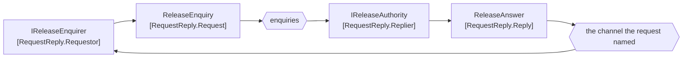

# Request-Reply

🌍 🇬🇧 English (this file) · 🇫🇷 [Français](RequestReply-fr.md)

## Intent

Request-Reply pairs a request with a reply over two channels, so that a message can get an answer without either
side blocking on the other's availability.

## Problem

Before loading, the terminal asks the shipping line whether a container is released.

Written as a remote call, the crane waits on the line being up:

```csharp
bool released = _lineService.IsReleased(containerNumber);
```

One line, and the terminal's ability to load a vessel now depends on another company's web service. When the
line's system is slow the crane is slow; when it is down the crane is down; and there is nothing the terminal can
do about either, because the waiting is built into the shape of the call.

## Solution

The pattern is two one-way messages on two channels.

The terminal sends a request and carries on. The answer arrives when it arrives, on a channel of its own, and the
terminal is free in between. Being a **separate message** is what lets the requestor be down when the reply
arrives and still receive it — which a call cannot do, because a call's answer exists only while the caller is
waiting for it.

That is the distinction the sample insists on: this is two messages, *not a call wearing a message's clothes*.

## Structure



Two channels, and the second one is named by the request rather than configured into the replier.

## The roles

| Role | Annotation | Applies to | What it carries |
|---|---|---|---|
| Request | `[RequestReply.Request]` | class, struct | The message that asks, naming or carrying the channel the answer comes back on. |
| Reply | `[RequestReply.Reply]` | class, struct | The message that answers, sent on a channel of its own. |
| Requestor | `[RequestReply.Requestor]` | interface, class | The participant that sends the request and consumes the reply. |
| Replier | `[RequestReply.Replier]` | interface, class | The participant that consumes the request and sends the reply. |

Four roles — the most in this chapter — because the pattern is a conversation rather than a message. Two of them
are messages and two are participants, and the pair of messages is linked in both directions: `Request` names its
`Reply` and the `Reply` names its `Request`.

## The example

From [`RequestReplyUsage.cs`](../../../../DesignPatternCatalog.Usage/EnterpriseIntegration/RequestReplyUsage.cs).

The two messages first, each pointing at the other:

```csharp
[RequestReply.Request(Reply = typeof(ReleaseAnswer))]
public sealed record ReleaseEnquiry(Guid EnquiryId, string ContainerNumber, string ReplyTo);
```

```csharp
[RequestReply.Reply(Request = typeof(ReleaseEnquiry))]
public sealed record ReleaseAnswer(Guid InReplyTo, bool Released, string? Hold);
```

The mutual `typeof` is what makes the pair checkable. A request whose declared reply type nobody ever sends, or a
reply nobody requests, is a conversation with one end — and that is exactly the kind of defect a rule over the
annotations can find, since neither message alone looks wrong.

Two properties in those records are other patterns doing their work here. `ReplyTo` is a
[return address](ReturnAddress-en.md); `EnquiryId` and `InReplyTo` are a
[correlation identifier](CorrelationIdentifier-en.md) and its quotation. They are annotated in their own samples
rather than in this one, which is the samples decomposing one conversation instead of repeating it.

`string? Hold` is the reply carrying *why*. An answer of `false` with no reason sends somebody to a telephone.

Then the two participants:

```csharp
[RequestReply.Requestor]
public interface IReleaseEnquirer {

    void Ask(ReleaseEnquiry enquiry);

    void OnAnswer(ReleaseAnswer answer);

}
```

`Ask` returns `void`, and that is the whole pattern in a signature. A requestor whose `Ask` returned a
`ReleaseAnswer` would be a remote call again, however many channels were underneath. The answer arrives at
`OnAnswer`, separately, possibly much later, possibly after a restart.

```csharp
[RequestReply.Replier]
public interface IReleaseAuthority {

    void Handle(ReleaseEnquiry enquiry);

}
```

One method, and it takes the request and returns nothing. The replier does not return an answer to a caller; it
sends one, to the channel the request named. The sample states what that buys: *it learns where to answer from
the message rather than from configuration, which is what lets one replier serve requestors it was never told
about.*

## Applicability

**Use request-reply where an answer is genuinely needed and waiting is not.** The book's framing: a message can
get an answer without either side blocking on the other's availability.

**Use it where the responder belongs to somebody else.** A partner's system will be slow and will be down, and
this is the shape that stops that from being the terminal's problem.

**Let the request name its reply channel.** [Return Address](ReturnAddress-en.md) is what makes one replier
serve requestors it was never configured for.

**Correlate.** A requestor with forty open enquiries cannot match answers by guessing, which is why the
[correlation identifier](CorrelationIdentifier-en.md) and this pattern are always seen together.

## When not to use it

**Do not use it where the caller genuinely cannot proceed.** If nothing can happen until the answer arrives, the
asynchrony is a fiction and [Remote Procedure Invocation](RemoteProcedureInvocation-en.md) is the honest
arrangement — it is at least clear about what it costs.

**Do not hide it behind a blocking wrapper.** A requestor that sends and then waits for the reply has rebuilt the
call with a broker in the middle: the same coupling, plus a queue, plus two channels to operate.

**Do not use it where no answer is wanted.** An [event](EventMessage-en.md) expects no reply, and giving one a
reply channel means deciding which subscriber's answer counts.

**Do not send it without a correlation identifier.** The reply arrives on a shared channel among thirty-nine
others, and an answer that cannot be matched to a question is an answer to nothing.

**Do not leave the request open for ever.** A requestor that keeps state for every unanswered enquiry accumulates
it until something clears it, and the pattern that bounds this is
[Message Expiration](MessageExpiration-en.md).

**Do not put a reply on a publish-subscribe channel.** A reply has one rightful recipient — the requestor that
asked — and broadcasting it tells three other systems the answer to a question they did not ask.

## Advantages

* Neither side blocks on the other's availability, which is the whole reason to prefer it to a call.
* The requestor may restart between asking and being answered, and still receive the answer.
* One replier can serve requestors it was never configured for, because the request says where to answer.
* The conversation is two declared message types, so a rule can check that both ends exist.
* Slowness in the responder becomes latency rather than unavailability.

## Drawbacks

* It is a conversation to build: two channels, a correlation identifier, a return address and state at the
  requestor.
* The requestor holds state for every open request, and something has to clear it.
* Replies arrive out of order and possibly long after, so the requestor's own code becomes asynchronous
  throughout.
* It is easy to wrap in a blocking call and lose everything the pattern bought, invisibly.
* A lost reply looks like a slow one, and only a timeout distinguishes them.

## Relations with other patterns

**`ReturnAddress`** is what the request carries so the replier knows where to answer.

**`CorrelationIdentifier`** is what makes the answer matchable, and the sample says outright why the two patterns
are always seen together.

**`CommandMessage`** is what a request usually is, and the reply is what the book says a command usually gets.

**`RemoteProcedureInvocation`** is the integration style this replaces, and the one it becomes again the moment
somebody wraps it in a blocking method.

**`MessageExpiration`** is what bounds a request nobody will answer.

**`Messaging`** is the style whose decoupling in time this pattern shows most sharply, because here an answer is
genuinely wanted and still nobody waits.

## Source

*Enterprise Integration Patterns*, Gregor Hohpe and Bobby Woolf, Addison-Wesley, 2003 — the message-construction
chapter.

* [Index entry](../../../generated/catalog-index.md#requestreply-enterprise-integration-patterns)
* [Generated attribute](../../../../DesignPatternCatalog.EnterpriseIntegration/RequestReply.cs)
* [Example](../../../../DesignPatternCatalog.Usage/EnterpriseIntegration/RequestReplyUsage.cs)
