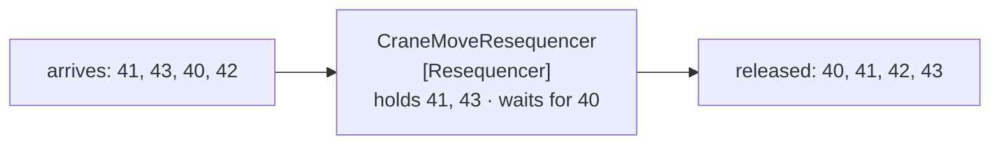

# Resequencer

🌍 🇬🇧 English (this file) · 🇫🇷 [Français](Resequencer-fr.md)

## Intent

Resequencer puts a stream of related messages back into order, so that a receiver that depends on sequence is not
defeated by the transport.

## Problem

Crane moves are published by six cranes over two brokers, and they arrive out of order often enough to matter.

A yard rebuilt from them puts a container in a slot it left ten minutes ago: move 41 said *bay 12 to bay 30*,
move 40 said *bay 3 to bay 12*, and applying them in the order they arrived leaves the yard believing a container
is in two places and then in the wrong one.

Nothing upstream is broken. Six publishers and two brokers have no shared clock and no shared queue, and
[competing consumers](PointToPointChannel-en.md) downstream would reorder them again anyway. Order is not a
property the transport was ever going to provide.

## Solution

The pattern buffers what arrives early and releases in order.

A resequencer holds message 41 until 40 arrives, then releases both. It **touches neither the messages nor their
destination** — which is what keeps it a router rather than a translator: what comes out is exactly what went in,
in a different order and at a different time.

It is stateful for the same reason an [aggregator](Aggregator-en.md) is: a gap it is waiting on outlives the
message that revealed it.

## Structure



Same four messages, same destination, different order — and the box in the middle changed nothing else.

## The roles

| Role | Annotation | Applies to | What it carries |
|---|---|---|---|
| Resequencer | `[Resequencer]` | interface, class | The stateful participant that buffers what arrives early and releases in order. |

One role, and it inherits [Message Router](MessageRouter-en.md)'s *unchanged* claim while adding a second: the
destination is unchanged too. A resequencer is the only pattern in this chapter whose entire effect is on
**timing**.

## The example

From [`ResequencerUsage.cs`](../../../../DesignPatternCatalog.Usage/EnterpriseIntegration/ResequencerUsage.cs).

```csharp
public IReadOnlyList<string> Offer(long sequence, string move) {
    _held[sequence] = move;
    List<string> released = new();
    while (_held.TryGetValue(_next, out string? ready)) {
        released.Add(ready);
        _held.Remove(_next);
        _next++;
    }

    return released;
}
```

The method is called `Offer` and returns what is now releasable — possibly nothing, possibly four messages at
once. That signature is the pattern: a resequencer is not asked *what is next*, it is handed a message and says
what became releasable as a result.

The `while` loop is why one late message releases a run. Message 40 arriving after 41, 42 and 43 releases all
four, which is the ordinary shape of the traffic rather than an edge case.

`_next` starting at 1 and only ever advancing is the honest limitation of the sample: **a message that never
arrives stops everything behind it for ever**. A production resequencer needs a rule for giving up on a gap, and
the sample does not have one — it has the mechanism and not the policy, which is worth knowing before copying it.

The `move` is stored and returned untouched. Nothing in the class inspects it, which is the *unchanged* claim
made structural.

The sample states what it needs and what it costs: *it needs a sequence to work from, and it is stateful for the
same reason an aggregator is.*

## Applicability

**Use a resequencer where a receiver depends on order and the transport does not provide it.** The book's case,
and the ordinary condition once there is more than one publisher or more than one consumer.

**Use it where the messages already carry a sequence.** It needs something to order by — usually
[Message Sequence](MessageSequence-en.md)'s position property.

**Use it where reordering is the whole requirement.** If the receiver wants one combined message instead, that is
an [aggregator](Aggregator-en.md).

**Decide what happens to a gap that never fills.** The mechanism blocks; the policy is yours, and without one a
single lost message stops the stream.

## When not to use it

**Do not use it where the receiver does not need order.** Each crane move applied to its own container needs no
sequence at all, and a resequencer would add latency and a failure mode for nothing.

**Do not use it without a sequence to work from.** Arrival time is not a sequence, and ordering by it reproduces
exactly the problem the pattern exists to fix.

**Do not use it where the order can be restored at the destination.** A receiver that sorts what it has is
simpler than a participant in the middle that holds state.

**Do not leave a gap unbounded.** This is the pattern's hardest edge: one message lost in transit blocks
everything behind it indefinitely, and the symptom is a stream that has silently stopped rather than an error.

**Do not let it aggregate.** Releasing four messages together is not combining them into one; a resequencer that
merges has become an aggregator with a misleading name.

**Do not put it behind competing consumers.** Several consumers on the far side will reorder the messages again,
which makes the whole participant pointless.

## Advantages

* A receiver that depends on order gets it, without any publisher coordinating.
* Nothing about the messages changes, so it can be inserted or removed without any other step knowing.
* One participant solves ordering for every receiver on the channel.
* It composes with [Splitter](Splitter-en.md), which is the commonest source of out-of-order streams.
* Its state is simpler than an aggregator's: what is held, and what number is next.

## Drawbacks

* It is stateful, so a restart loses whatever it was holding.
* A message that never arrives blocks everything behind it, and the pattern says nothing about when to give up.
* It adds latency by design — the whole point is to delay what arrived early.
* It needs a sequence, so it cannot be added to a stream that never carried one.
* Everything after it must preserve the order it restored, which competing consumers will not.

## Relations with other patterns

**`MessageSequence`** is what a resequencer works from, and its position property is the thing being ordered by.

**`Aggregator`** is the other stateful router: that one combines many into one, this one delays and releases
unchanged.

**`Splitter`** is usually what produced the stream, since concurrent processing of split elements is where the
disorder comes from.

**`MessageRouter`** is the root, and this narrows it in an unusual way — the destination never changes, only the
timing.

**`PointToPointChannel`**'s page names the same failure from the channel's side: several consumers processing
concurrently is how order is lost.

**`MessageExpiration`** is one way to bound a gap that will never fill, by deciding the missing message is no
longer worth waiting for.

## Source

*Enterprise Integration Patterns*, Gregor Hohpe and Bobby Woolf, Addison-Wesley, 2003 — the message-routing
chapter.

* [Index entry](../../../generated/catalog-index.md#resequencer-enterprise-integration-patterns)
* [Generated attribute](../../../../DesignPatternCatalog.EnterpriseIntegration/Resequencer.cs)
* [Example](../../../../DesignPatternCatalog.Usage/EnterpriseIntegration/ResequencerUsage.cs)
