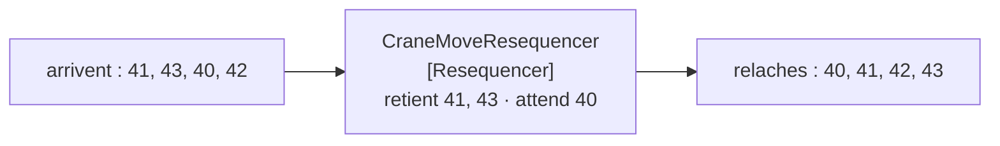

# Resequencer

🌍 🇫🇷 Français (ce fichier) · 🇬🇧 [English](Resequencer-en.md)

## Intention

Resequencer remet un flux de messages apparentés dans l'ordre, de sorte qu'un receveur qui dépend de la séquence ne
soit pas défait par le transport.

## Problème

Les mouvements de portique sont publiés par six portiques sur deux courtiers, et ils arrivent dans le désordre
assez souvent pour que cela compte.

Un parc rebâti à partir d'eux met un conteneur dans un emplacement qu'il a quitté dix minutes plus tôt : le
mouvement 41 disait *travée 12 vers travée 30*, le mouvement 40 disait *travée 3 vers travée 12*, et les appliquer
dans l'ordre d'arrivée laisse le parc croire qu'un conteneur est à deux endroits, puis au mauvais.

Rien en amont n'est cassé. Six émetteurs et deux courtiers n'ont ni horloge ni file communes, et des
[consommateurs concurrents](PointToPointChannel-fr.md) en aval les réordonneraient de toute façon. L'ordre n'est pas
une propriété que le transport allait jamais fournir.

## Solution

Le patron tamponne ce qui arrive tôt et relâche dans l'ordre.

Un réordonnanceur retient le message 41 jusqu'à l'arrivée du 40, puis relâche les deux. Il **ne touche ni aux
messages ni à leur destination** — ce qui en fait un routeur plutôt qu'un traducteur : ce qui sort est exactement ce
qui est entré, dans un autre ordre et à un autre moment.

Il est doté d'un état pour la même raison qu'un [agrégateur](Aggregator-fr.md) : un trou qu'il attend survit au
message qui l'a révélé.

## Structure



Les mêmes quatre messages, la même destination, un autre ordre — et la boîte du milieu n'a rien changé d'autre.

## Les rôles

| Rôle | Annotation | S'applique à | Ce qu'il porte |
|---|---|---|---|
| Resequencer | `[Resequencer]` | interface, classe | Le participant doté d'un état qui tamponne ce qui arrive tôt et relâche dans l'ordre. |

Un seul rôle, et il hérite la revendication d'*inchangé* de [Message Router](MessageRouter-fr.md) en y ajoutant une
seconde : la destination est inchangée elle aussi. Un réordonnanceur est le seul patron de ce chapitre dont l'effet
entier porte sur le **temps**.

## L'exemple

Extrait de [`ResequencerUsage.cs`](../../../../DesignPatternCatalog.Usage/EnterpriseIntegration/ResequencerUsage.cs).

```csharp
public IReadOnlyList<string> Offer(long sequence, string move) {
    _held[sequence] = move;
    List<string> released = new();
    while (_held.TryGetValue(_next, out string? ready)) {
        released.Add(ready);
        _held.Remove(_next);
        _next++;
    }

    return released;
}
```

La méthode s'appelle `Offer` et rend ce qui est désormais relâchable — peut-être rien, peut-être quatre messages
d'un coup. Cette signature est le patron : on ne demande pas à un réordonnanceur *quel est le suivant*, on lui tend
un message et il dit ce qui est devenu relâchable en conséquence.

La boucle `while` est pourquoi un message tardif relâche une série. Le message 40 arrivant après 41, 42 et 43
relâche les quatre, ce qui est la forme ordinaire du trafic plutôt qu'un cas limite.

`_next` qui part de 1 et n'avance jamais que dans un sens est la limite honnête de l'exemple : **un message qui
n'arrive jamais bloque indéfiniment tout ce qui est derrière lui**. Un réordonnanceur de production a besoin d'une
règle pour renoncer à un trou, et l'exemple n'en a pas — il a le mécanisme et non la politique, ce qui vaut d'être su
avant de le copier.

Le `move` est stocké et rendu intact. Rien dans la classe ne l'inspecte, ce qui est la revendication d'*inchangé*
rendue structurelle.

L'exemple énonce ce dont il a besoin et ce qu'il coûte : *il a besoin d'une séquence pour travailler, et il est doté
d'un état pour la même raison qu'un agrégateur.*

## Possibilités d'application

**Employez un réordonnanceur là où un receveur dépend de l'ordre et où le transport ne le fournit pas.** Le cas du
livre, et la condition ordinaire dès qu'il y a plus d'un émetteur ou plus d'un consommateur.

**Employez-le là où les messages portent déjà une séquence.** Il a besoin de quelque chose pour ordonner —
d'ordinaire la propriété de position de [Message Sequence](MessageSequence-fr.md).

**Employez-le là où réordonner est toute l'exigence.** Si le receveur veut plutôt un message combiné, c'est un
[agrégateur](Aggregator-fr.md).

**Décidez ce qu'il advient d'un trou qui ne se comble jamais.** Le mécanisme bloque ; la politique vous revient, et
sans elle un seul message perdu arrête le flux.

## Quand ne pas l'utiliser

**Ne l'employez pas là où le receveur n'a pas besoin de l'ordre.** Chaque mouvement de portique appliqué à son propre
conteneur n'a besoin d'aucune séquence, et un réordonnanceur ajouterait de la latence et un mode de défaillance pour
rien.

**Ne l'employez pas sans séquence sur laquelle travailler.** L'heure d'arrivée n'est pas une séquence, et ordonner
par elle reproduit exactement le problème que le patron existe pour corriger.

**Ne l'employez pas là où l'ordre peut être rétabli à destination.** Un receveur qui trie ce qu'il a est plus simple
qu'un participant au milieu qui détient un état.

**Ne laissez pas un trou sans borne.** C'est l'arête la plus dure du patron : un message perdu en chemin bloque
indéfiniment tout ce qui est derrière lui, et le symptôme est un flux qui s'est arrêté en silence plutôt qu'une
erreur.

**Ne le laissez pas agréger.** Relâcher quatre messages ensemble n'est pas les combiner en un ; un réordonnanceur qui
fusionne est devenu un agrégateur au nom trompeur.

**Ne le mettez pas derrière des consommateurs concurrents.** Plusieurs consommateurs de l'autre côté réordonneront
les messages de nouveau, ce qui rend tout le participant inutile.

## Avantages

* Un receveur qui dépend de l'ordre l'obtient, sans qu'aucun émetteur se coordonne.
* Rien des messages ne change : il peut être inséré ou retiré sans qu'aucune autre étape le sache.
* Un seul participant résout l'ordre pour tous les receveurs du canal.
* Il se compose avec [Splitter](Splitter-fr.md), qui est la source la plus courante de flux désordonnés.
* Son état est plus simple que celui d'un agrégateur : ce qui est retenu, et quel numéro vient ensuite.

## Inconvénients

* Il est doté d'un état : un redémarrage perd ce qu'il retenait.
* Un message qui n'arrive jamais bloque tout ce qui est derrière lui, et le patron ne dit rien du moment où renoncer.
* Il ajoute de la latence par conception — tout le propos est de retarder ce qui est arrivé tôt.
* Il a besoin d'une séquence : il ne peut pas être ajouté à un flux qui n'en a jamais porté.
* Tout ce qui vient après lui doit préserver l'ordre qu'il a rétabli, ce que des consommateurs concurrents ne feront
  pas.

## Liens avec les autres patrons

**`MessageSequence`** est ce à partir de quoi un réordonnanceur travaille, et sa propriété de position est ce selon
quoi il ordonne.

**`Aggregator`** est l'autre routeur doté d'un état : celui-là combine plusieurs en un, celui-ci retarde et relâche
inchangé.

**`Splitter`** est d'ordinaire ce qui a produit le flux, puisque le traitement concurrent des éléments divisés est
d'où vient le désordre.

**`MessageRouter`** est la racine, et celui-ci la restreint d'une façon inhabituelle — la destination ne change
jamais, seul le moment change.

**La page de `PointToPointChannel`** nomme la même panne du côté du canal : plusieurs consommateurs qui traitent
concurremment sont la façon dont l'ordre se perd.

**`MessageExpiration`** est une façon de borner un trou qui ne se comblera jamais, en décidant que le message
manquant ne vaut plus la peine d'être attendu.

## Source

*Enterprise Integration Patterns*, Gregor Hohpe et Bobby Woolf, Addison-Wesley, 2003 — le chapitre sur le routage
des messages.

* [Entrée d'index](../../../generated/catalog-index.md#resequencer-enterprise-integration-patterns)
* [Attribut généré](../../../../DesignPatternCatalog.EnterpriseIntegration/Resequencer.cs)
* [Exemple](../../../../DesignPatternCatalog.Usage/EnterpriseIntegration/ResequencerUsage.cs)
