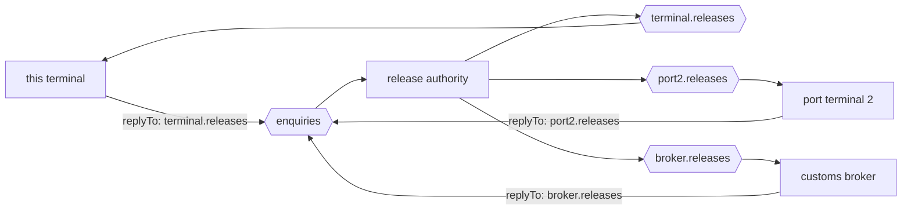

# Return Address

🌍 🇬🇧 English (this file) · 🇫🇷 [Français](ReturnAddress-fr.md)

## Intent

Return Address puts the reply channel on the request, so that a replier answers where the requestor asked rather
than where it was configured to.

## Problem

One release authority answers four requestors: this terminal, two other terminals in the port, and a customs
broker.

Told by configuration where to reply, it holds a table of them:

```csharp
string replyChannel = _settings.ReplyChannels[requestorName];
```

The fourth requestor needed a deployment. The fifth will need another, and each one is a change to a system
belonging to somebody else, scheduled at their convenience. Meanwhile the replier holds a list of everybody who
might ever ask it something — the same list [Message Router](MessageRouter-en.md)'s page describes a gate service
accumulating, arrived at from the opposite direction.

## Solution

The pattern puts the address on the message.

The request says where the answer belongs. The replier reads it and answers there, holding no table and knowing
no requestor. One replier, four requestors, each answered on its own channel — and the fifth costs nobody a
deployment.

It also moves where a failure lives: a reply that goes nowhere becomes a defect in the **message** rather than in
the replier.

## Structure



Three reply channels and no configuration in the middle box: each arrow out is chosen by the message that came
in.

## The roles

| Role | Annotation | Applies to | What it carries |
|---|---|---|---|
| ReturnAddress | `[ReturnAddress]` | property, field | The property naming the channel the reply belongs on. |

One role, and it annotates a **property** rather than a type. That is the shape of most of this chapter: the
message kinds are types, and the message properties — return address, correlation identifier, expiration, format
indicator — are properties, because what they mark is one field's job inside a message that is also something
else.

## The example

From [`ReturnAddressUsage.cs`](../../../../DesignPatternCatalog.Usage/EnterpriseIntegration/ReturnAddressUsage.cs).

```csharp
public string ContainerNumber { get; }

/// <summary>The channel the answer should be sent on.</summary>
[ReturnAddress]
public string ReplyTo { get; }
```

Two properties, and only one is annotated. `ContainerNumber` is what the question is about; `ReplyTo` is how the
conversation works — and the annotation is what separates the two for a reader who has only the type.

It is a channel name, not a system name. `terminal.releases` rather than `TerminalA` is what keeps the replier
free of any mapping: a name it can send to directly needs no table, and a name it must look up is the
configuration coming back.

The property is get-only, set in the constructor. A return address a middleman can change is a reply redirected,
and immutability is the cheapest defence against that.

The sample states both halves of what the pattern buys: *carrying it on the message is what lets one replier serve
many requestors — and what makes a reply that goes nowhere a defect in the message rather than in the replier.*

## Applicability

**Use a return address wherever a reply is expected.** In practice that means: on every
[request](RequestReply-en.md).

**Use it where one replier serves several requestors.** This is where the payoff is, and it grows with the number
of them.

**Carry a channel name rather than a system name.** A name the replier can send to directly is what removes the
mapping; anything it has to resolve is configuration with an extra step.

**Make it immutable.** The address decides where an answer goes, and a message whose address can be rewritten in
transit is a redirected reply.

## When not to use it

**Do not use it where no reply is expected.** An [event message](EventMessage-en.md) has no answer, and a return
address on one is an invitation somebody will eventually accept.

**Do not let it name a channel the requestor cannot read.** A reply sent correctly to a channel nobody consumes is
lost as thoroughly as one never sent, and the requestor waits without a symptom.

**Do not accept it unchecked from outside a trust boundary.** A request from a partner naming an internal channel
as its return address has asked your replier to send data somewhere you did not choose, and the replier will
comply.

**Do not use it as a routing instruction.** A return address says where the *answer to this* goes; a sender using
it to steer a message through several steps wants
[Routing Slip](../../../generated/catalog-index.md#routingslip-enterprise-integration-patterns).

**Do not rely on it alone.** It gets the answer to the right channel and says nothing about which question it
answers — that is [Correlation Identifier](CorrelationIdentifier-en.md), and forty answers on one channel need
both.

## Advantages

* One replier serves any number of requestors, and a new one costs it nothing.
* The replier holds no table of who might ask, so it acquires no list to maintain.
* A misdirected reply is a defect in the message, which is where it can be seen.
* The requestor chooses where its answers arrive, which is the party that knows.
* It is one property, so it composes with any request without changing its shape.

## Drawbacks

* An address supplied by a sender is an instruction from outside, and outside a trust boundary that is an
  exposure.
* The replier will send wherever it is told, including to a channel nobody reads.
* It is easy to leave off, and a request without one fails only at reply time, in the replier.
* It says where and not what for, so it is never enough on its own.
* Channel names in messages travel into logs and stores, which spreads knowledge of the topology.

## Relations with other patterns

**`RequestReply`** is the conversation this belongs to, and this is the property that makes its second channel a
message's decision rather than a deployment's.

**`CorrelationIdentifier`** is the other half of the same job: this says where the reply goes, that says what it
answers.

**`CommandMessage`** is the kind that usually carries one, since the book says a command usually expects a reply.

**`MessageEndpoint`** is what reads the address and sends there, and keeping the channel out of the application is
its side of the same arrangement.

**`RoutingSlip`** is the pattern for a message that must visit several steps, which is what a return address is
sometimes mistaken for.

## Source

*Enterprise Integration Patterns*, Gregor Hohpe and Bobby Woolf, Addison-Wesley, 2003 — the message-construction
chapter.

* [Index entry](../../../generated/catalog-index.md#returnaddress-enterprise-integration-patterns)
* [Generated attribute](../../../../DesignPatternCatalog.EnterpriseIntegration/ReturnAddress.cs)
* [Example](../../../../DesignPatternCatalog.Usage/EnterpriseIntegration/ReturnAddressUsage.cs)
