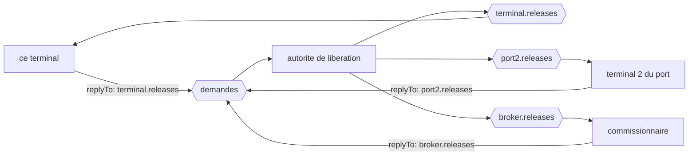

# Return Address

🌍 🇫🇷 Français (ce fichier) · 🇬🇧 [English](ReturnAddress-en.md)

## Intention

Return Address met le canal de réponse sur la requête, de sorte qu'un répondeur réponde là où le demandeur l'a
demandé plutôt que là où il a été configuré pour le faire.

## Problème

Une autorité de libération répond à quatre demandeurs : ce terminal, deux autres terminaux du port, et un
commissionnaire en douane.

Renseignée par configuration sur l'endroit où répondre, elle détient leur table :

```csharp
string replyChannel = _settings.ReplyChannels[requestorName];
```

Le quatrième demandeur a exigé un déploiement. Le cinquième en exigera un autre, et chacun est un changement dans
un système appartenant à quelqu'un d'autre, planifié à sa convenance. Pendant ce temps le répondeur détient la
liste de tous ceux qui pourraient un jour lui demander quelque chose — la même liste que la page de
[Message Router](MessageRouter-fr.md) décrit un service de portique en train d'accumuler, atteinte par le chemin
inverse.

## Solution

Le patron met l'adresse sur le message.

La requête dit où appartient la réponse. Le répondeur la lit et répond là, sans détenir aucune table et sans
connaître aucun demandeur. Un répondeur, quatre demandeurs, chacun répondu sur son propre canal — et le cinquième
ne coûte de déploiement à personne.

Cela déplace aussi le lieu d'une panne : une réponse qui ne va nulle part devient un défaut du **message** plutôt
que du répondeur.

## Structure



Trois canaux de réponse et aucune configuration dans la boîte du milieu : chaque flèche sortante est choisie par le
message entrant.

## Les rôles

| Rôle | Annotation | S'applique à | Ce qu'il porte |
|---|---|---|---|
| ReturnAddress | `[ReturnAddress]` | propriété, champ | La propriété qui nomme le canal auquel appartient la réponse. |

Un seul rôle, et il annote une **propriété** plutôt qu'un type. C'est la forme de la majeure partie de ce chapitre :
les sortes de messages sont des types, et les propriétés de messages — adresse de retour, identifiant de
corrélation, expiration, indicateur de format — sont des propriétés, parce que ce qu'elles marquent est le métier
d'un champ à l'intérieur d'un message qui est aussi autre chose.

## L'exemple

Extrait de [`ReturnAddressUsage.cs`](../../../../DesignPatternCatalog.Usage/EnterpriseIntegration/ReturnAddressUsage.cs).

```csharp
public string ContainerNumber { get; }

/// <summary>The channel the answer should be sent on.</summary>
[ReturnAddress]
public string ReplyTo { get; }
```

Deux propriétés, et une seule est annotée. `ContainerNumber` est ce sur quoi porte la question ; `ReplyTo` est la
façon dont la conversation fonctionne — et l'annotation est ce qui sépare les deux pour un lecteur qui n'a que le
type.

C'est un nom de canal, non un nom de système. `terminal.releases` plutôt que `TerminalA` est ce qui garde le
répondeur libre de toute correspondance : un nom auquel il peut envoyer directement n'a besoin d'aucune table, et un
nom qu'il doit résoudre est la configuration qui revient.

La propriété est en lecture seule, fixée dans le constructeur. Une adresse de retour qu'un intermédiaire peut
changer est une réponse détournée, et l'immuabilité est la défense la moins chère contre cela.

L'exemple énonce les deux moitiés de ce que le patron achète : *la porter sur le message est ce qui permet à un
répondeur de servir de nombreux demandeurs — et ce qui fait d'une réponse qui ne va nulle part un défaut du message
plutôt que du répondeur.*

## Possibilités d'application

**Employez une adresse de retour partout où une réponse est attendue.** En pratique cela veut dire : sur chaque
[requête](RequestReply-fr.md).

**Employez-la là où un répondeur sert plusieurs demandeurs.** C'est là qu'est le gain, et il croît avec leur
nombre.

**Portez un nom de canal plutôt qu'un nom de système.** Un nom auquel le répondeur peut envoyer directement est ce
qui retire la correspondance ; tout ce qu'il doit résoudre est de la configuration avec une étape de plus.

**Rendez-la immuable.** L'adresse décide où va une réponse, et un message dont l'adresse peut être réécrite en
chemin est une réponse détournée.

## Quand ne pas l'utiliser

**Ne l'employez pas là où aucune réponse n'est attendue.** Un [message d'événement](EventMessage-fr.md) n'a pas de
réponse, et une adresse de retour sur lui est une invitation que quelqu'un finira par accepter.

**Ne la laissez pas nommer un canal que le demandeur ne peut pas lire.** Une réponse correctement envoyée sur un
canal que personne ne consomme est aussi complètement perdue qu'une réponse jamais envoyée, et le demandeur attend
sans symptôme.

**Ne l'acceptez pas sans contrôle depuis l'extérieur d'une frontière de confiance.** Une requête d'un partenaire qui
nomme un canal interne comme adresse de retour a demandé à votre répondeur d'envoyer des données quelque part que
vous n'avez pas choisi, et le répondeur obéira.

**N'en faites pas une instruction de routage.** Une adresse de retour dit où va la *réponse à ceci* ; un émetteur qui
s'en sert pour piloter un message à travers plusieurs étapes veut
[Routing Slip](../../../generated/catalog-index.md#routingslip-enterprise-integration-patterns).

**Ne comptez pas sur elle seule.** Elle porte la réponse au bon canal et ne dit rien de la question à laquelle elle
répond — cela, c'est [Correlation Identifier](CorrelationIdentifier-fr.md), et quarante réponses sur un canal
demandent les deux.

## Avantages

* Un répondeur sert un nombre quelconque de demandeurs, et un nouveau ne lui coûte rien.
* Le répondeur ne détient aucune table de qui pourrait demander : il n'acquiert aucune liste à maintenir.
* Une réponse mal dirigée est un défaut du message, ce qui est là où il peut se voir.
* Le demandeur choisit où arrivent ses réponses, et c'est la partie qui sait.
* C'est une seule propriété : elle se compose avec n'importe quelle requête sans en changer la forme.

## Inconvénients

* Une adresse fournie par un émetteur est une instruction venue du dehors, et hors d'une frontière de confiance c'est
  une exposition.
* Le répondeur enverra là où on le lui dit, y compris sur un canal que personne ne lit.
* Elle est facile à oublier, et une requête qui n'en a pas n'échoue qu'au moment de la réponse, chez le répondeur.
* Elle dit où et non pour quoi : elle n'est jamais suffisante à elle seule.
* Des noms de canaux dans les messages voyagent vers les journaux et les stockages, ce qui répand la connaissance de
  la topologie.

## Liens avec les autres patrons

**`RequestReply`** est la conversation à laquelle celle-ci appartient, et c'est la propriété qui fait de son second
canal la décision d'un message plutôt que celle d'un déploiement.

**`CorrelationIdentifier`** est l'autre moitié du même métier : celle-ci dit où va la réponse, celui-là dit à quoi
elle répond.

**`CommandMessage`** est la sorte qui en porte d'ordinaire une, puisque le livre dit qu'une commande attend
d'ordinaire une réponse.

**`MessageEndpoint`** est ce qui lit l'adresse et envoie là, et garder le canal hors de l'application est son côté du
même agencement.

**`RoutingSlip`** est le patron d'un message qui doit visiter plusieurs étapes, ce pour quoi une adresse de retour est
parfois prise à tort.

## Source

*Enterprise Integration Patterns*, Gregor Hohpe et Bobby Woolf, Addison-Wesley, 2003 — le chapitre sur la
construction des messages.

* [Entrée d'index](../../../generated/catalog-index.md#returnaddress-enterprise-integration-patterns)
* [Attribut généré](../../../../DesignPatternCatalog.EnterpriseIntegration/ReturnAddress.cs)
* [Exemple](../../../../DesignPatternCatalog.Usage/EnterpriseIntegration/ReturnAddressUsage.cs)
