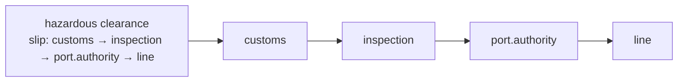

# Routing Slip

🌍 🇬🇧 English (this file) · 🇫🇷 [Français](RoutingSlip-fr.md)

## Intent

Routing Slip attaches the itinerary to the message, so that a sequence of steps can vary per message without a
central participant deciding it.

## Problem

A hazardous container's paperwork goes through customs, then the port authority, then the line — unless it is a
tank container, in which case an inspection comes second.

Six variations in all, and none of them worth a central participant holding state for. A
[process manager](ProcessManager-en.md) would work and would be a running instance per container, a store to keep
them in, and a bottleneck every clearance passes through — for a route that is decided once, at the start, and
never changes after.

Wiring the steps to each other is worse: customs would have to know that inspection sometimes comes next, which
makes a step that clears documents into a step that knows the shape of the whole process.

## Solution

The pattern attaches the itinerary to the message.

The route is computed once and travels with what it routes. Each step does its work, reads the next destination
off the slip, and sends it there. **No step knows the next one and nothing central remembers where anything is.**

The state is on the message rather than in a store, which is what makes a failure mid-route diagnosable from the
message alone: a container stuck between the port authority and the line is holding the evidence of where it had
been going.

## Structure



Four steps and no arrow into a coordinator, because there is not one. The list under the message is the entire
mechanism.

## The roles

| Role | Annotation | Applies to | What it carries |
|---|---|---|---|
| RoutingSlip | `[RoutingSlip.RoutingSlip]` | interface, class | The participant that computes the itinerary and attaches it. |
| Itinerary | `[RoutingSlip.Itinerary]` | property, field | The ordered list of steps carried on the message, and the position within it. |

Two roles, and the split is between *deciding the route* and *the route itself*. Annotating the itinerary
separately is what says the sequence lives on the message — a reader who sees only the computing participant
might assume it also drives the process, which is exactly what this pattern does not do.

## The example

From [`RoutingSlipUsage.cs`](../../../../DesignPatternCatalog.Usage/EnterpriseIntegration/RoutingSlipUsage.cs).

```csharp
[RoutingSlip.Itinerary]
public IReadOnlyList<string> Steps { get; }
```

```csharp
public HazardousClearance(bool isTank) {
    Steps = isTank
        ? new[] { "customs", "inspection", "port.authority", "line" }
        : new[] { "customs", "port.authority", "line" };
}
```

The whole route is decided in the constructor, from one fact known at the start. That is the pattern's
precondition made visible: a routing slip can only express variation that is knowable **before the journey
begins**. If whether an inspection is needed depended on what customs said, no constructor could compute it, and
the pattern would not apply.

```csharp
public string? Next() => Position < Steps.Count ? Steps[Position++] : null;
```

`Next` returns null at the end, so *the itinerary is finished* is an ordinary return value rather than an
exception. And `Position` advancing inside the accessor is the position living with the steps — the message
carries not just where it is going but how far it has got.

`Position` is `public` with a `private set`, which is the same defence a [return address](ReturnAddress-en.md)
gets: a step that could rewind the position would replay part of the route, and a step that could skip it would
silently omit a clearance.

The sample states the trade against its alternative: *the route travels with the message, so no step needs to
know the next and no participant holds the state.*

## Applicability

**Use a routing slip where the sequence varies per message but is known at the start.** The book's case, and the
precondition that decides between this and a process manager.

**Use it where the variations do not justify a central participant.** Six routes and no branching is a list, not a
process engine.

**Use it where steps should stay ignorant of each other.** Customs clears documents; it should not know what
happens next.

**Keep the position on the message.** It is what makes a stuck message self-describing.

## When not to use it

**Do not use it where the next step depends on what a step said.** A slip is fixed when it is written, so a route
that must branch on a reply needs a [process manager](ProcessManager-en.md) — this is the single distinction
between the two patterns.

**Do not use it where the route must be changed in flight.** Cancelling or redirecting a message means finding
it, and there is nothing central that knows where it is.

**Do not use it where you need to know what is in progress.** No participant holds the state, so *how many
clearances are between customs and the port authority* is a question nothing can answer.

**Do not put a long itinerary on a message.** The slip travels everywhere the message does, into every log and
store, and a twenty-step route is twenty steps of overhead on every hop.

**Do not let a step edit the itinerary.** A step that appends to the route has taken a decision that belongs to
whoever computed it, and the message no longer describes what was intended.

**Do not use it without a plan for a step that is gone.** A slip naming a channel that no longer exists strands
the message with no participant watching for it — the [dead letter channel](DeadLetterChannel-en.md) is what makes
that visible.

## Advantages

* No central participant, so nothing to run, scale or restart.
* No step knows the next, so steps stay independent and reusable.
* The route varies per message, decided once by whoever knows.
* A stuck message carries its own diagnosis: where it was going and how far it got.
* Adding a variation is a change to the participant that computes slips, and to nothing else.

## Drawbacks

* The route is fixed when written, so it cannot respond to what the steps find.
* Nothing knows what is in flight, so there is no view of work in progress.
* The itinerary travels everywhere the message does, and grows the message.
* A message lost mid-route is lost with its state, since the state was on it.
* Nothing prevents a step from editing the slip except convention.

## Relations with other patterns

**`ProcessManager`** is the alternative, and the choice between them is one question: does the next step depend
on what the replies said.

**`Message`** is what carries the itinerary, and the slip belongs in the header rather than the body — the
division `Message`'s own annotations make checkable.

**`MessageRouter`** is what each step effectively becomes, with the routing rule read from the message instead of
held in the participant.

**`PipesAndFilters`** is the arrangement this produces at run time, with the pipeline described per message
rather than wired in advance.

**`ReturnAddress`** is the same idea for one hop rather than a sequence — the message saying where it goes next.

**`DeadLetterChannel`** is what catches a slip naming a step that has gone.

## Source

*Enterprise Integration Patterns*, Gregor Hohpe and Bobby Woolf, Addison-Wesley, 2003 — the message-routing
chapter.

* [Index entry](../../../generated/catalog-index.md#routingslip-enterprise-integration-patterns)
* [Generated attribute](../../../../DesignPatternCatalog.EnterpriseIntegration/RoutingSlip.cs)
* [Example](../../../../DesignPatternCatalog.Usage/EnterpriseIntegration/RoutingSlipUsage.cs)
