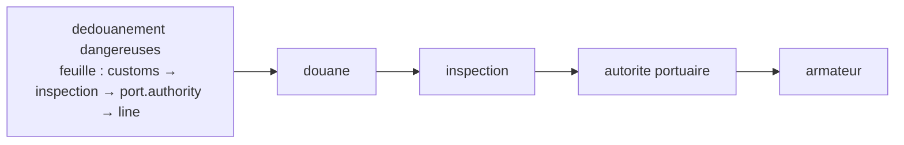

# Routing Slip

🌍 🇫🇷 Français (ce fichier) · 🇬🇧 [English](RoutingSlip-en.md)

## Intention

Routing Slip attache l'itinéraire au message, de sorte qu'une séquence d'étapes puisse varier d'un message à
l'autre sans qu'un participant central la décide.

## Problème

Les papiers d'un conteneur de marchandises dangereuses passent par la douane, puis l'autorité portuaire, puis
l'armateur — sauf s'il s'agit d'un conteneur-citerne, auquel cas une inspection vient en deuxième.

Six variations en tout, et aucune ne vaut qu'un participant central détienne un état pour elle. Un
[gestionnaire de processus](ProcessManager-fr.md) fonctionnerait et serait une instance en cours par conteneur, un
stockage pour les garder, et un goulot par lequel passe chaque dédouanement — pour une route décidée une fois, au
départ, et qui ne change jamais ensuite.

Câbler les étapes entre elles est pire : la douane devrait savoir qu'une inspection vient parfois ensuite, ce qui
fait d'une étape qui traite des documents une étape qui connaît la forme du processus entier.

## Solution

Le patron attache l'itinéraire au message.

La route est calculée une fois et voyage avec ce qu'elle route. Chaque étape fait son travail, lit la destination
suivante sur la feuille, et y envoie le message. **Aucune étape ne connaît la suivante et rien de central ne se
souvient d'où est quoi.**

L'état est sur le message plutôt que dans un stockage, ce qui rend une panne en cours de route diagnosticable à
partir du seul message : un conteneur bloqué entre l'autorité portuaire et l'armateur détient la preuve de là où il
allait.

## Structure



Quatre étapes et aucune flèche vers un coordinateur, parce qu'il n'y en a pas. La liste sous le message est tout le
mécanisme.

## Les rôles

| Rôle | Annotation | S'applique à | Ce qu'il porte |
|---|---|---|---|
| RoutingSlip | `[RoutingSlip.RoutingSlip]` | interface, classe | Le participant qui calcule l'itinéraire et l'attache. |
| Itinerary | `[RoutingSlip.Itinerary]` | propriété, champ | La liste ordonnée des étapes portée sur le message, et la position dans cette liste. |

Deux rôles, et la division est entre *décider la route* et *la route elle-même*. Annoter l'itinéraire séparément est
ce qui dit que la séquence vit sur le message — un lecteur qui ne verrait que le participant calculant pourrait
supposer qu'il pilote aussi le processus, ce qui est exactement ce que ce patron ne fait pas.

## L'exemple

Extrait de [`RoutingSlipUsage.cs`](../../../../DesignPatternCatalog.Usage/EnterpriseIntegration/RoutingSlipUsage.cs).

```csharp
[RoutingSlip.Itinerary]
public IReadOnlyList<string> Steps { get; }
```

```csharp
public HazardousClearance(bool isTank) {
    Steps = isTank
        ? new[] { "customs", "inspection", "port.authority", "line" }
        : new[] { "customs", "port.authority", "line" };
}
```

La route entière est décidée dans le constructeur, à partir d'un fait connu au départ. C'est la précondition du
patron rendue visible : une feuille de route ne peut exprimer que la variation connaissable **avant que le voyage
commence**. Si le besoin d'une inspection dépendait de ce que la douane a dit, aucun constructeur ne pourrait la
calculer, et le patron ne s'appliquerait pas.

```csharp
public string? Next() => Position < Steps.Count ? Steps[Position++] : null;
```

`Next` rend `null` à la fin : *l'itinéraire est terminé* est une valeur de retour ordinaire plutôt qu'une exception.
Et `Position` qui avance dans l'accesseur est la position qui vit avec les étapes — le message porte non seulement où
il va, mais jusqu'où il est allé.

`Position` est `public` avec un `private set`, ce qui est la même défense que reçoit une
[adresse de retour](ReturnAddress-fr.md) : une étape qui pourrait reculer la position rejouerait une part de la
route, et une étape qui pourrait la sauter omettrait un dédouanement en silence.

L'exemple énonce l'échange face à son alternative : *la route voyage avec le message, si bien qu'aucune étape n'a
besoin de connaître la suivante et qu'aucun participant ne détient l'état.*

## Possibilités d'application

**Employez une feuille de route là où la séquence varie d'un message à l'autre mais est connue au départ.** Le cas
du livre, et la précondition qui départage celui-ci et un gestionnaire de processus.

**Employez-la là où les variations ne justifient pas un participant central.** Six routes sans embranchement font
une liste, non un moteur de processus.

**Employez-la là où les étapes doivent s'ignorer.** La douane traite des documents ; elle ne devrait pas savoir ce
qui vient après.

**Gardez la position sur le message.** C'est ce qui rend un message bloqué autodescriptif.

## Quand ne pas l'utiliser

**Ne l'employez pas là où l'étape suivante dépend de ce qu'une étape a dit.** Une feuille est fixée quand elle est
écrite : une route qui doit s'embrancher selon une réponse demande un
[gestionnaire de processus](ProcessManager-fr.md) — c'est l'unique distinction entre les deux patrons.

**Ne l'employez pas là où la route doit être changée en vol.** Annuler ou détourner un message oblige à le trouver,
et rien de central ne sait où il est.

**Ne l'employez pas là où vous devez savoir ce qui est en cours.** Aucun participant ne détient l'état : *combien de
dédouanements sont entre la douane et l'autorité portuaire* est une question à laquelle rien ne peut répondre.

**Ne mettez pas un long itinéraire sur un message.** La feuille voyage partout où va le message, dans chaque journal
et chaque stockage, et une route à vingt étapes fait vingt étapes de surcoût à chaque saut.

**Ne laissez pas une étape modifier l'itinéraire.** Une étape qui ajoute à la route a pris une décision qui
appartient à qui l'a calculée, et le message ne décrit plus ce qui était prévu.

**Ne l'employez pas sans plan pour une étape disparue.** Une feuille qui nomme un canal qui n'existe plus échoue le
message sans qu'aucun participant le guette — le [canal de lettres mortes](DeadLetterChannel-fr.md) est ce qui rend
cela visible.

## Avantages

* Aucun participant central : rien à faire tourner, à mettre à l'échelle ou à redémarrer.
* Aucune étape ne connaît la suivante : les étapes restent indépendantes et réutilisables.
* La route varie d'un message à l'autre, décidée une fois par qui sait.
* Un message bloqué porte son propre diagnostic : où il allait et jusqu'où il est allé.
* Ajouter une variation est un changement du participant qui calcule les feuilles, et de rien d'autre.

## Inconvénients

* La route est fixée à l'écriture : elle ne peut pas répondre à ce que les étapes trouvent.
* Rien ne sait ce qui est en vol : il n'y a aucune vue du travail en cours.
* L'itinéraire voyage partout où va le message, et alourdit le message.
* Un message perdu en cours de route est perdu avec son état, puisque l'état était sur lui.
* Rien n'empêche une étape de modifier la feuille, sinon la convention.

## Liens avec les autres patrons

**`ProcessManager`** est l'alternative, et le choix entre les deux tient à une question : l'étape suivante dépend-elle
de ce que les réponses ont dit.

**`Message`** est ce qui porte l'itinéraire, et la feuille appartient à l'en-tête plutôt qu'au corps — la division que
les annotations propres de `Message` rendent contrôlable.

**`MessageRouter`** est ce que devient effectivement chaque étape, avec la règle de routage lue sur le message au
lieu d'être détenue par le participant.

**`PipesAndFilters`** est l'agencement que celui-ci produit à l'exécution, avec le pipeline décrit par message plutôt
que câblé à l'avance.

**`ReturnAddress`** est la même idée pour un saut plutôt que pour une séquence — le message qui dit où il va ensuite.

**`DeadLetterChannel`** est ce qui attrape une feuille nommant une étape disparue.

## Source

*Enterprise Integration Patterns*, Gregor Hohpe et Bobby Woolf, Addison-Wesley, 2003 — le chapitre sur le routage
des messages.

* [Entrée d'index](../../../generated/catalog-index.md#routingslip-enterprise-integration-patterns)
* [Attribut généré](../../../../DesignPatternCatalog.EnterpriseIntegration/RoutingSlip.cs)
* [Exemple](../../../../DesignPatternCatalog.Usage/EnterpriseIntegration/RoutingSlipUsage.cs)
